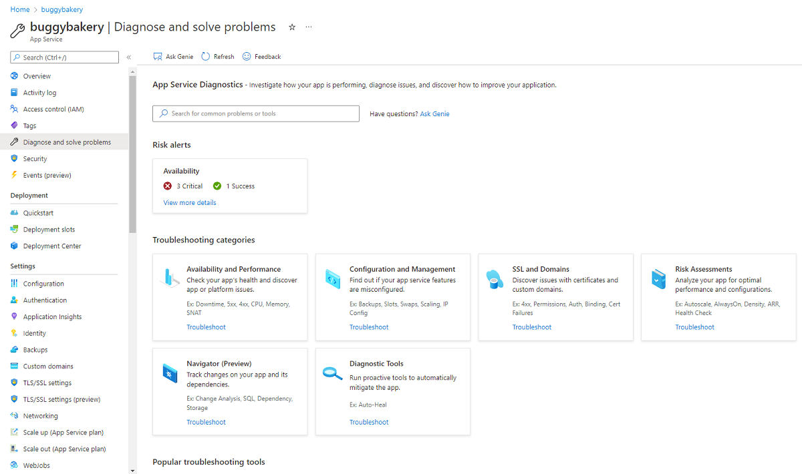
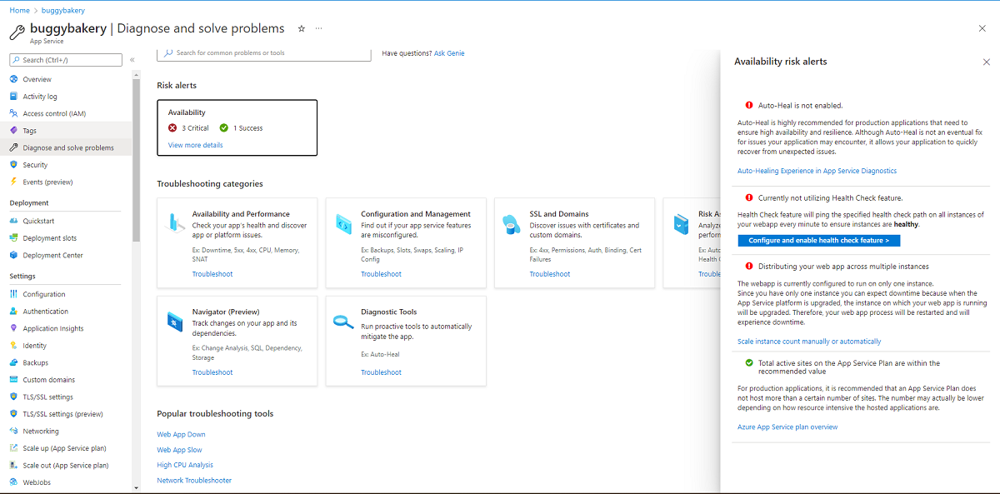
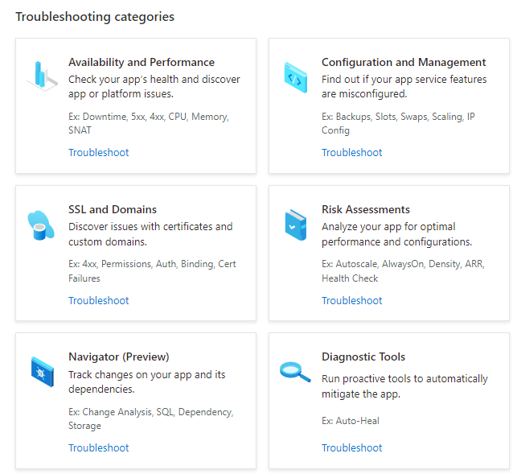
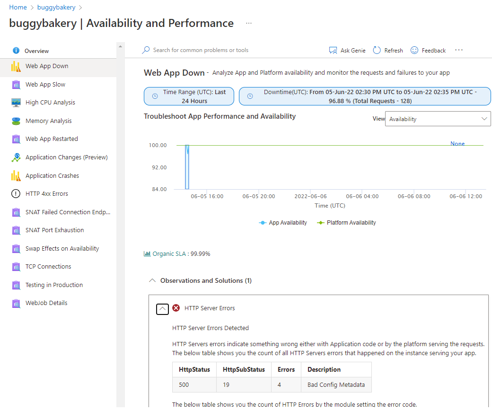
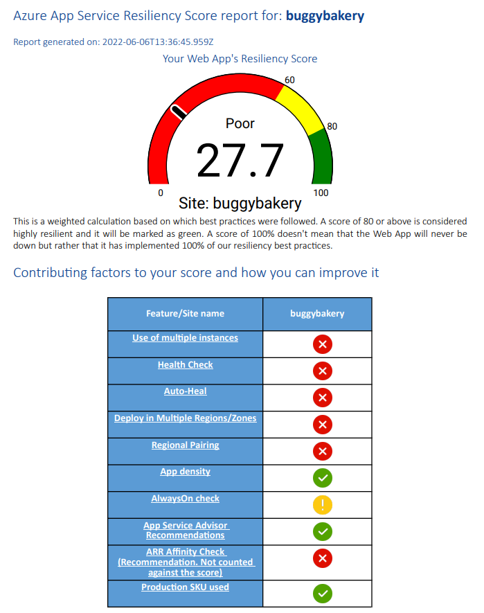
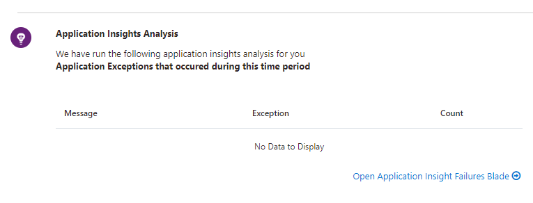
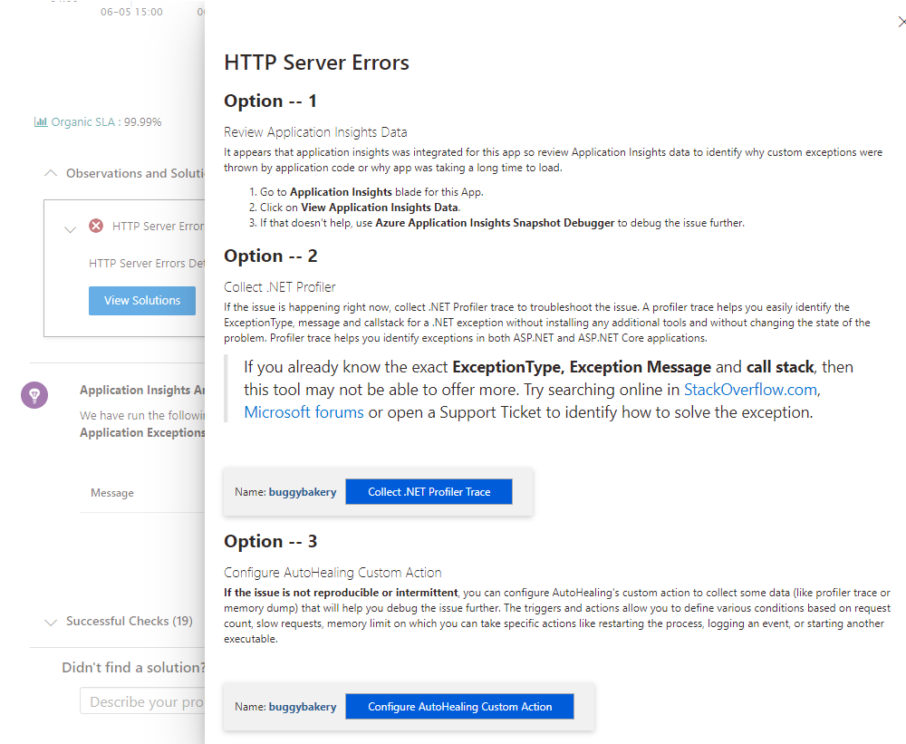

# Azure App Service diagnostics overview

When you’re running a web application, you want to be prepared for any issues that may arise, from 500 errors to your users telling you that your site is down. App Service diagnostics is an intelligent and interactive experience to help you troubleshoot your app with no configuration required. If you do run into issues with your app, App Service diagnostics points out what’s wrong to guide you to the right information to more easily and quickly troubleshoot and resolve the issue.

Although this experience is most helpful when you’re having issues with your app within the last 24 hours, all the diagnostic graphs are always available for you to analyze.

App Service diagnostics works for not only your app on Windows, but also apps on [Linux/containers](./overview.md#app-service-on-linux), [App Service Environment](./environment/intro.md), and [Azure Functions](../azure-functions/functions-overview.md).

## Open App Service diagnostics

To access App Service diagnostics, navigate to your App Service web app or App Service Environment in the [Azure portal](https://portal.azure.com). In the left navigation, click on **Diagnose and solve problems**.

For Azure Functions, navigate to your function app, and in the top navigation, click on **Platform features**, and select **Diagnose and solve problems** from the **Resource management** section.

The App Service diagnostics homepage provides many tools to diagnoise app problems. For more information, see [Diagnostic tools](#diagnostic-tools) in this article.

> [!NOTE]
> If your app is down or performing slow, you can [collect a profiling trace](https://azure.github.io/AppService/2018/06/06/App-Service-Diagnostics-Profiling-an-ASP.NET-Web-App-on-Azure-App-Service.html) to identify the root cause of the issue. Profiling is light weight and is designed for production scenarios.
>

## Diagnostic Interface

The homepage for App Service diagnostics offers streamlined diagnostics access using four sections:

- **Ask Genie search box**
- **Risk Alerts**
- **Troubleshooting categories**
- **Popular troubleshooting tools**

## Ask Genie search box

The Genie search box is a quick way to find a diagnostic. The same diagnostic can be found through Troubleshooting categories.

## Risk Alerts

The App Service diagnostics homepage performs a series of configuration checks and offers recommendations based on your unique application's configuration.

Recommendations and checks performed can be reviewed by clicking "View more details" link.

## Troubleshooting categories

Troubleshooting categories group diagnostics for ease of discovery. The following are available:

- **Availability and Performance**
- **Configuration and Management**
- **SSL and Domains**
- **Risk Assessments**
- **Navigator (Preview)**
- **Diagnostic Tools**

The tiles or the Troubleshoot link show the available diagnostics for the category. If you were interested in investigating Availability and performance the following diagnostics are offered:

- **Overview**
- **Web App Down**
- **Web App Slow**
- **High CPU Analysis**
- **Memory Analysis**
- **Web App Restarted**
- **Application Change (Preview)**
- **Application Crashes**
- **HTTP 4xx Errors**
- **SNAT Failed Connection Endpoints**
- **SWAP Effects on Availability**
- **TCP Connections**
- **Testing in Production**
- **WebJob Details**

![App Service Diagnose and solve problems Availability and Performance category homepage, with left hand navigation containing Overview, Web App Down, Web App Slow, High CPU Analysis, Memory Analysis, Web App Restarted, Application Change (Preview), Application Crashes, HTTP 4xx Errors, SNAT Failed connection Endpoint, SNAT Port Exhaustion, Swap Effects on Availability, TCP Connections, Testing in Production, WebJob Details and the default availability dashboard for the last 24 hours of App usage, with a date and time selection interface.](./media/app-service-diagnostics/app-service-diagnostics-availability-and-performance-1.png)

## Diagnostic report

After you choose to investigate the issue further by clicking on a topic, you can view more details about the topic often supplemented with graphs and markdowns. Diagnostic report can be a powerful tool for pinpointing the problem with your app. The following is the Web App Down from Availability and Performance:

## Resiliency Score

To review tailored best practice recommendations, check out the Resiliency Score Report. This is available as a downloadable PDF Report. To get it, simply click on the "Get Resilience Score report" button available on the command bar of any of the Troubleshooting categories.

### Investigate application code issues (only for Windows app)

Because many app issues are related to issues in your application code, App Service diagnostics integrates with [Application Insights](../azure-monitor/app/app-insights-overview.md) to highlight exceptions and dependency issues to correlate with the selected downtime. Application Insights has to be enabled separately.

To view Application Insights exceptions and dependencies, select the **web app down** or **web app slow** tile shortcuts.

### Troubleshooting steps

If an issue is detected with a specific problem category within the last 24 hours, you can view the full diagnostic report, and App Service diagnostics may prompt you to view more troubleshooting advice and next steps for a more guided experience.

## Diagnostic tools 

Diagnostics Tools include more advanced diagnostic tools that help you investigate application code issues, slowness, connection strings, and more. and proactive tools that help you mitigate issues with CPU usage, requests, and memory.

### Proactive CPU monitoring (only for Windows app)

Proactive CPU monitoring provides you an easy, proactive way to take an action when your app or child process for your app is consuming high CPU resources. You can set your own CPU threshold rules to temporarily mitigate a high CPU issue until the real cause for the unexpected issue is found. For more information, see [Mitigate your CPU problems before they happen](https://azure.github.io/AppService/2019/10/07/Mitigate-your-CPU-problems-before-they-even-happen.html).

### Auto-healing 

Auto-healing is a mitigation action you can take when your app is having unexpected behavior. You can set your own rules based on request count, slow request, memory limit, and HTTP status code to trigger mitigation actions. Use the tool to temporarily mitigate an unexpected behavior until you find the root cause. The tool is currently available for Windows Web Apps, Linux Web Apps, and Linux Custom Containers. Supported conditions and mitigation vary depending on the type of the web app. For more information, see [Announcing the new auto healing experience in app service diagnostics](https://azure.github.io/AppService/2018/09/10/Announcing-the-New-Auto-Healing-Experience-in-App-Service-Diagnostics.html) and [Announcing Auto Heal for Linux](https://azure.github.io/AppService/2021/04/21/Announcing-Autoheal-for-Azure-App-Service-Linux.html).

### Proactive auto-healing (only for Windows app)

Like proactive CPU monitoring, proactive auto-healing is a turn-key solution to mitigating unexpected behavior of your app. Proactive auto-healing restarts your app when App Service determines that your app is in an unrecoverable state. For more information, see [Introducing Proactive Auto Heal](https://azure.github.io/AppService/2017/08/17/Introducing-Proactive-Auto-Heal.html).

## Navigator and change analysis (only for Windows app)

In a large team with continuous integration and where your app has many dependencies, it can be difficult to pinpoint the specific change that causes an unhealthy behavior. Navigator helps get visibility on your app’s topology by automatically rendering a dependency map of your app and all the resources in the same subscription. Navigator lets you view a consolidated list of changes made by your app and its dependencies and narrow down on a change causing unhealthy behavior. It can be accessed through the homepage tile **Navigator** and needs to be enabled before you use it the first time. For more information, see [Get visibility into your app's dependencies with Navigator](https://azure.github.io/AppService/2019/08/06/Bring-visibility-to-your-app-and-its-dependencies-with-Navigator.html).

Change analysis for app changes can be accessed through tile shortcuts, **Application Changes** and **Application Crashes** in **Availability and Performance** so you can use it concurrently with other metrics. Before using the feature, you must first enable it. For more information, see [Announcing the new change analysis experience in App Service Diagnostics](https://azure.github.io/AppService/2019/05/07/Announcing-the-new-change-analysis-experience-in-App-Service-Diagnostics-Analysis.html).

Post your questions or feedback at [UserVoice](https://feedback.azure.com/d365community/forum/b09330d1-c625-ec11-b6e6-000d3a4f0f1c​​​​​​​​​​​​​​) by adding "[Diag]" in the title.

## More resources

[Tutorial: Run a load test to identify performance bottlenecks in a web app](../load-testing/tutorial-identify-bottlenecks-azure-portal.md)
