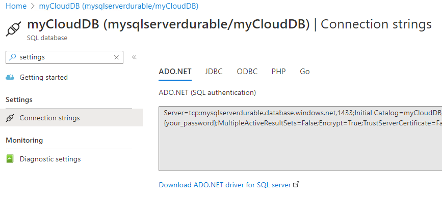
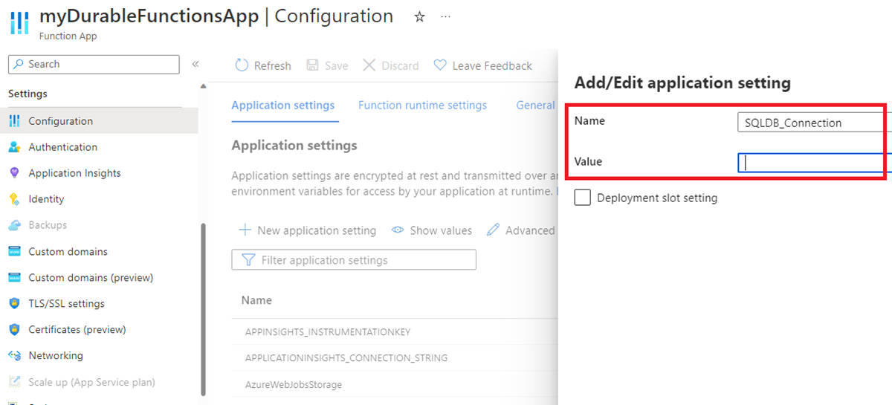

# Quickstart: Set a durable function to use the MSSQL storage provider

Durable Functions supports several [storage providers](durable-functions-storage-providers.md), also known as _back ends_, for storing orchestration and entity runtime state. By default, new projects are configured to use the [Azure Storage provider](durable-functions-storage-providers.md#azure-storage). In this quickstart, you configure a durable function app to use the [Microsoft SQL Server (MSSQL) storage provider](durable-functions-storage-providers.md#mssql).

> [!NOTE]
>
> - The MSSQL back end was designed to maximize application portability and control over your data. It uses [Microsoft SQL Server](https://www.microsoft.com/sql-server/) to persist all task hub data state so that users get the benefits of a modern, enterprise-grade database management system (DBMS) infrastructure. To learn more about when to use the MSSQL storage provider, see the [storage providers overview](durable-functions-storage-providers.md).
>
> - Migrating [task hub data](durable-functions-task-hubs.md) across storage providers currently isn't supported. Function apps that have existing runtime data start with a fresh, empty task hub after they switch to the MSSQL back end. Similarly, the task hub contents that are created by using MSSQL can't be preserved if you switch to a different storage provider.

## Prerequisites

The following steps assume that you're starting with an existing Durable Functions app and that you're familiar with how to operate it.

Specifically, this quickstart assumes that you have already:

- Created an Azure Functions project on your local computer.
- Added Durable Functions to your project with an [orchestrator function](durable-functions-bindings.md#orchestration-trigger) and a [client function](durable-functions-bindings.md#orchestration-client) that triggers it.
- Configured the project for local debugging.

If you don't meet these prerequisites, we recommend that you start with one of the following quickstarts:

- [Create your first durable function - C#](durable-functions-create-first-csharp.md)
- [Create your first durable function - JavaScript](quickstart-js-vscode.md)
- [Create your first durable function - Python](quickstart-python-vscode.md)
- [Create your first durable function - PowerShell](quickstart-powershell-vscode.md)
- [Create your first durable function - Java](quickstart-java.md)

## Add the durable task MSSQL extension (.NET only)

> [!NOTE]
> If your app uses [Extension Bundles](../functions-bindings-register.md#extension-bundles), skip this section. Extension Bundles removes the need for manual extension management.

First, install the latest version of the MSSQL storage provider extension from NuGet. For .NET, you add a reference to it in your _.csproj_ file and building the project. You can also use the [dotnet add package](/dotnet/core/tools/dotnet-add-package) command to add extension packages.

Which extension package you install depends on the .NET worker you're using:

- For the _in-process_ .NET worker, install [Microsoft.DurableTask.SqlServer.AzureFunctions](https://www.nuget.org/packages/Microsoft.DurableTask.SqlServer.AzureFunctions).
- For the _isolated_ .NET worker, install [Microsoft.Azure.Functions.Worker.Extensions.DurableTask.SqlServer](https://www.nuget.org/packages/Microsoft.Azure.Functions.Worker.Extensions.DurableTask.SqlServer).

You can install the extension by using the following [Azure Functions Core Tools CLI](../functions-run-local.md#install-the-azure-functions-core-tools) command:

```cmd
func extensions install --package <package name depending on your worker model> --version <latest version>
```

For more information about installing Azure Functions extensions via the Core Tools CLI, see [func extensions install](../functions-core-tools-reference.md#func-extensions-install).

## Set up your database

> [!NOTE]
> If you already have an MSSQL-compatible database, you can skip this section and the next section on setting up a Docker-based local database.

Because the MSSQL back end is designed for portability, you have several options to set up your backing database. For example, you can set up an on-premises SQL Server instance, use a fully managed instance of [Azure SQL Database](/azure/azure-sql/database/sql-database-paas-overview), or use any other SQL Server-compatible hosting option.

You can also do local, offline development by using [SQL Server Express](https://www.microsoft.com/sql-server/sql-server-downloads) on your local Windows computer or use a [SQL Server Docker image](https://hub.docker.com/_/microsoft-mssql-server) running in a Docker container.

This quickstart focuses on using a SQL Server Docker image.

### Set up your local Docker-based SQL Server instance

To run these steps, you need a [Docker](https://www.docker.com/products/docker-desktop/) installation on your local computer. You can use the following PowerShell commands to set up a local SQL Server database on Docker. You can install PowerShell on [Windows, macOS, or Linux](/powershell/scripting/install/installing-powershell).

```powershell
# primary parameters
$pw        = "yourStrong(!)Password"
$edition   = "Developer"
$port      = 1433
$tag       = "2019-latest"
$dbname    = "DurableDB"
$collation = "Latin1_General_100_BIN2_UTF8"

# pull the image from the Microsoft container registry
docker pull mcr.microsoft.com/mssql/server:$tag

# run the image, providing some basic setup parameters
docker run --name mssql-server -e 'ACCEPT_EULA=Y' -e "SA_PASSWORD=$pw" -e "MSSQL_PID=$edition" -p ${port}:1433 -d mcr.microsoft.com/mssql/server:$tag

# wait a few seconds for the container to start...

# create the database with strict binary collation
docker exec -d mssql-server /opt/mssql-tools/bin/sqlcmd -S . -U sa -P "$pw" -Q "CREATE DATABASE [$dbname] COLLATE $collation"
```

After you run these commands, you should have a local SQL Server running on Docker and listening on port 1443. If port 1443 conflicts with another service, you can rerun these commands after you change the variable `$port` to a different value.

> [!NOTE]
> To stop and delete a running container, you can use `docker stop <containerName>` and `docker rm <containerName>` respectively. You can use these commands to re-create your container and to stop if after you're done with this quickstart. For more assistance, try `docker --help`.

To validate your database installation, you can query for your new SQL database by using the following Docker command:

```powershell
docker exec -it mssql-server /opt/mssql-tools/bin/sqlcmd -S . -U sa -P "$pw" -Q "SELECT name FROM sys.databases"
```

If the database setup completed successfully, you should see the name of your created database (for example, **DurableDB**) in the command-line output:

```bash
name

--------------------------------------------------------------
master

tempdb

model

msdb

DurableDB

```

### Add your SQL connection string to local.settings.json

The MSSQL back end needs a connection string to access your database. How to obtain a connection string depends primarily on your specific MSSQL server provider. Review the documentation of your specific provider for information on how to obtain a connection string.

If you use the preceding Docker commands without changing any parameters, your connection string is:

```cmd
Server=localhost,1433;Database=DurableDB;User Id=sa;Password=yourStrong(!)Password;
```

After you get your connection string, add it to a variable in _local.settings.json_ to use it during local development.

Here's an example _local.settings.json_ that assigns the default Docker-based SQL Server instance connection string to the variable `SQLDB_Connection`:

```json
{
  "IsEncrypted": false,
  "Values": {
    "AzureWebJobsStorage": "UseDevelopmentStorage=true", 
    "SQLDB_Connection": "Server=localhost,1433;Database=DurableDB;User Id=sa;Password=yourStrong(!)Password;",
    "FUNCTIONS_WORKER_RUNTIME": "<dependent on your programming language>"
  }
}
```

> [!NOTE]
> The value of `FUNCTIONS_WORKER_RUNTIME` depends on the programming language you use. For more information, see the [runtime reference](../functions-app-settings.md#functions_worker_runtime).

### Update host.json

Edit the storage provider section of the `host.json` file to set `type` to `mssql`. You must also specify the connection string variable name, `SQLDB_Connection`, under `connectionStringName`. Set `createDatabaseIfNotExists` to `true`. This setting creates a database named `DurableDB` if one doesn't already exist, with collation `Latin1_General_100_BIN2_UTF8`.

```json
{
  "version": "2.0",
  "extensions": {
    "durableTask": {
      "storageProvider": {
        "type": "mssql",
        "connectionStringName": "SQLDB_Connection",
        "createDatabaseIfNotExists": true 
        }
    }
  },
  "logging": {
    "logLevel": {
      "DurableTask.SqlServer": "Warning",
      "DurableTask.Core": "Warning"
    }
  }
}    
```

This snippet is a relatively basic _host.json_ example. Later, you might want to [add parameters](https://microsoft.github.io/durabletask-mssql/#/quickstart?id=hostjson-configuration).

### Test locally

Your app is now ready for local development. You can start the function app to test it. One way to start the app is to run `func host start` on your application's root and execute a basic orchestrator function.

While the function app is running, it updates runtime state in the configured SQL database. You can test it's working as expected by using your SQL query interface. For example, in your Docker-based local SQL Server container, you can view the state of your orchestration instances by using the following `docker` command:

```bash
docker exec -it mssql-server /opt/mssql-tools/bin/sqlcmd -S . -d $dbname -U sa -P "$pw"  -Q "SELECT TOP 5 InstanceID, RuntimeStatus, CreatedTime, CompletedTime FROM dt.Instances"
```

After you run an orchestration, that query returns results that look like this example:

```cmd
InstanceID                           RuntimeStatus        CreatedTime                   CompletedTime
------------------------------------ -------------------- ----------------------------- ----------------------------
9fe1ea9d109341ff923621c0e58f215c     Completed            2022-11-16 21:42:39.1787277   2022-11-16 21:42:42.3993899
```

## Run your app in Azure

To run your app in Azure, you need a publicly accessible SQL Server instance. You can get one by creating an Azure SQL database.

### Create an Azure SQL database

> [!NOTE]
> If you already have an Azure SQL database or another publicly accessible SQL Server instance that you would like to use, you can skip to the next section.

In the Azure portal, you can [create an Azure SQL database](/azure/azure-sql/database/single-database-create-quickstart). When you configure the database, make sure that you set the value for _Database collation_ (under _Additional settings_) to `Latin1_General_100_BIN2_UTF8`.

> [!NOTE]
> Microsoft offers a [12-month free Azure subscription account](https://azure.microsoft.com/free/) if you’re exploring Azure for the first time.

You can get your Azure SQL database's connection string by going to the database's overview pane in the Azure portal. Then, under **Settings**, select **Connection strings** and get the **ADO.NET** connection string. Make sure that you provide your password in the template that's provided.

Here's an example of how to get the Azure SQL connection string in the portal:



In the Azure portal, the connection string has the database's password removed: it's replaced with `{your_password}`. Replace that placeholder with the password that you used to create the database earlier in this section. If you forgot your password, you can reset it by going to the database overview pane in the Azure portal. In the **Essentials** view, select your server name. Then, select **Reset password**. See the following screenshots for examples.


### Add the connection string as an application setting

Next, add your database's connection string as an application setting. To add it in the Azure portal, first go to your Azure Functions app view. Under **Configuration**, select **New application setting**. Assign **SQLDB_Connection** to map to a publicly accessible connection string. See the following screenshots for examples.




### Deploy

You can now deploy your function app to Azure and run your tests or workload on it. To validate that the MSSQL back end is correctly configured, you can query your database for task hub data.

For example, you can query your orchestration instances on your SQL database's overview pane. Select **Query Editor**, authenticate, and then run the following query:

```sql
SELECT TOP 5 InstanceID, RuntimeStatus, CreatedTime, CompletedTime FROM dt.Instances
```

After you run a simple orchestrator, you should see at least one result, as shown in this example:


For more information about the durable function task MSSQL back-end architecture, configuration, and workload behavior, see the [MSSQL storage provider documentation](https://microsoft.github.io/durabletask-mssql/).
