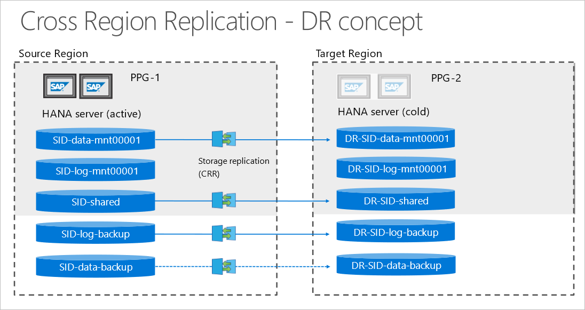
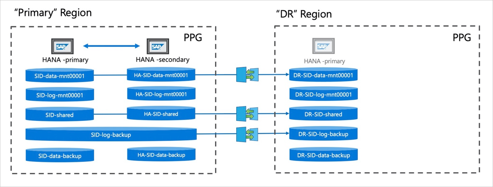
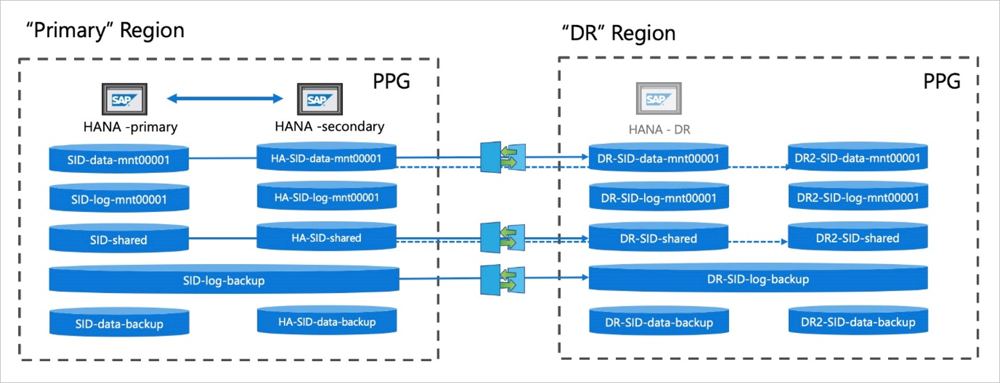

# Add volumes for an SAP HANA system as a DR system using cross-region replication

This article describes using an application volume group to add volumes for an SAP HANA system as a disaster recovery (DR) system. This configuration uses Azure NetApp Files cross-region replication (CRR) functionality.

## CRR between source and destination HANA servers

The Azure NetApp Files [cross-region replication](cross-region-replication-introduction.md) functionality enables you to replicate volumes between [supported cross-region replication pairs](cross-region-replication-introduction.md#supported-region-pairs). This functionality allows you to [replicate a volume](cross-region-replication-create-peering.md) from a source region to a volume on the destination region for disaster recovery (DR). 

Instead of using HANA System Replication (HSR), you can use cross-region replication to protect a database without needing a HANA database server that runs all the time. You need to create replication destination volumes in a region supported for cross-region replication. Application volume group for SAP HANA ensures that the destination volumes are created with the correct volume type that meets all SAP HANA specific requirements.

The following diagram illustrates cross-region replication between the source and destination HANA servers. Cross-region replication is asynchronous. As such, not all volumes need to be replicated.  

  

> [!NOTE]  
> When you use an HA deployment with HSR at the primary side, you can choose to replicate not only the primary HANA system as described in this section, but also the HANA secondary system using cross-region replication. To automatically adapt the naming convention, you select both the **HSR secondary** and **Disaster recovery destination** options in the Create a Volume Group screen. The prefix will then be changed to `DR2-`. 

> [!IMPORTANT]
> * Recovering the HANA database at the destination region requires that you use application-consistent storage snapshots for your HANA backup. You can create such snapshots by using data-protection solutions such as the [Azure Application Consistent Snapshot tool](azacsnap-introduction.md) (AzAcSnap).
> * You need to replicate at least the data volume and the log-backup volume. 
> * You can optionally replicate the data-backup volume and the shared volume. 
> * You should *never* replicate the log volume. The application volume group will create the log volume as a standard volume.

## Replication schedules, RTO, and RPO

The following table summarizes the replication schedule options. It also describes the default settings proposed by the application volume group:

|     Volume type    |     Default replication schedule    |     Available options    |     Notes    |
|---|---|---|---|
|     Data    |     Daily    |     Daily, hourly    |     The choice   you select impacts Recover Time Objective (RTO) and the amount of transferred   data.    |
|     Log    |     -    |     -    |     Log volumes aren't replicated.    |
|     SAP shared    |     Every 10 minutes    |     Every 10 minutes, hourly, daily    |     You should   choose a schedule based on your SLA requirements and the data stored in the shared   volume.    |
|     Data-backup    |     Daily    |     Daily, weekly    |     Replicating   the data-backup volumes is optional.    |
|     Log-backup    |     Every 10 minutes    |     Every 10 minutes    |     This setting   impacts Recover Point Objective (RPO).     |

The schedule for replication frequency has impacts on the SLAs: 

* **Recover Time Objective (RTO)**:  
    The minimum amount of time a recovery would take.   
    To recover by using the latest available application-consistent snapshot, all available log backups need to be replayed. RTO depends on your backup frequency and the data volume replication frequency. For example, if your backup frequency is every 6 hours and your replication schedule is "Daily", then the oldest backup could be 30 hours (24 hours + 6 hours) old. In this scenario, replaying up to 30 hours of log backups would be required.
* **Recover Point Objective (RPO)**:  
    The minimum data loss that might occur.   
    The SAP HANA log-backup frequency is typically 15 minutes, but this setting can be configured differently. Assuming a 10-minute replication schedule for log backups, the maximum loss of transaction would be `[15+10+transfer_time]` minutes.

## Add volumes  

The following example adds volumes to an SAP HANA system. The system serves as a DR destination system using cross-region replication.

[!INCLUDE [Extension 1 interface call-out](./includes/extension-one.md)]

### [Without Extension 1](#tab/without-extension-1)

1. From your NetApp account, select **Application volume groups**, and select **+Add Group**. Then, in Deployment Type, select **SAP HANA** and select **Next**. 

2. In the **SAP HANA** tab, provide HANA-specific information. 

    > [!IMPORTANT]
    > Be sure to select the **Disaster recovery destination** option to indicate that you are creating a HANA system as a cross-region replication destination.  

    * **SAP ID (SID)**:    
        The three alphanumeric-character SAP HANA system identifier.
    * **Group name**:  
        The volume group name. 
    * **SAP node memory**:  
        This value defines the size of the SAP HANA database on the host. It's used to calculate the required volume size and throughput. 
    * **Capacity overhead (%)**:  
        When you use snapshots for data protection, you need to plan for extra capacity. This field will add additional size (%) for the data volume.  
        You can estimate this value by using `"change rate per day" X "number of days retention"`.
    * **Single-host**:  
        Select this option for an SAP HANA single-host system or the first host for a multiple-host system. Only the shared, log-backup, and data-backup volumes will be created with the first host.
    * **Multiple-host**:  
        Select this option if you're adding additional hosts to a multiple-hosts HANA system.
    * **Disaster recover destination**:  
        Select this option to create volumes for a HANA system as a DR site using [cross-region replication](cross-region-replication-introduction.md).  
    
        Selecting **Disaster recover destination** triggers the naming convention for the volume group name to include `"-DR-"` to indicate a disaster-recovery setup. 

    Select **Next: Volume Group**.    

    

3. In the **Volume group** tab, provide information for creating the volume group:

* **Proximity placement group (PPG)**:  
    Specifies that the data and shared volumes are to be created close to the disaster recovery VMs.  
    Even if you don't need the VM’s for replication, you need to start at least one VM to anchor the PPG while provisioning the volumes.
* **Capacity pool**:  
    All volumes will be placed in a single manual QoS capacity pool.   
    If you want to create the log-backup and data-backup volumes in a separate capacity pool, you can choose not to add those volumes to the volume group.
* **Virtual network**:  
    Specify an existing VNet where the VMs are placed. 
* **Subnet**:  
    Specify the delegated subnet where the IP addresses for the NFS exports will be created. Ensure that you have a delegated subnet with enough free IP addresses.

Select **Next: Protocols**. 

4. In the **Protocols** section of the Volume Group tab, you can modify the **Export Policy**, which should be common to all volumes.

    Select **Next: Replication**.

5. In the **Replication** section of the Volume Group tab, the Replication Schedule field defaults to "Multiple" (disabled). The default replication schedules are different for the replicated volumes. As such, you can modify the replication schedules only for each volume individually from the Volumes tab, and not globally for the entire volume group. 

    

    Select **Next: Tags**.

6. In the **Tags** section of the Volume Group tab, you can add tags as needed for the volumes.   

    Select **Next: Volumes**. 

7. The **Volumes** tab displays the volume list.

    The volume naming convention includes a `"DR-"` prefix to indicate that the volumes belong to the disaster-recovery (destination) side of the setup.

    The Volumes tab also displays the volume type: 
 
    * **DP** - Indicates destination in the cross-region replication setting. Volumes of this type aren't online but in replication mode.
    * **RW** - Indicates that reads and writes are allowed.

    The default type for the log volume is `RW`, and the setting can't be changed.

    The default type for the data, shared, and log-backup volumes is `DP`, and the setting can't be changed.

    The default type for the data-backup volume is DP, but this setting can be changed to RW.  

    

8. Select each volume with the DP type to specify the **Source volume ID**. For more information, see [Locate the source volume resource ID](cross-region-replication-create-peering.md#locate-the-source-volume-resource-id). 
 
    You can optionally change the default replication schedule of a volume. See [Replication schedules, RTO, and RPO](#replication-schedules-rto-and-rpo) for the replication schedule options. 

    

9. After you create the volume group, set up replication by following instructions in [Authorize replication from the source volume](cross-region-replication-create-peering.md#authorize-replication-from-the-source-volume).  

    1. For each DP volume that you created, copy the volume **Resource ID**.

    2. For each source volume, select **Replication** then **Authorize**. Paste the **Resource ID** of each corresponding destination volume. 

### [Extension 1](#tab/extension-1)

1. From your NetApp account, select **Application volume groups**, and select **+Add Group**. Then, in Deployment Type, select **SAP HANA** and select **Next**. 

2. In the **SAP HANA** tab, provide HANA-specific information. 

    > [!IMPORTANT]
    > Be sure to select the **Disaster recovery destination** option to indicate that you are creating a HANA system as a cross-region replication destination.  

    * **SAP ID (SID)**:    
        The three alphanumeric-character SAP HANA system identifier.
    * **Group name**:  
        The volume group name. 
    * **SAP node memory**:  
        This value defines the size of the SAP HANA database on the host. It's used to calculate the required volume size and throughput. 
    * **Capacity overhead (%)**:  
        When you use snapshots for data protection, you need to plan for extra capacity. This field will add additional size (%) for the data volume.  
        You can estimate this value by using `"change rate per day" X "number of days retention"`.
    * **Single-host**:  
        Select this option for an SAP HANA single-host system or the first host for a multiple-host system. Only the shared, log-backup, and data-backup volumes will be created with the first host.
    * **Multiple-host**:  
        Select this option if you're adding additional hosts to a multiple-hosts HANA system.
    * **Disaster recover destination**:  
        Select this option to create volumes for a HANA system as a DR site using [cross-region replication](cross-region-replication-introduction.md).  
    
        Selecting **Disaster recover destination** triggers the naming convention for the volume group name to include `"-DR-"` to indicate a disaster-recovery setup. 

    Select **Next: Volume Group**.    

    

3. In the **Volume group** tab, provide information for creating the volume group:

    * **Availability option**:
        Select either **Availability zone** or **Proximity placement group**. 
        When selecting **Availability zone**, you must select the appropriate availability zone in the next field. 
        * **Proximity placement group (PPG)**:  
            Specifies that the data, log, and shared volumes are to be created close to the VMs.
        * **Availability Zone**: 
            This option lets you deploy the volumes in the logical availability zone that you specify. Select an availability zone where Azure NetApp Files resources are present. For details, see [Manage availability zone volume placement](manage-availability-zone-volume-placement.md).
    * **Network features**: 
        Standard network features is the default, however you can still use Basic network features. 
        See [Configure network features for a volume](configure-network-features.md) and [Guidelines for Azure NetApp Files network planning](azure-netapp-files-network-topologies.md) for details.
    * **Capacity pool**:  
        All volumes are placed in a single manual QoS capacity pool. 
        If you want to create the log-backup and data-backup volumes in a separate capacity pool, you can choose not to add those volumes to the volume group.
    * **Virtual network**:  
        Specify an existing VNet where the VMs are placed. 
    * **Subnet**:  
        Specify the delegated subnet where the IP addresses for the NFS exports are created. Ensure that you have a delegated subnet with enough free IP addresses.
    
    Select **Next: Tags**. 

Select **Next: Protocols**. 

4. In the **Protocols** section of the Volume Group tab, you can modify the **Export Policy**, which should be common to all volumes.

    Select **Next: Replication**.

5. In the **Replication** section of the Volume Group tab, the Replication Schedule field defaults to "Multiple" (disabled). The default replication schedules are different for the replicated volumes. As such, you can modify the replication schedules only for each volume individually from the Volumes tab, and not globally for the entire volume group. 

    

    Select **Next: Tags**.

6. In the **Tags** section of the Volume Group tab, you can add tags as needed for the volumes.   

    Select **Next: Volumes**. 

7. The **Volumes** tab displays the volume list.

    The volume naming convention includes a `"DR-"` prefix to indicate that the volumes belong to the disaster-recovery (destination) side of the setup.

    The Volumes tab also displays the volume type: 
 
    * **DP** - Indicates destination in the cross-region replication setting. Volumes of this type aren't online but in replication mode.
    * **RW** - Indicates that reads and writes are allowed.

    The default type for the log volume is `RW`, and the setting can't be changed.

    The default type for the data, shared, and log-backup volumes is `DP`, and the setting can't be changed.

    The default type for the data-backup volume is DP, but this setting can be changed to RW.  

    

8. Select each volume with the DP type to specify the **Source volume ID**. For more information, see [Locate the source volume resource ID](cross-region-replication-create-peering.md#locate-the-source-volume-resource-id). 
 
    You can optionally change the default replication schedule of a volume. See [Replication schedules, RTO, and RPO](#replication-schedules-rto-and-rpo) for the replication schedule options. 

    

9. After you create the volume group, set up replication by following instructions in [Authorize replication from the source volume](cross-region-replication-create-peering.md#authorize-replication-from-the-source-volume).  

    1. For each DP volume that you created, copy the volume **Resource ID**.

    2. For each source volume, select **Replication** then **Authorize**. Paste the **Resource ID** of each corresponding destination volume. 

---

## Setup options for replicating an SAP HANA database using HANA system replication for HA

In some situations, you might want to combine an HA setup of HANA system replication with a disaster-recovery (DR) setup using cross-region replication. Depending on the specific usage pattern and service-level agreement (SLA), two setup options for replication are possible. This section describes the options.  

### Replicate only the primary HANA database volumes 

In this scenario, you typically don’t change roles for primary and secondary systems. A takeover is done only in an emergency case. As such, the application-consistent snapshot backups required for cross-region replication are taken mostly on the primary host. This is the case because only the primary HANA database can be used to create a backup.

The following diagram describes this scenario:

In this scenario, a DR setup must include only the volumes of the primary HANA system. With the daily replication of the primary data volume and the log backups of both the primary and secondary systems, the system can be recovered at the DR site. In the diagram, a single volume is used for the log backups of the primary and secondary systems.

In case of a takeover by the secondary HSR host, the backups taken in the secondary system won’t be replicated, but log backups of the secondary will continue to be replicated. If a disaster happens, the system at the DR site can still be recovered using the old snapshot backup from the former primary and the replicated log backups from both hosts. RTO will increase because more logs are to be recovered, depending on how long the HSR pair will run in the takeover mode. If the takeover mode is significantly longer and RTO becomes a problem, you need to set up a new cross-region replication including the data volume of the secondary system.

The workflow for this scenario is identical to the [Add volumes](#add-volumes) workflow.

### Replicate both primary and secondary HANA database volumes  

For reasons other than HA, you might want to periodically switch roles between the primary and secondary HANA systems. In this scenario, applications-consistent backups must be created on both HANA hosts. 

The following diagram describes this scenario:

In this scenario, you might want to replicate both sets of volumes from the primary and secondary HANA systems as shown in the diagram. 

To create the volumes for the secondary replication target, the naming convention will be adapted. To distinguish between the replication of the primary and secondary database, the prefix will change from `DR` to `DR2` for the secondary HANA system. Except this name change, the workflow is identical to the [Add volumes](#add-volumes) workflow.

> [!NOTE]  
> For a detailed discussion of a disaster recovery solution for HANA with Azure NetApp Files, see [NetApp technical report TR-4891: SAP HANA disaster recovery with Azure NetApp Files](https://docs.netapp.com/us-en/netapp-solutions-sap/backup/saphana-dr-anf_data_protection_overview_overview.html). The technical report provides detailed background and examples about using cross-region replication for SAP HANA on Azure NetApp Files.

## Next steps  

* [Understand Azure NetApp Files application volume group for SAP HANA](application-volume-group-introduction.md)
* [Requirements and considerations for application volume group for SAP HANA](application-volume-group-considerations.md)
* [Deploy the first SAP HANA host using application volume group for SAP HANA](application-volume-group-deploy-first-host.md)
* [Add hosts to a multiple-host SAP HANA system using application volume group for SAP HANA](application-volume-group-add-hosts.md)
* [Add volumes for an SAP HANA system as a secondary database in HSR](application-volume-group-add-volume-secondary.md)
* [Manage volumes in an application volume group](application-volume-group-manage-volumes.md)
* [Delete an application volume group](application-volume-group-delete.md)
* [Application volume group FAQs](faq-application-volume-group.md)
* [Troubleshoot application volume group errors](troubleshoot-application-volume-groups.md)
