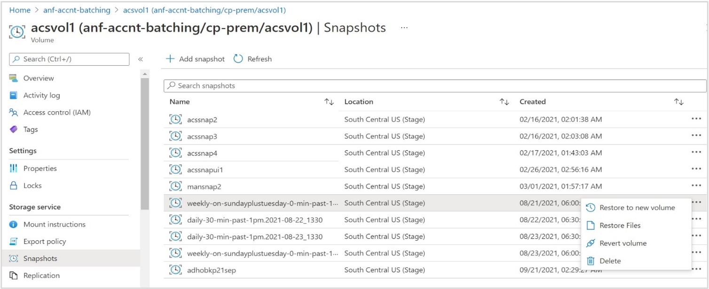

# Restore individual files using single-file snapshot restore 

If you don't want to [restore the entire snapshot to a new volume](snapshots-restore-new-volume.md) or [copy large files across the network](snapshots-restore-file-client.md), you can use the single-file snapshot restore feature to recover individual files directly within a volume from a snapshot. This option doesn't require an external client data copy.  

The single-file snapshot restore feature enables you to restore a single file or a list of files (up to 10 files at a time) from a snapshot. You can specify a specific destination location or folder for the files to be restored to.    

## Considerations  

* If you use this feature to restore files to be new files, ensure that the volume has enough logical free space to accommodate the files.
* You can restore up to 10 files at a time, specified in a total length of 1024 characters.    
* All the directories in the destination path that you specify must be present in the active file system. 
The restore operation doesn't create directories in the process. If the specified destination path is invalid (doesn't exist in Active file system), the restore operation fails.
* If you don’t specify a destination path, the files restore to the original file location. If the files already exist in the original location, they are overwritten by the files restored from the snapshot. 
* A volume can have only one active file-restore operation. If you want to restore additional files, you must wait until the current restore operation completes before initiating another restore operation.   
* *During the file restore operation*, the following restrictions apply: 
    * You can't create new snapshots on the volume.  
    * You can't delete the snapshot from which the files are being restored. 
    * Policy-scheduled snapshots can't complete during a single-file snapshot restoration operation. The scheduled snapshot is skipped.

## Steps

1. Navigate to the volume that has the snapshot to use for restoring files.    

2. Select **Snapshots** to display the list of volume snapshots.

3. Identify the snapshot you want to use, select the three dots `...` then select **Restore Files** from the menu.

    [  ](./media/snapshots-restore-file-single/snapshot-restore-files-menu.png#lightbox)

5. In the Restore Files window that appears, provide the following information:  
    1. In the **File paths** field, specify the file or files to restore using their relative paths.   
        * You can specify up to 10 files each time. If you're providing multiple files, the file paths be separated by commas or entered on new lines.
        * The maximum length of the File paths field must not exceed 1,024 characters and 10 files.
        * Regardless of the volume's protocol type (NFS, SMB, or dual protocol), directories in the path must be specified using forward slashes (`/`), not backslashes (`\`).  

    2. In the **Destination Path** field, provide the location in the volume where the specified files are to be restored to.
        * If you don't specify a destination path, the files are restored to their original location. If files with the same names already exist in the original location, they're overwritten by the files restored from the snapshot.  
        * If you specify a destination path: 
            * Ensure all directories in the path are present in the active file system. If directories in the path are absent, the restore operation fails.   
                For example, if you specify `/CurrentCopy/contoso` as the destination path, the `/CurrentCopy/contoso` path must already exist.  
            * Regardless of the volume’s protocol type (NFS, SMB, or dual protocol), directories in the path must be specified using forward slashes (`/`), not backslashes (`\`).   

    3. Select **Restore** to initiate the restore operation.

    

## Examples 
The following examples show you how to specify files from a volume snapshot for restoration. These examples use NFSv3. 

### NFS volumes (NFSv3/NFSv4.1)   

```bash
bash# sudo mkdir volume-azure-nfs
bash# sudo mount –t nfs –o rw,hard,rsize=65536,wsize=65536,vers=3,tcp 10.1.1.8:/volume-azure-nfs volume-azure-nfs
bash# cd volume-azure-nfs/.snapshot
bash# ls 
daily-10-min-past-12am.2021-09-08_0010
daily-10-min-past-12am.2021-09-09_0010
bash# cd daily-10-min-past-12am.2021-09-08_0010
bash# ls
contoso department1 department2
bash# cd contoso
bash# ls
vm-7891.vmdk vm-8976.vmdk
```

File to be restored to the active file system:   
`volume-azure-nfs/.snapshot/daily-10-min-past-12am.2021-09-08_0010/contoso/vm-8976.vmdk`

Destination path in the active file system:  
`volume-azure-nfs/currentCopy/contoso`  

The path `/volume-azure-nfs/currentCopy/contoso` must be valid in the active file system.

From the Azure portal:   

1. Select **Snapshots**. Select the three dots on the line of snapshot `daily-10-min-past-12am.2021-09-08_0010`.
2. Select **Restore Files**.
3. In **File paths**, specify the file to be restored in the active file system: **`/contoso/vm-8976.vmdk`**.
4. Specify the **Destination path** for the restore operation: **`/currentCopy/contoso`**.

### SMB volumes 

```
C:\> net use N: \\scppr2-8336.contoso.com\volume-azure-smb
N:\> cd ~snapshot
N:\ dir
Directory of N:\~snapshot
09/1110 AM    <DIR>          .
09/2256 PM    <DIR>          ..
09/0847 PM                 102,400,000 daily-10-min-past-12am.2021-09-08_0010
09/0900 PM                 106,400,000 daily-10-min-past-12am.2021-09-09_0010
N:\> cd daily-10-min-past-12am.2021-09-08_0010
N:\> dir
Directory of N:\~snapshot\daily-10-min-past-12am.2021-09-08_0010
09/1110 AM    <DIR>          .
09/2256 PM    <DIR>          ..
02/2747 PM                 102,400 contoso
04/2100 PM                 106,400 department1
N:\> cd contoso
N:\> dir
Directory of N:\~snapshot\ daily-10-min-past-12am.2021-09-08_0010\contoso
09/1110 AM    <DIR>          .
09/2256 PM    <DIR>          ..
02/2747 PM                 102,400 vm-9981.vmdk
04/2100 PM                 106,400 vm-7654.vmdk
```

File to be restored to active file system:   
`N: \~snapshot\daily-10-min-past-12am.2021-09-08_0010\contoso\vm-9981.vmdk`

Destination path in the active file system:   
`N: \currentCopy\contoso`

The path `N:\currentCopy\contoso` must be valid in the active file system.

From the Azure portal: 
1. Select **Snapshots**. Select the three dots on the line of snapshot `daily-10-min-past-12am.2021-09-08_0010`.
2. Select **Restore Files**.
3. In **File paths**, specify the file to be restored in the active file system: **`/contoso/vm-9981.vmdk`**.
4. In **Destination path**, enter the destination: **`/currentCopy/contoso`**.

## Next steps

* [Learn more about snapshots](snapshots-introduction.md) 
* [Resource limits for Azure NetApp Files](azure-netapp-files-resource-limits.md)
* [Azure NetApp Files Snapshot Overview](https://anfcommunity.com1/azure-netapp-files-snapshot-overview/)
