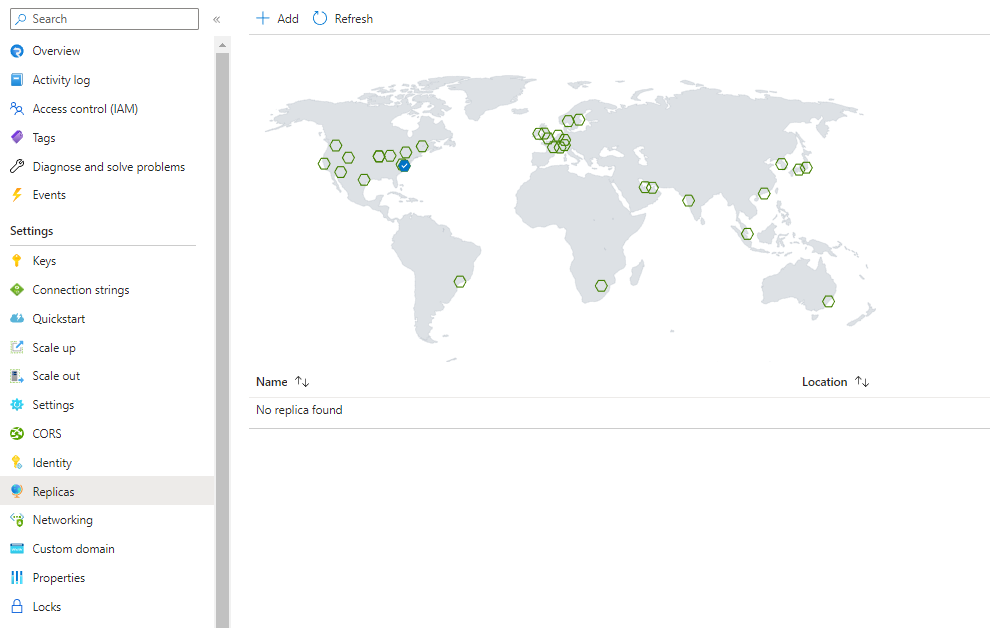

# Application Firewall for Azure SignalR Service

Application Firewall brings more sophisticated control over client connections over a distributed system. In this doc,  typical scenarios are  demonstrated to show how Application Firewall rules work and how to configure them. Before that, let's clarify what Application Firewall don't do:

1. It's not intended to replace Authentication. The firewall works behind the client conenction authentication layer.
2. It's not related to the network layer access control. 

## Prerequisites

* An Azure SignalR Service in [Premium tier](https://azure.microsoft.com/pricing/details/signalr-service/).

## Typical Scenarios

   Contoso is a software company. Its product uses Azure SignalR service to send/receive messages. 

   ### Scenario 1: Limit the connections per user
   Some users of Contoso might keep requesting tokens to establish connections. For example, one user might open tens of browser tabs or login using different devices, you can use the ThrottleByUserIdRule to limit the concurrent connection of a user.
   ### Scenario 2: Limit the token reuse
   Some malicious user might reuse the token to establish infinite connections. This brings risk of exhausting connection quota. You can use the ThrottleByJwtSignatureRule to limit the concurrent connection of the same token.
   > [!NOTE]
   > Each token generated by SDK contains a timestamp. If vast tokens are generated within seconds, the token might be identical. To avoid this, a random claim could be inserted into the token claim.
   ### Scenario 3: Advanced control by custom claim
   More advancedly, Contoso offers its service to different groups or companies. Contoso wants to put limit of the connections each group/company can have at the same time. 
   You could use the ThrottleByJwtCustomClaimRule to put different limits on different groups or companies.


## Setup Application Firewall 

# [Portal](#tab/Portal)
To use Application Firewall, Navigate to the SignalR **Application Firewall** blade on the Azure portal and click **Add** to add a rule. 



After creation, you would be able to view/edit your replica on the portal by clicking the replica name.

# [Bicep](#tab/Bicep)

Use Visual Studio Code or your favorite editor to create a file with the following content and name it main.bicep:

```bicep
@description('The name for your SignalR service')
param resourceName string = 'contoso'

resource signalr 'Microsoft.SignalRService/signalr@2024-04-01-preview' = {
  name: resourceName
  properties: {
    applicationFirewall:{
        clientConnectionCountRules:[
            // Add or remove rules as needed
            {
                type: 'ThrottleByUserIdRule'
                maxCount: 5
            }
            {
                type: 'ThrottleByJwtSignatureRule'
                maxCount: 10
            }
            {
                type: 'ThrottleByJwtCustomClaimRule'
                maxCount: 10
                customClaim: 'customClaimA'
            }
            {
                type: 'ThrottleByJwtCustomClaimRule'  
                maxCount: 10
                customClaim: 'customClaimB'
          }
        ]
    }
  }
}

```

Deploy the Bicep file using Azure CLI 
   ```azurecli
   az deployment group create --resource-group MyResourceGroup --template-file main.bicep
   ```

----

## Under the hood
To enforce the limit of concurrent client connections, what Azure SignaLR service does is aggragating different client connections. The aggragated key is extracted from the JWTToken which is generated by the app server. Thus, to make the client connections rules work, necessary claims need to exist.

##

## Avoid using too aggressive limit
SignalR service would aggregate the client connections according to the rules. Since the TCP connection might disconnect without completing the 4-way handshake, SignalR service would still count those "orphan" connections until they are disconnected because the heartbeat failure. So, a very aggresive throttling strategy might throttle the clients unexpectly. A smoother way is doubling the maxCount.

