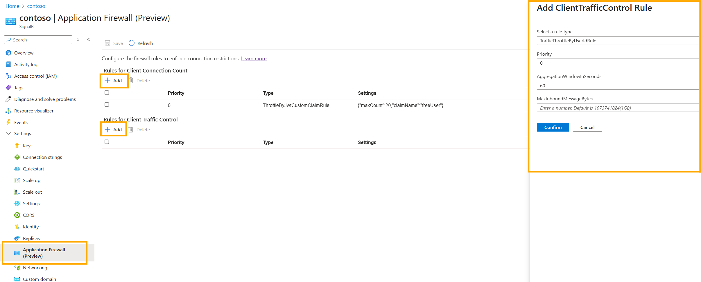

# Application Firewall for Azure SignalR Service

The Application Firewall provides sophisticated control over client connections in a distributed system. Before diving into its functionality and setup, let's clarify what the Application Firewall does not do:

1. It does not replace authentication. The firewall operates behind the client connection authentication layer.
2. It is not related to network layer access control.

## What Does the Application Firewall Do?

The Application Firewall consists of various rule lists. Currently, there is a rule list called *Client Connection Count Rules*. Future updates will support more rule lists to control aspects like connection lifetime and message throughput.

This guideline is divided into three parts:
1. Introduction to different application firewall rules.
2. Instructions on configuring the rules using the Portal or Bicep on the SignalR service side.
3. Steps to configure the token on the server side.

## Prerequisites

* An Azure SignalR Service in [Premium tier](https://azure.microsoft.com/pricing/details/signalr-service/).

## Client Connection Count Rules
Client Connection Count Rules restrict concurrent client connections. When a client attempts to establish a new connection, the rules are checked **sequentially**. If any rule is violated, the connection is rejected with a status code 429.

### Rule introduction

   #### ThrottleByUserIdRule
   This rule limits the concurrent connections of a user. For example, if a user opens multiple browser tabs or logs in using different devices, you can use this rule to restrict the number of concurrent connections for that user.

   **Note:** The UserId must exist in the access token for this rule to work. Refer to [Configure access token](#configure-access-token).

   
   #### ThrottleByJwtSignatureRule
   This rule limits the concurrent connections of the same token to prevent malicious users from reusing tokens to establish infinite connections, which can exhaust connection quota.

   **Note:** It's not guaranteed by default that tokens generated by the SDK are different each time. Though each token contaisn a timestamp, this timestamp might be the same if vast tokens are generated within seconds. To avoid identical tokens, insert a random claim into the token claims.  Refer to [Configure access token](#configure-access-token).


   #### ThrottleByJwtCustomClaimRule

   More advancedly, connections could be grouped into different groups according to custom claim. Connections with the same claim will be aggregated to do the check.  For example, you could add a *ThrottleByJwtCustomClaimRule* to allow 5 concurrent connections for those with custom claim key "freeUser".

   **Key point**: The rule applies to all claims with a certain claim name. The connection count aggregation is on the same claim (including claim name and claim value). The *ThrottleByUserIdRule* is a special case of this rule, applying to all connections with the userIdentity claim.
   


 ### Best Practice
  #### Avoid using too aggressive maxCount

  Client connections may close without completing the tcp handshake. SignalR service can't detect those "half-closed" connections immediately. The connection is taken as active until the heartbeart failure. Therefore, aggressive throttling strategies might unexpectedly throttle clients. A smoother approach is to **leave some buffer** for the connection count, for example: double the *maxCount*.


## Setup Application Firewall 

# [Portal](#tab/Portal)
To use Application Firewall, navigate to the SignalR **Application Firewall** blade on the Azure portal and click **Add** to add a rule. 



# [Bicep](#tab/Bicep)

Use Visual Studio Code or your favorite editor to create a file with the following content and name it main.bicep:

```bicep
@description('The name for your SignalR service')
param resourceName string = 'contoso'

resource signalr 'Microsoft.SignalRService/signalr@2024-04-01-preview' = {
  name: resourceName
  properties: {
    applicationFirewall:{
        clientConnectionCountRules:[
            // Add or remove rules as needed
            {
              // This rule will be skipped if no userId is set
                type: 'ThrottleByUserIdRule'
                maxCount: 5
            }
            {
                type: 'ThrottleByJwtSignatureRule'
                maxCount: 10
            }
            {
                // This rule will be skipped if no freeUser claim is set
                type: 'ThrottleByJwtCustomClaimRule'
                maxCount: 10
                claimName: 'freeUser'
            }
            {
                // This rule will be skipped if no paidUser claim is set
                type: 'ThrottleByJwtCustomClaimRule'  
                maxCount: 100
                claimName: 'paidUser'
          }
        ]
    }
  }
}

```

Deploy the Bicep file using Azure CLI 
   ```azurecli
   az deployment group create --resource-group MyResourceGroup --template-file main.bicep
   ```

----


## Configure access token
The application firewall rules only take effect when the access token contains the corresponding claim. A rule will be **skipped** if the connection does not have the corresponding claim. 

Below is an example to add userId or custom claim in the access token in **Default Mode**:

```cs
services.AddSignalR().AddAzureSignalR(options =>
    {
        //  Add necessary claims according to your rules.
        options.ClaimsProvider = context => new[]
        {
            // Add UserId: Used in ThrottleByUserIdRule
            new Claim(ClaimTypes.NameIdentifier, context.Request.Query["username"]),

            // Add unique claim: Ensure uniqueness when using ThrottleByJwtSignatureRule. 
            // The token name is not important. You could change it as you like.
            new Claim("uniqueToken", Guid.NewGuid().ToString()),
           
            // Cutom claim: Used in ThrottleByJwtCustomClaimRule
            new Claim("<Custom Claim Name>", "<Custom Claim Value>"),
            // Custom claim example
            new Claim("freeUser", context.Request.Query["username"]),
        };
    });
```
The logic for **Serverless Mode** is similar.

For more details, refer to [Client negotiation](signalr-concept-client-negotiation.md#What-can-you-do-during-negotiation) .  


