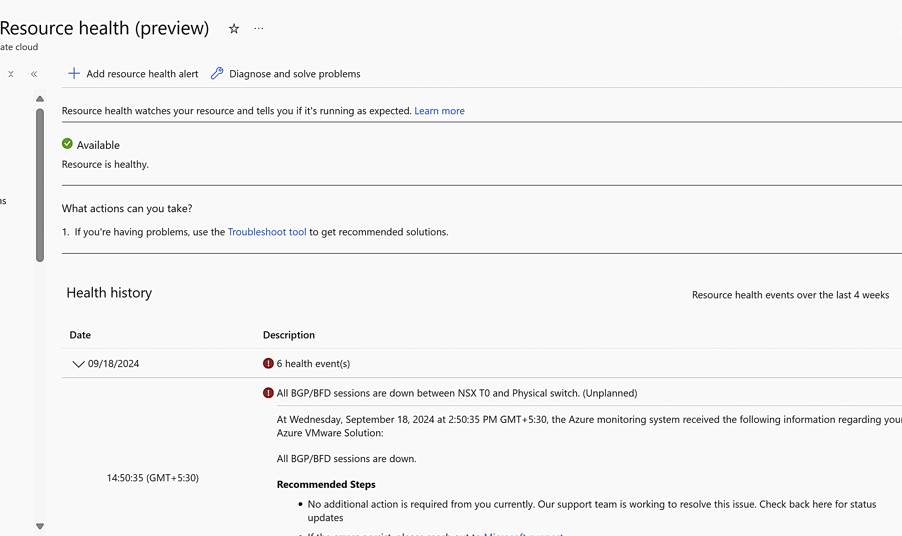
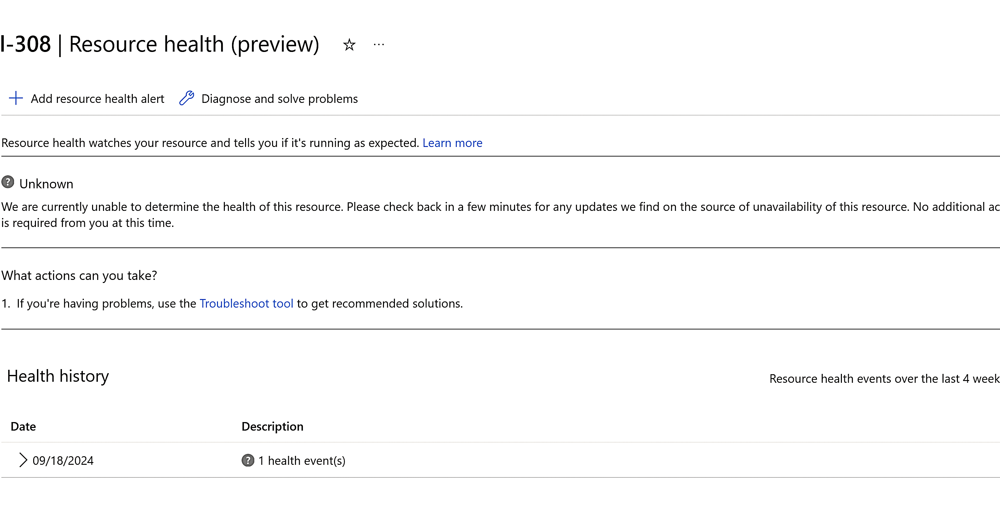
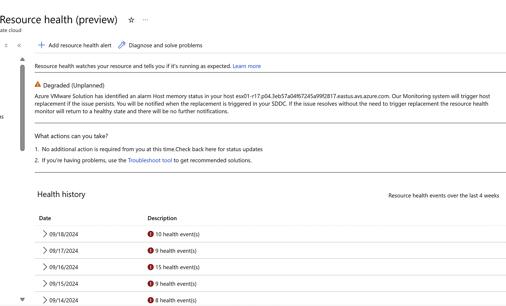

# Application performance monitoring and troubleshooting solutions for Azure VMware Solution

A key objective of Azure VMware Solution is to maintain the performance and security of applications and services across VMware on Azure and on-premises. Getting there requires visibility into complex infrastructures and quickly pinpointing the root cause of service disruptions across the hybrid cloud.  

## Microsoft solutions

Microsoft recommends [Application Insights](/azure/azure-monitor/app/app-insights-overview#application-insights-overview), a feature of [Azure Monitor](/azure/azure-monitor/overview#azure-monitor-overview), to maximize the availability and performance of your applications and services.

Learn how modern monitoring with Azure Monitor can transform your business by reviewing the [product overview, features, getting started guide and more](https://azure.microsoft.com/services/monitor).

### Azure Resource Health for Azure VMware Solution Private Cloud (Public preview)

In this article, you learn how Azure Resource Health helps you diagnose and get support for service problems that affect your Private Cloud resources. Azure Resource Health reports on the current and past health of your Private Cloud Infrastructure resources and provides you with a personalized dashboard of the health of the infrastructure resources. Azure Resource Health allows you to report on historical events and can identify every time a service is unavailable and if Service Level Agreement (SLA) is violated. 

#### Preview Enablement

You are required to register yourself for the feature preview under _Preview Features_ of Azure VMware Solution in Azure portal. Customers should first register themselves to ***"Microsoft.AVS/ResourceHealth"*** preview flag from Azure portal and once registered, all the preconfigured alerts related to Host replacement, vCenter, and other critical alarms will start to surface in the Resource Health of Azure VMware Solution (AVS) User Interface (UI).

#### Benefits of enabling Resource Health

- Resource Health feature enablement adds significant value to your monitoring capabilities. You get notified about unplanned maintenance that took place in your private cloud infrastructure.

- Resource Health gives you a personalized dashboard of the health of your resources. Resource Health shows all the time that your resources have been unavailable which makes it easy for you to check if SLA was violated.

- For the Public Preview, a group of critical alerts are enabled which notifies you about Host replacements, storage critical alarms and also about the Network health of your private cloud.

- The alerts are updated to have all the necessary information for better reporting and triage purposes.

- Resource Health uses Azure Action groups that allow you to configure Email/SMS/Webhook/ITSM and get notified via communication method of your choice.

- Once Enabled the health of your private cloud infrastructure reflects following statuses

  
  - Available
  
  - Unavailable

  - Unknown

  - Degraded

#### Available 

Available means that there are no events detected that affect the health of the resource. In cases where the resource recovered from unplanned downtime during the last 24 hours, you see a "Recently resolved" notification

#### Unavailable 

Unavailable means that the service detected an ongoing platform or nonplatform event that affects the health of the resource.

#### Unknown

Unknown means that Resource Health hasn't received information about the resource for more than 10 minutes. You may see this status under two different conditions: 

- Your subscription is not enabled for Resource Health metrics, and you need to register yourself for the preview.

- If the resource is running as expected, the status of the resource will change to Available after a few minutes. If you experience problems with the resource, the Unknown health status might mean that an event in the private cloud is affecting the resource.

#### Degraded

Degraded means that Resource Health detected a loss in performance in either one or more private cloud resources, although it's still available for use. Different resources have their own criteria for when they report that they are degraded.

#### 

#### Pre-configured Alarms enabled in Azure Resource Health

|Alert Name|Remediation Mode|
| -------- | -------- |
|Physical Disk Health Alarm |System Remediation|
|System Board Health Alarm|System Remediation|
| Memory Health Alarm|System Remediation|
|Storage Health Alarm|System Remediation|
|Temperature Health Alarm |System Remediation|
|Host Connection State Alarm|System Remediation|
|High Availability (HA) host Status |System Remediation|
| Network Connectivity Lost Alarm|System Remediation|
|Virtual Storage (vSAN) Host Disk Error Alarm|System Remediation|
|Voltage Health Alarm |System Remediation|
|Processor Health Alarm| System Remediation|
|Fan Health Alarm|System Remediation|
|High pNIC error rate detected|System Remediation|
|iDRAC critical alerts if there are hardware faults (CPU/DIMM/PCI bus/Voltage issues)|System Remediation|
|vSphere HA restarted a virtual machine|System Remediation|
|Virtual Storage (vSAN) High Disk Utilization|Customer Intervention Required|
|Replacement Start and Stop Notification|System Remediation|
|Repair Service notification to customers (Host reboot and Restart of Management services) |System Remediation|
|Notification to customer when a Virtual Machine is configured to use an external device that prevents a maintenance operation|Customer Intervention Required|
| Customer notification when CD-ROM is mounted on the Virtual Machine and its ISO image isn't accessible and blocks maintenance operation|Customer Intervention Required|
|Notification to customer when an external Datastore mounted becomes inaccessible and will block maintenance operations|Customer Intervention Required|
|Notification to customer when connected network adapter becomes inaccessible and blocks any maintenance operations|Customer Intervention Required|
|VMware Network (NSX –T) alarms (Customer notification about License expiration)|Customer Intervention Required|

#### Next Steps

Now that you have configured an alert rule for your Azure VMware Solution private cloud, you can learn more about: 

-  [Azure Resource Health](/azure/service-health/resource-health-overview)

-  [Azure Monitor](/azure/azure-monitor/overview)

-  [Azure Action Groups](/azure/azure-monitor/alerts/action-groups)

You can also continue with one of the other Azure VMware Solution how-to [guides](/azure/azure-vmware/deploy-azure-vmware-solution?tabs=azure-portal)

## Third-party solutions
Our application performance monitoring and troubleshooting partners have industry-leading solutions in VMware-based environments that assure the availability, reliability, and responsiveness of applications and services. You can adopt many of the solutions integrated with VMware NSX-T Data Center for their on-premises deployments. As one of our key principles, we want to enable you to continue to use your investments and VMware solutions running on Azure. Many of the Independent Software Vendors (ISV) already validated their solutions with Azure VMware Solution.

You can find more information about these solutions here:

- [NETSCOUT](https://www.netscout.com/technology-partners/microsoft-azure)
- [Turbonomic](https://www.ibm.com/products/turbonomic/integrations/microsoft-azure?mhsrc=ibmsearch_a&mhq=Azure)
