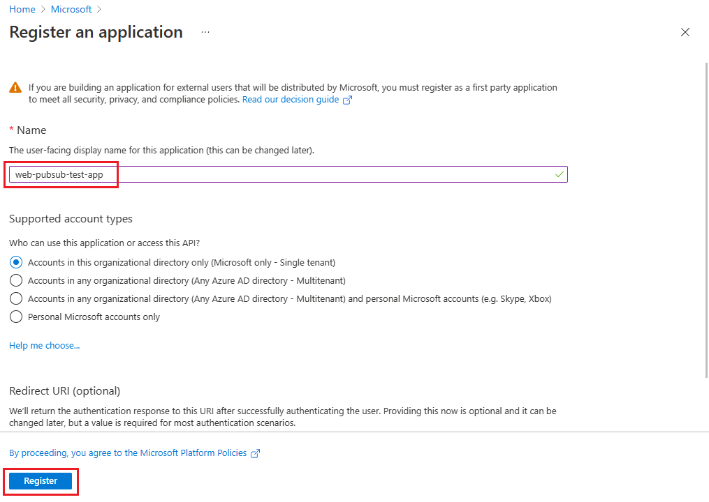
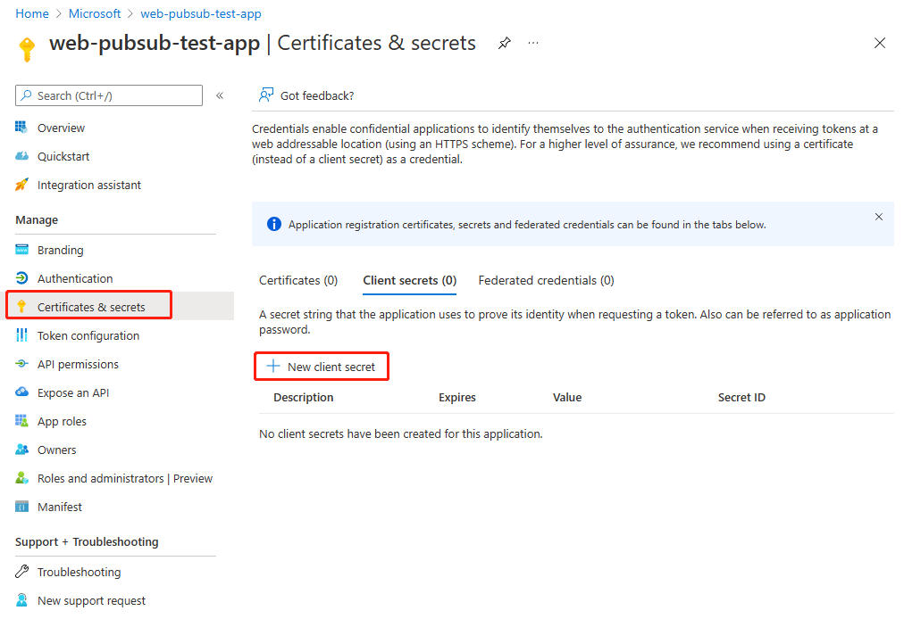
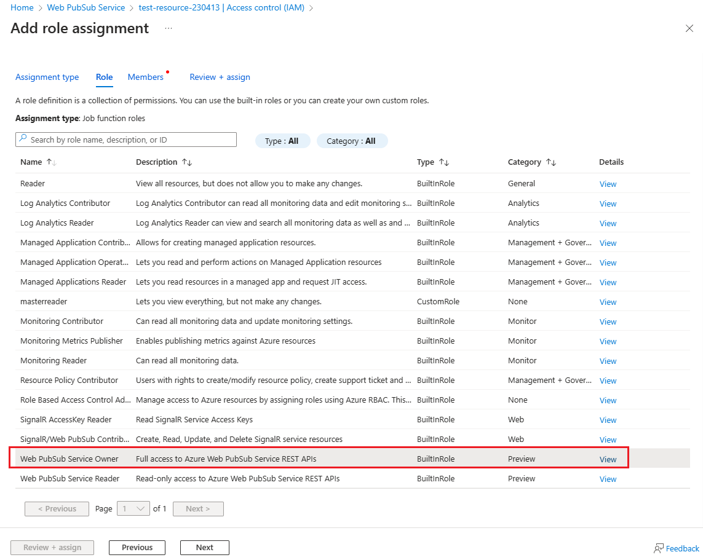
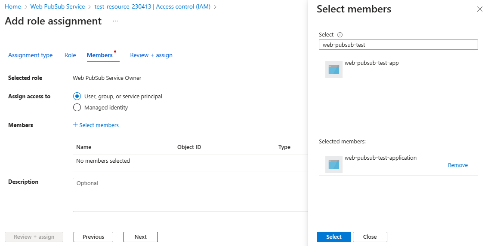

# Authorize an application request by using Microsoft Entra ID

Azure Web PubSub supports Microsoft Entra ID for authorizing requests from [applications](../active-directory/develop/app-objects-and-service-principals.md).

This article shows you how to configure your Web PubSub resource and codes to authorize the request to a Web PubSub resource from an Azure application.

## Register an application

The first step is to register an Azure application.

1. In the [Azure portal](https://portal.azure.com/), search for and then select **Microsoft Entra ID**
1. On the left menu under **Manage**, select **App registrations**.
1. Select **New registration**.

   

1. Enter a display **Name** for your application.
1. Select **Register** to confirm the register.

When your application is registered, go to the application **Overview** pane to view the values for **Application (client) ID** and **Directory (tenant) ID**. You use these values in the following sections.

For more information about registering an application, see the quickstart [Register an application by using the Microsoft identity platform](../active-directory/develop/quickstart-register-app.md).

## Add credentials

You can add both certificates and client secrets (a string) as credentials to your confidential client app registration.

### Client secret

The application requires a client secret for a client to prove its identity when it requests a token.

To create a client secret:

1. On the left menu under **Manage**, select **Certificates & secrets**.
1. On the **Client secrets** tab, select **New client secret**.

   
1. Enter a description for the client secret, and then choose an expire time for the secret.
1. Copy the value of the client secret, and then paste it to a secure location to save for later use.

   > [!NOTE]
   > The secret is visible only when you create the secret. You can't view the client secret in the portal later.

### Certificate

You can also upload a certificate instead of creating a client secret.

For information about adding credentials, see [Add credentials](../active-directory/develop/quickstart-register-app.md#add-credentials).

## Add a role assignment in the Azure portal

This section demonstrates how to assign a Web PubSub Service Owner role to a service principal (application) for a Web PubSub resource.

> [!NOTE]
> You can assign a role to any scope, including management group, subscription, resource group, and single resource. For more information about scope, see [Understand scope for Azure RBAC](../role-based-access-control/scope-overview.md).

1. In the [Azure portal](https://portal.azure.com/), go to your Web PubSub resource.

1. On the left menu, select **Access control (IAM)** to display access control settings for your Web PubSub resource.

1. Select the **Role assignments** tab and view the role assignments at this scope.

   The following screenshot shows an example of the Access control (IAM) pane for a Web PubSub resource:

   

1. Select **Add** > **Add role assignment**.

1. Select the **Roles** tab, and then select **Web PubSub Service Owner**.

1. Select **Next**.

   

1. Select the **Members** tab. Under **Assign access to**, select **User, group, or service principal**.

1. Choose **Select Members**

1. Search for and select the application that you want to assign the role to.

1. Choose **Select** to confirm the selection.

1. Select **Next**.

   

1. Select **Review + assign** to confirm the change.

> [!IMPORTANT]
> Azure role assignments might take up to 30 minutes to propagate.

To learn more about how to assign and manage Azure role assignments, see these articles:

- [Assign Azure roles by using the Azure portal](../role-based-access-control/role-assignments-portal.yml)
- [Assign Azure roles by using REST API](../role-based-access-control/role-assignments-rest.md)
- [Assign Azure roles by using Azure PowerShell](../role-based-access-control/role-assignments-powershell.md)
- [Assign Azure roles by using the Azure CLI](../role-based-access-control/role-assignments-cli.md)
- [Assign Azure roles by using an Azure Resource Manager template](../role-based-access-control/role-assignments-template.md)

## Use Postman to get the Microsoft Entra token

1. Open Postman.

1. For **Method**, select **GET**.

1. For **URI**, enter `https://login.microsoftonline.com/<TENANT ID>/oauth2/token`. Replace `<TENANT ID>` with the value for **Directory (tenant) ID** on the **Overview** tab of the application you created.

1. Select the **Headers** tab, and then add the following keys and values:

   1. For **Key**, select **Content-Type**.
   1. For **Value**, enter `application/x-www-form-urlencoded`.

   

1. Select the **Body** tab.
1. Select the body type **x-www-form-urlencoded**.
1. Under **Key**, add the following keys and values:

   1. Select **grant_type**, and then select the value **client_credentials**.
   1. Select **client_id**, and then paste the value of **Application (client) ID** from the **Overview** tab of the application you created.
   1. Select **client_secret**, and then paste the value of client secret you saved.
   1. Select **resource**, and then enter `https://webpubsub.azure.com` for the value.

   

1. Select **Send** to send the request to get the token. The value for `access_token` is the access token.

   

## Code samples that use Microsoft Entra authorization

Get samples that use Microsoft Entra authorization in our four officially supported programming languages:

- [C#](./howto-create-serviceclient-with-net-and-azure-identity.md)
- [Python](./howto-create-serviceclient-with-python-and-azure-identity.md)
- [Java](./howto-create-serviceclient-with-java-and-azure-identity.md)
- [JavaScript](./howto-create-serviceclient-with-javascript-and-azure-identity.md)

## Related content

- [Overview of Microsoft Entra ID for Web PubSub](concept-azure-ad-authorization.md)
- [Use Microsoft Entra ID to authorize a request from a managed identity to Web PubSub resources](howto-authorize-from-managed-identity.md)
- [Disable local authentication](./howto-disable-local-auth.md)
