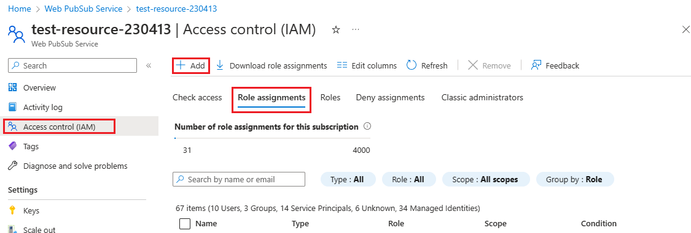
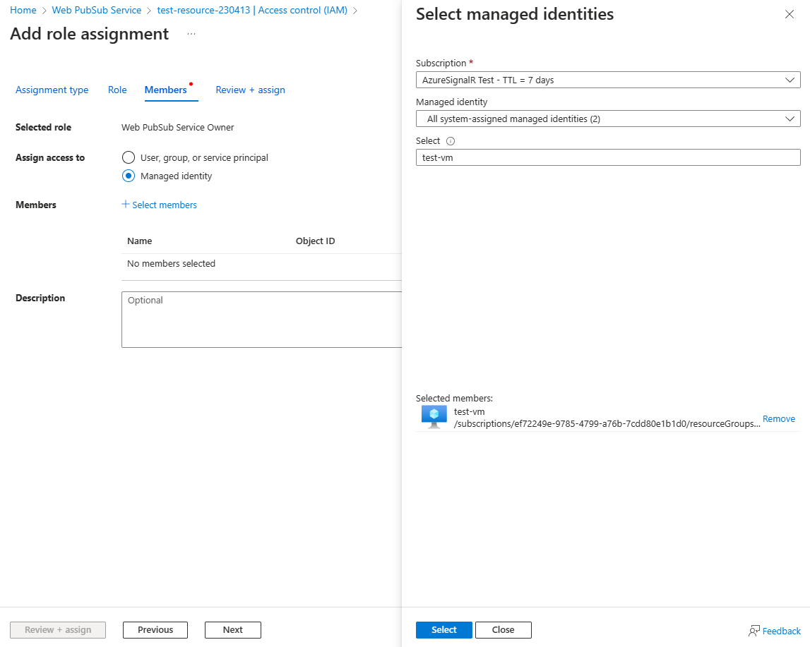

# Authorize a managed identity request to Web PubSub resources by using Microsoft Entra ID

Azure Web PubSub Service supports Microsoft Entra ID for authorizing requests from [managed identities](../active-directory/managed-identities-azure-resources/overview.md).

This article shows you how to configure your Web PubSub resource and codes to authorize the request to a Web PubSub resource from a managed identity.

## Configure managed identities

The first step is to configure managed identities.

In this section, you set a system-assigned managed identity on a virtual machine by using the Azure portal.

1. In the [Azure portal](https://portal.azure.com/), search for and then select a virtual machine (VM).
1. Under **Settings**, select **Identity**.
1. On the **System assigned** tab, set **Status** to **On**.

   
1. Select the **Save** button to confirm the change.

### Create a user-assigned managed identity

Learn how to [create a user-assigned managed identity](../active-directory/managed-identities-azure-resources/how-manage-user-assigned-managed-identities.md#create-a-user-assigned-managed-identity).

### Configure managed identities on other platforms

- [Configure managed identities for Azure resources on a VM by using the Azure portal](../active-directory/managed-identities-azure-resources/qs-configure-portal-windows-vm.md)
- [Configure managed identities for Azure resources on an Azure VM by using Azure PowerShell](../active-directory/managed-identities-azure-resources/qs-configure-powershell-windows-vm.md)
- [Configure managed identities for Azure resources on an Azure VM by using the Azure CLI](../active-directory/managed-identities-azure-resources/qs-configure-cli-windows-vm.md)
- [Configure managed identities for Azure resources on an Azure VM by using a template](../active-directory/managed-identities-azure-resources/qs-configure-template-windows-vm.md)
- [Configure a VM with managed identities for Azure resources by using an Azure SDK](../active-directory/managed-identities-azure-resources/qs-configure-sdk-windows-vm.md)

### Configure managed identities for Azure App Service and Azure Functions

Learn how to [use managed identities for App Service and Azure Functions](../app-service/overview-managed-identity.md).

## Add a role assignment in the Azure portal

This section demonstrates how to assign the Web PubSub Service Owner role to a system-assigned identity for a Web PubSub resource.

> [!NOTE]
> You can assign a role to any scope, including management group, subscription, resource group, and single resource. For more information about scope, see [Understand scope for Azure RBAC](../role-based-access-control/scope-overview.md).

1. In the [Azure portal](https://portal.azure.com/), go to your Web PubSub resource.

1. On the left menu, select **Access control (IAM)** to display access control settings for your Web PubSub service.

1. Select the **Role assignments** tab and view the role assignments at this scope.

   The following screenshot shows an example of the Access control (IAM) pane for a Web PubSub resource:

   

1. Select **Add** > **Add role assignment**.

1. Select the **Roles** tab, and then select **Web PubSub Service Owner**.

1. Select **Next**.

   

1. Select the **Members** tab. Under **Assign access to**, select **Managed identity**.

1. Choose **Select Members**.

1. On the **Select managed identities** pane, select **System-assigned managed identity** > **Virtual machine**.

1. Search for and then select the virtual machine that you want to assign the role to.

1. Select **Select** to confirm the selection.

1. Select **Next**.

   

1. Select **Review + assign** to confirm the change.

> [!IMPORTANT]
> Azure role assignments might take up to 30 minutes to propagate.

To learn more about how to assign and manage Azure role assignments, see these articles:

- [Assign Azure roles by using the Azure portal](../role-based-access-control/role-assignments-portal.yml)
- [Assign Azure roles by using REST API](../role-based-access-control/role-assignments-rest.md)
- [Assign Azure roles by using Azure PowerShell](../role-based-access-control/role-assignments-powershell.md)
- [Assign Azure roles by using the Azure CLI](../role-based-access-control/role-assignments-cli.md)
- [Assign Azure roles by using an Azure Resource Manager template](../role-based-access-control/role-assignments-template.md)

## Sample codes that use Microsoft Entra authorization

Get samples that use Microsoft Entra authorization in our four officially supported programming languages:

- [C#](./howto-create-serviceclient-with-net-and-azure-identity.md)
- [Python](./howto-create-serviceclient-with-python-and-azure-identity.md)
- [Java](./howto-create-serviceclient-with-java-and-azure-identity.md)
- [JavaScript](./howto-create-serviceclient-with-javascript-and-azure-identity.md)

## Related content

- [Overview of Microsoft Entra ID for Web PubSub](concept-azure-ad-authorization.md)
- [Authorize request to Web PubSub resources with Microsoft Entra ID from Azure applications](howto-authorize-from-application.md)
- [Disable local authentication](./howto-disable-local-auth.md)
