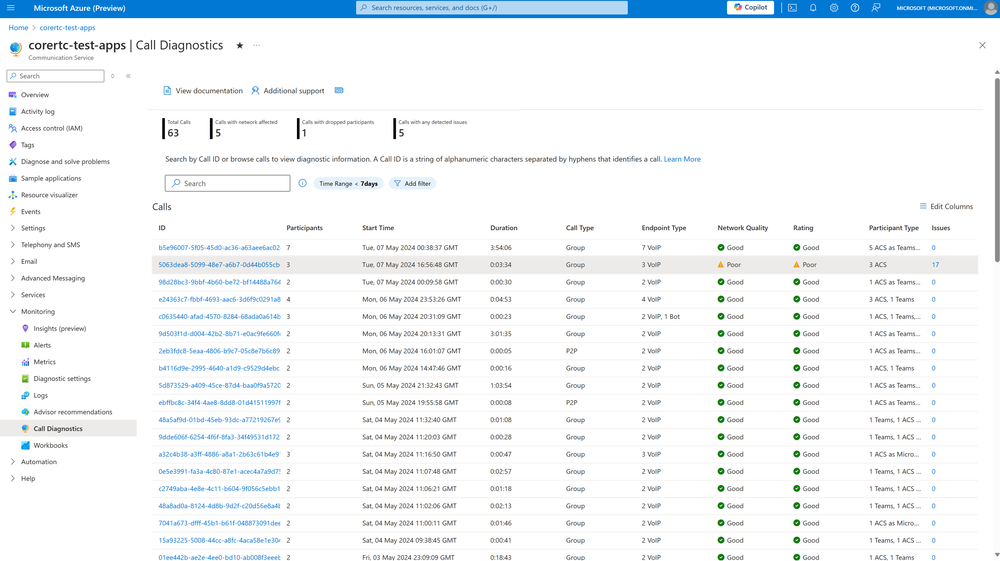
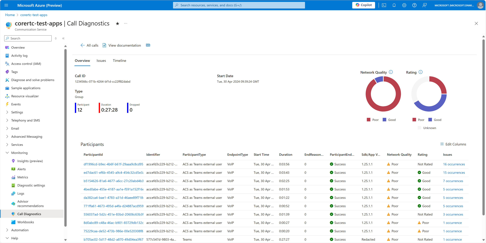
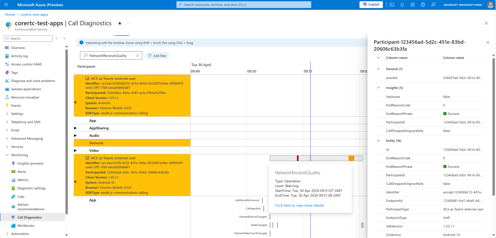
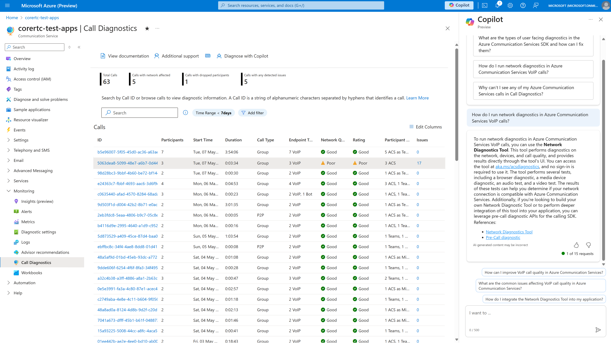

# Call Diagnostics

Azure Communication Services offers call quality analytics and visualizations in Call Diagnostics. You can use this feature to investigate call metrics, investigate events, and understand detected quality problems in your Communication Services calling solution.

Understanding call quality and reliability is foundational to delivering a great customer experience. Various problems can affect the quality of calls, such as poor internet connectivity, software incompatibilities, and technical difficulties with devices. These problems can be frustrating for all call participants, whether they're a patient checking in for a doctor's call or a student taking a lesson with a teacher. For a developer, diagnosing and fixing these problems can be time-consuming.

Call Diagnostics acts as a detective for calls. It helps developers who use Azure Communication Services to investigate events that happened in a call. The goal of the investigation is to identify likely causes of poor call quality and reliability.

Just like a real conversation, many things happen simultaneously in a call that might or might not affect communication. The timeline in Call Diagnostics makes it easier to visualize what happened in a call. It shows you rich data visualizations of call events and provides insights into problems that commonly affect calls.

## How to enable Call Diagnostics

Azure Communication Services collects call data in the form of metrics and events. For Call Diagnostics to analyze new call data, you must enable a diagnostic setting in Azure Monitor. Azure Monitor then sends this data to a Log Analytics workspace.

> [!IMPORTANT]
> Call Diagnostics can query only data that's sent to a Log Analytics workspace. Diagnostic settings begin collecting data by a single Azure Communications Services resource ID after you enable the diagnostic setting.

Because Call Diagnostics is an application layer on top of data for your Azure Communications Services resource, you can query the call data and [build workbook reports on top of your data](/azure/azure-monitor/logs/data-platform-logs#built-in-insights-and-custom-dashboards-workbooks-and-reports).

You can access Call Diagnostics from any Azure Communication Services resource in the Azure portal. After you open your Azure Communications Services resource, look for the **Monitoring** section on the service menu and select **Call Diagnostics**.

After you set up Call Diagnostics for your Azure Communication Services resource, you can search for calls by using valid IDs for calls that took place in that resource. Data can take several hours after call completion to appear in your resource and populate in Call Diagnostics.

The following sections describe the main areas of the **Call Diagnostics** pane in the portal.

## Call search

The portal lists all calls by default. The search box lets you find individual calls, or filter calls to explore calls that have problems. Selecting a call takes you to a detail pane that has three tabs: **Overview**, **Issues**, and **Timeline**.

You can search by call ID in the search box. To find a call ID, see [Access your client call ID](../troubleshooting-info.md#access-your-client-call-id).

> [!NOTE]
> You can explore information icons and links within Call Diagnostics to learn functionality, definitions, and helpful tips.

## Call overview

After you select a call, its details appear on the **Overview** tab. This tab shows a call summary that highlights the participants and key metrics for their call quality. You can select a participant to drill into their call timeline details directly, or you can go to the **Issues** tab for further analysis.

## Call issues

The **Issues** tab gives you a high-level analysis of any media quality and reliability problems that Call Diagnostics detected during the call.

This tab highlights detected problems commonly known to affect a user's call quality, such as poor network conditions, speaking while muted, or device failures. If you want to explore a detected problem, select the highlighted item. A prepopulated view of the related events appears on the **Timeline** tab.

## Call timeline

When call problems are difficult to troubleshoot, you can explore the **Timeline** tab to see a detailed sequence of events that occurred during the call.

The timeline view is complex. It's designed for developers who need to explore details of a call and interpret detailed debugging data. In large calls, the timeline view can present an overwhelming amount of information. We recommend that you use filtering to narrow your search results and reduce complexity.

You can view detailed call logs for each participant within a call. Call information might not be present for various reasons, such as privacy constraints between calling resources.

## Copilot in Azure for Call Diagnostics

AI can help app developers across every step of the development lifecycle: designing, building, and operating. Developers can use [Microsoft Copilot in Azure (preview)](../../../copilot/overview.md) within Call Diagnostics to understand and resolve a variety of calling problems. For example, developers can ask Copilot in Azure these questions:

- How do I run network diagnostics in Azure Communication Services VoIP calls?
- How can I optimize my calls for poor network conditions?
- What are the common causes of poor media streams in Azure Communication Services calls?
- The video on my call didn't work. How do I fix the subcode 41048?

## Frequently asked questions

### How do I set up Call Diagnostics?

Follow instructions to add diagnostic settings for your resource in [Enable logs via Diagnostic Settings in Azure Monitor](../analytics/enable-logging.md). We recommend that you initially collect all logs. After you understand the capabilities in Azure Monitor, determine which logs you want to retain and for how long. When you add your diagnostic setting, you're prompted to [select logs](../analytics/enable-logging.md#adding-a-diagnostic-setting). To collect all logs, select **allLogs**.

Your data volume, retention, and Call Diagnostics query usage in Log Analytics within Azure Monitor is billed through existing Azure data meters. We recommend that you monitor your data usage and retention policies for cost considerations as needed. For more information, see [Controlling costs](/azure/azure-monitor/essentials/diagnostic-settings#controlling-costs).

If you have multiple Azure Communications Services resource IDs, you must enable these settings for each resource ID and query call details for participants within their respective resource IDs.

Participants who join from other Azure Communication Services resources have limited information in Call Diagnostics. The participants who belong to the resource when you open Call Diagnostics have all available insights shown.

### What are the common call problems I might see, and how can I fix them?

Here are resources for common call problems:

- For an overview of troubleshooting strategies and for more information on isolating call problems, see [Overview of general troubleshooting strategies](../../resources/troubleshooting/voice-video-calling/general-troubleshooting-strategies/overview.md).

- For descriptions of common error messages, see [Understanding error messages and codes](../../resources/troubleshooting/voice-video-calling/general-troubleshooting-strategies/understanding-error-codes.md).

- If users can't join calls, see [Overview of call setup issues](../../resources/troubleshooting/voice-video-calling/call-setup-issues/overview.md).

- If users have camera or microphone problems (for example, they can't hear someone), see [Overview of device and permission issues](../../resources/troubleshooting/voice-video-calling/device-issues/overview.md).

- If call participants have audio problems (for example, they sound like a robot or hear an echo), see [Overview of audio issues](../../resources/troubleshooting/voice-video-calling/audio-issues/overview.md).

- If call participants have video problems (for example, their video looks fuzzy or cuts in and out), see [Overview of video issues](../../resources/troubleshooting/voice-video-calling/video-issues/overview.md).

### How do I use Copilot in Azure (preview) in Call Diagnostics?

Your organization manages access to [Microsoft Copilot in Azure (preview)](../../../copilot/overview.md). After your organization has access to Copilot in Azure, the Call Diagnostics interface includes the **Diagnose with Copilot** option in the search area, on the **Overview** tab, and on the **Issues** tab.

Use Copilot in Azure for Call Diagnostics to improve call quality by detailing problems faced during Azure Communication Services calls. Giving Copilot in Azure detailed information from Call Diagnostics will help it enhance analysis, identify problems, and identify fixes. Be aware that Copilot in Azure currently lacks programmatic access to your call details.

## Related content

- Learn how to manage call quality: [Improve and manage call quality](manage-call-quality.md).
- Explore troubleshooting guidance: [Overview of audio issues](../../resources/troubleshooting/voice-video-calling/audio-issues/overview.md).
- Learn about other quality best practices: [Best practices: Azure Communication Services calling SDKs](../best-practices.md).
- Learn how to use the Log Analytics workspace: [Log Analytics tutorial](/azure/azure-monitor/logs/log-analytics-tutorial).
- Create your own queries in Log Analytics: [Get started with log queries in Azure Monitor](/azure/azure-monitor/logs/get-started-queries).
- Explore known call issues: [Known issues in the SDKs and APIs](../known-issues.md).
