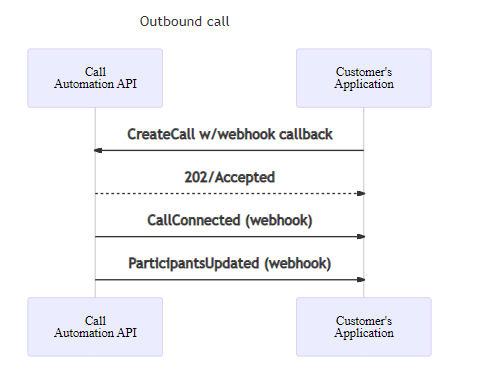
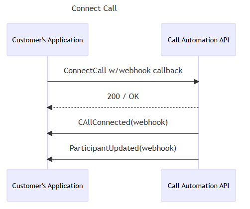
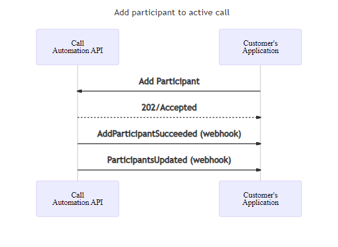
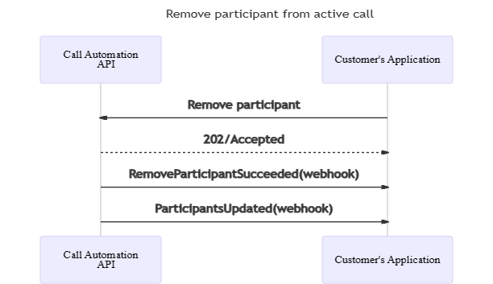

# How to control and steer calls with Call Automation

Call Automation uses a REST API interface to receive requests for actions and provide responses to notify whether the request was successfully submitted or not. Due to the asynchronous nature of calling, most actions have corresponding events that are triggered when the action completes successfully or fails. This guide covers the  actions available for steering calls, like CreateCall, Transfer, Redirect, and managing participants. Actions are accompanied with sample code on how to invoke the said action and sequence diagrams describing the events expected after invoking an action. These diagrams help you visualize how to program your service application with Call Automation.

Call Automation supports various other actions to manage call media and recording that have separate guides.

As a prerequisite, we recommend you to read these articles to make the most of this guide:

1. Call Automation [concepts guide](../../concepts/call-automation/call-automation.md#call-actions) that describes the action-event programming model and event callbacks.
2. Learn about [user identifiers](../../concepts/identifiers.md#the-communicationidentifier-type) like CommunicationUserIdentifier and PhoneNumberIdentifier used in this guide.

For all the code samples, `client` is CallAutomationClient object that can be created as shown and `callConnection` is the CallConnection object obtained from Answer or CreateCall response. You can also obtain it from callback events received by your application.

## [csharp](#tab/csharp)

```csharp
var client = new CallAutomationClient("<resource_connection_string>"); 
```

## [Java](#tab/java)

```java
 CallAutomationClient client = new CallAutomationClientBuilder().connectionString("<resource_connection_string>").buildClient();
```

## [JavaScript](#tab/javascript)

```javascript
const client = new CallAutomationClient("<resource_connection_string>");
```

## [Python](#tab/python)

```python
call_automation_client = CallAutomationClient.from_connection_string("<resource_connection_string>")
```

-----

## Make an outbound call

You can place a 1:1 or group call to a communication user or phone number (public or Communication Services owned number).
When calling a PSTN endpoint, you also need to provide a phone number that is used as the source caller ID and shown in the call notification to the target PSTN endpoint.
To place a call to a Communication Services user, you need to provide a CommunicationUserIdentifier object instead of PhoneNumberIdentifier.  

### [csharp](#tab/csharp)

```csharp
Uri callbackUri = new Uri("https://<myendpoint>/Events"); //the callback endpoint where you want to receive subsequent events 
var callerIdNumber = new PhoneNumberIdentifier("+16044561234"); // This is the Azure Communication Services provisioned phone number for the caller  
var callThisPerson = new CallInvite(new PhoneNumberIdentifier("+16041234567"), callerIdNumber); // person to call
CreateCallResult response = await client.CreateCallAsync(callThisPerson, callbackUri);
```

### [Java](#tab/java)

```java
String callbackUri = "https://<myendpoint>/Events"; //the callback endpoint where you want to receive subsequent events
PhoneNumberIdentifier callerIdNumber = new PhoneNumberIdentifier("+18001234567"); // This is the Azure Communication Services provisioned phone number for the caller  
CallInvite callInvite = new CallInvite(new PhoneNumberIdentifier("+16471234567"), callerIdNumber); // person to call
CreateCallResult response = client.createCall(callInvite, callbackUri).block();
```

### [JavaScript](#tab/javascript)

```javascript
const callInvite = {
    targetParticipant: { phoneNumber: "+18008008800" }, // person to call
    sourceCallIdNumber: { phoneNumber: "+18888888888" } // This is the Azure Communication Services provisioned phone number for the caller
};
const callbackUri = "https://<myendpoint>/Events"; // the callback endpoint where you want to receive subsequent events 
const response = await client.createCall(callInvite, callbackUri);
```

### [Python](#tab/python)

```python
callback_uri = "https://<myendpoint>/Events"  # the callback endpoint where you want to receive subsequent events
caller_id_number = PhoneNumberIdentifier(
    "+18001234567"
)  # This is the Azure Communication Services provisioned phone number for the caller
call_invite = CallInvite(
    target=PhoneNumberIdentifier("+16471234567"),
    source_caller_id_number=caller_id_number,
)
call_connection_properties = client.create_call(call_invite, callback_uri)
```

-----
When making a group call that includes a phone number, you must provide a phone number that is used as a caller ID number to the PSTN endpoint.

### [csharp](#tab/csharp)

```csharp
Uri callbackUri = new Uri("https://<myendpoint>/Events"); //the callback endpoint where you want to receive subsequent events 
var pstnEndpoint = new PhoneNumberIdentifier("+16041234567");
var voipEndpoint = new CommunicationUserIdentifier("<user_id_of_target>"); //user id looks like 8:a1b1c1-...
var groupCallOptions = new CreateGroupCallOptions(new List<CommunicationIdentifier>{ pstnEndpoint, voipEndpoint }, callbackUri)
{
    SourceCallerIdNumber = new PhoneNumberIdentifier("+16044561234"), // This is the Azure Communication Services provisioned phone number for the caller
};
CreateCallResult response = await client.CreateGroupCallAsync(groupCallOptions);
```

### [Java](#tab/java)

```java
String callbackUri = "https://<myendpoint>/Events"; //the callback endpoint where you want to receive subsequent events
PhoneNumberIdentifier callerIdNumber = new PhoneNumberIdentifier("+18001234567"); // This is the Azure Communication Services provisioned phone number for the caller
List<CommunicationIdentifier> targets = new ArrayList<>(Arrays.asList(new PhoneNumberIdentifier("+16471234567"), new CommunicationUserIdentifier("<user_id_of_target>")));
CreateGroupCallOptions groupCallOptions = new CreateGroupCallOptions(targets, callbackUri);
groupCallOptions.setSourceCallIdNumber(callerIdNumber);
Response<CreateCallResult> response = client.createGroupCallWithResponse(createGroupCallOptions).block();
```

### [JavaScript](#tab/javascript)

```javascript
const callbackUri = "https://<myendpoint>/Events"; // the callback endpoint where you want to receive subsequent events 
const participants = [
    { phoneNumber: "+18008008800" },
    { communicationUserId: "<user_id_of_target>" }, //user id looks like 8:a1b1c1-...
];
const createCallOptions = {
    sourceCallIdNumber: { phoneNumber: "+18888888888" }, // This is the Azure Communication Services provisioned phone number for the caller
};
const response = await client.createGroupCall(participants, callbackUri, createCallOptions);
```

### [Python](#tab/python)

```python
callback_uri = "https://<myendpoint>/Events"  # the callback endpoint where you want to receive subsequent events
caller_id_number = PhoneNumberIdentifier(
    "+18888888888"
)  # This is the Azure Communication Services provisioned phone number for the caller
pstn_endpoint = PhoneNumberIdentifier("+18008008800")
voip_endpoint = CommunicationUserIdentifier(
    "<user_id_of_target>"
)  # user id looks like 8:a1b1c1-...
call_connection_properties = client.create_group_call(
    target_participants=[voip_endpoint, pstn_endpoint],
    callback_url=callback_uri,
    source_caller_id_number=caller_id_number,
)
```

-----
The response provides you with CallConnection object that you can use to take further actions on this call once it's connected. Once the call is answered, two events are published to the callback endpoint you provided earlier:

1. `CallConnected` event notifying that the call has been established with the callee.
2. `ParticipantsUpdated` event that contains the latest list of participants in the call.


## Connect to a call (in preview)
[!INCLUDE [Public Preview Disclaimer](../../includes/public-preview-include-document.md)]

Connect action enables your service to establish a connection with an ongoing call and take actions on it. This is useful to manage a Rooms call or when client applications started a 1:1 or group call that Call automation isn't part of. Connection is established using the CallLocator property and can be of types: ServerCallLocator, GroupCallLocator, and RoomCallLocator. These IDs can be found when the call is originally established or a Room is created, and also published as part of [CallStarted](./../../../event-grid/communication-services-voice-video-events.md#microsoftcommunicationcallstarted) event. 

To connect to any 1:1 or group call, use the ServerCallLocator. If you started a call using GroupCallId, you can also use the GroupCallLocator. 
### [csharp](#tab/csharp)

```csharp
Uri callbackUri = new Uri("https://<myendpoint>/Events"); //the callback endpoint where you want to receive subsequent events
CallLocator serverCallLocator = new ServerCallLocator("<ServerCallId>");
ConnectCallResult response = await client.ConnectCallAsync(serverCallLocator, callbackUri);
```

### [Java](#tab/java)

```java
String callbackUri = "https://<myendpoint>/Events"; //the callback endpoint where you want to receive subsequent events
CallLocator serverCallLocator =  new ServerCallLocator("<ServerCallId>");
ConnectCallResult response = client.connectCall(serverCallLocator, callbackUri).block();
```

### [JavaScript](#tab/javascript)

```javascript
const callbackUri = "https://<myendpoint>/Events"; // the callback endpoint where you want to receive subsequent events 
const serverCallLocator = { kind: "serverCallLocator", id: "<serverCallId>" };
const response = await client.connectCall(serverCallLocator, callbackUri);
```

### [Python](#tab/python)

```python
callback_uri = "https://<myendpoint>/Events"  # the callback endpoint where you want to receive subsequent events
server_call_locator = ServerCallLocator("<server_call_id>")
call_connection_properties = client.connect_call(call_locator=server_call_locator, callback_url=callback_uri)
```

-----

To connect to a Rooms call, use RoomCallLocator which takes RoomId. 
### [csharp](#tab/csharp)

```csharp
Uri callbackUri = new Uri("https://<myendpoint>/Events"); //the callback endpoint where you want to receive subsequent events
CallLocator roomCallLocator = new RoomCallLocator("<RoomId>");
ConnectCallResult response = await client.ConnectCallAsync(roomCallLocator, callbackUri);
```

### [Java](#tab/java)

```java
String callbackUri = "https://<myendpoint>/Events"; //the callback endpoint where you want to receive subsequent events
CallLocator roomCallLocator =  new RoomCallLocator("<RoomId>");
ConnectCallResult response = client.connectCall(roomCallLocator, callbackUri).block();
```

### [JavaScript](#tab/javascript)

```javascript
const roomCallLocator = { kind: "roomCallLocator", id: "<RoomId>" };
const callbackUri = "https://<myendpoint>/Events"; // the callback endpoint where you want to receive subsequent events 
const response = await client.connectCall(roomCallLocator, callbackUri);
```

### [Python](#tab/python)

```python
callback_uri = "https://<myendpoint>/Events"  # the callback endpoint where you want to receive subsequent events
room_call_locator = RoomCallLocator("<room_id>")
call_connection_properties = client.connect_call(call_locator=room_call_locator, callback_url=callback_uri)
```

-----

A successful response provides you with CallConnection object that you can use to take further actions on this call. Two events are published to the callback endpoint you provided earlier:
1. `CallConnected` event notifying that you successfully connect to the call.
2. `ParticipantsUpdated` event that contains the latest list of participants in the call.
   
At any point after a successful connection, if your service is disconnected from this call you will be notified via a CallDisconected event. Failure to connect to the call in the first place results in ConnectFailed event.  



## Answer an incoming call

Once you've subscribed to receive [incoming call notifications](../../concepts/call-automation/incoming-call-notification.md) to your resource, you will answer an incoming call. When answering a call, it's necessary to provide a callback url. Communication Services post all subsequent events about this call to that url.  

### [csharp](#tab/csharp)

```csharp
string incomingCallContext = "<IncomingCallContext_From_IncomingCall_Event>"; 
Uri callBackUri = new Uri("https://<myendpoint_where_I_want_to_receive_callback_events"); 

var answerCallOptions = new AnswerCallOptions(incomingCallContext, callBackUri);  
AnswerCallResult answerResponse = await client.AnswerCallAsync(answerCallOptions);
CallConnection callConnection = answerResponse.CallConnection; 
```

### [Java](#tab/java)

```java
String incomingCallContext = "<IncomingCallContext_From_IncomingCall_Event>";
String callbackUri = "https://<myendpoint>/Events"; 
 
AnswerCallOptions answerCallOptions = new AnswerCallOptions(incomingCallContext, callbackUri); 
Response<AnswerCallResult> response = client.answerCallWithResponse(answerCallOptions).block(); 
```

### [JavaScript](#tab/javascript)

```javascript
const incomingCallContext = "<IncomingCallContext_From_IncomingCall_Event>";
const callbackUri = "https://<myendpoint>/Events";

const { callConnection } = await client.answerCall(incomingCallContext, callbackUri);
```

### [Python](#tab/python)

```python
incoming_call_context = "<IncomingCallContext_From_IncomingCall_Event>"
callback_uri = "https://<myendpoint>/Events"  # the callback endpoint where you want to receive subsequent events
call_connection_properties = client.answer_call(
    incoming_call_context=incoming_call_context, callback_url=callback_uri
)
```

-----
The response provides you with CallConnection object that you can use to take further actions on this call once it's connected. Once the call is answered, two events are published to the callback endpoint you provided earlier:

1. `CallConnected` event notifying that the call has been established with the caller.
2. `ParticipantsUpdated` event that contains the latest list of participants in the call.


## Reject a call

You can choose to reject an incoming call as shown below. You can provide a reject reason: none, busy or forbidden. If nothing is provided, none is chosen by default.

# [csharp](#tab/csharp)

```csharp
string incomingCallContext = "<IncomingCallContext_From_IncomingCall_Event>"; 
var rejectOption = new RejectCallOptions(incomingCallContext); 
rejectOption.CallRejectReason = CallRejectReason.Forbidden; 
_ = await client.RejectCallAsync(rejectOption); 
```

# [Java](#tab/java)

```java
String incomingCallContext = "<IncomingCallContext_From_IncomingCall_Event>";  
RejectCallOptions rejectCallOptions = new RejectCallOptions(incomingCallContext) 
        .setCallRejectReason(CallRejectReason.BUSY); 
Response<Void> response = client.rejectCallWithResponse(rejectCallOptions).block(); 
```

# [JavaScript](#tab/javascript)

```javascript
const incomingCallContext = "<IncomingCallContext_From_IncomingCall_Event>";
const rejectOptions = {
    callRejectReason: KnownCallRejectReason.Forbidden,
};
await client.rejectCall(incomingCallContext, rejectOptions);
```

# [Python](#tab/python)

```python
incoming_call_context = "<IncomingCallContext_From_IncomingCall_Event>"
client.reject_call(
    incoming_call_context=incoming_call_context,
    call_reject_reason=CallRejectReason.FORBIDDEN,
)
```

-----
No events are published for reject action.

## Redirect a call

You can choose to redirect an incoming call to another endpoint without answering it. Redirecting a call removes your application's ability to control the call using Call Automation.

# [csharp](#tab/csharp)

```csharp
string incomingCallContext = "<IncomingCallContext_From_IncomingCall_Event>"; 
var target = new CallInvite(new CommunicationUserIdentifier("<user_id_of_target>")); //user id looks like 8:a1b1c1-... 
_ = await client.RedirectCallAsync(incomingCallContext, target); 
```

# [Java](#tab/java)

```java
String incomingCallContext = "<IncomingCallContext_From_IncomingCall_Event>"; 
CallInvite target = new CallInvite(new CommunicationUserIdentifier("<user_id_of_target>")); //user id looks like 8:a1b1c1-... 
RedirectCallOptions redirectCallOptions = new RedirectCallOptions(incomingCallContext, target); 
Response<Void> response = client.redirectCallWithResponse(redirectCallOptions).block();
```

# [JavaScript](#tab/javascript)

```javascript
const incomingCallContext = "<IncomingCallContext_From_IncomingCall_Event>";
const target = { targetParticipant: { communicationUserId: "<user_id_of_target>" } }; //user id looks like 8:a1b1c1-...
await client.redirectCall(incomingCallContext, target);
```

# [Python](#tab/python)

```python
incoming_call_context = "<IncomingCallContext_From_IncomingCall_Event>"
call_invite = CallInvite(
    CommunicationUserIdentifier("<user_id_of_target>")
  )  # user id looks like 8:a1b1c1-...
client.redirect_call(
    incoming_call_context=incoming_call_context, target_participant=call_invite
)
```

-----
To redirect the call to a phone number, construct the target and caller ID with PhoneNumberIdentifier. 

# [csharp](#tab/csharp)

```csharp
var callerIdNumber = new PhoneNumberIdentifier("+16044561234"); // This is the Azure Communication Services provisioned phone number for the caller
var target = new CallInvite(new PhoneNumberIdentifier("+16041234567"), callerIdNumber);
```

# [Java](#tab/java)

```java
PhoneNumberIdentifier callerIdNumber = new PhoneNumberIdentifier("+16044561234"); // This is the Azure Communication Services provisioned phone number for the caller
CallInvite target = new CallInvite(new PhoneNumberIdentifier("+18001234567"), callerIdNumber);
```

# [JavaScript](#tab/javascript)

```javascript
const callerIdNumber = { phoneNumber: "+16044561234" };
const target = {
    targetParticipant: { phoneNumber: "+16041234567" }, 
    sourceCallIdNumber: callerIdNumber,
};
```

# [Python](#tab/python)

```python
caller_id_number = PhoneNumberIdentifier(
    "+18888888888"
)  # This is the Azure Communication Services provisioned phone number for the caller
call_invite = CallInvite(
    target=PhoneNumberIdentifier("+16471234567"),
    source_caller_id_number=caller_id_number,
)
```

-----
No events are published for redirect. If the target is a Communication Services user or a phone number owned by your resource, it generates a new IncomingCall event with 'to' field set to the target you specified.

## Transfer a participant in call

When your application answers a call or places an outbound call to an endpoint, that endpoint can be transferred to another destination endpoint. Transferring a 1:1 call removes your application from the call and hence remove its ability to control the call using Call Automation. The call invite to the target will display the caller ID of the endpoint being transferred. Providing a custom caller ID is not supported. 

# [csharp](#tab/csharp)

```csharp
var transferDestination = new CommunicationUserIdentifier("<user_id>"); 
var transferOption = new TransferToParticipantOptions(transferDestination) {
    OperationContext = "<Your_context>",
    OperationCallbackUri = new Uri("<uri_endpoint>") // Sending event to a non-default endpoint.
};
// adding customCallingContext
transferOption.CustomCallingContext.AddVoip("customVoipHeader1", "customVoipHeaderValue1");
transferOption.CustomCallingContext.AddVoip("customVoipHeader2", "customVoipHeaderValue2");

TransferCallToParticipantResult result = await callConnection.TransferCallToParticipantAsync(transferOption);
```

# [Java](#tab/java)

```java
CommunicationIdentifier transferDestination = new CommunicationUserIdentifier("<user_id>");
TransferCallToParticipantOptions options = new TransferCallToParticipantOptions(transferDestination)
                .setOperationContext("<operation_context>")
                .setOperationCallbackUrl("<url_endpoint>"); // Sending event to a non-default endpoint.
// set customCallingContext
options.getCustomCallingContext().addVoip("voipHeaderName", "voipHeaderValue");

Response<TransferCallResult> transferResponse = callConnectionAsync.transferToParticipantCallWithResponse(options).block();
```

# [JavaScript](#tab/javascript)

```javascript
const transferDestination = { communicationUserId: "<user_id>" };
const options = { operationContext: "<Your_context>", operationCallbackUrl: "<url_endpoint>" };
// adding customCallingContext
const customCallingContext: CustomCallingContext = [];
customCallingContext.push({ kind: "voip", key: "customVoipHeader1", value: "customVoipHeaderValue1" })
options.customCallingContext = customCallingContext;

const result = await callConnection.transferCallToParticipant(transferDestination, options);
```

# [Python](#tab/python)

```python
transfer_destination = CommunicationUserIdentifier("<user_id>")
call_connection_client = call_automation_client.get_call_connection("<call_connection_id_from_ongoing_call>")
# set custom context
voip_headers = {"customVoipHeader1", "customVoipHeaderValue1"}

result = call_connection_client.transfer_call_to_participant(
    target_participant=transfer_destination,
    voip_headers=voip_headers,
    opration_context="Your context",
    operationCallbackUrl="<url_endpoint>"
)
```
-----
When your application answers a group call or places an outbound group call to an endpoint or added a participant to a 1:1 call, an endpoint can be transferred from the call to another destination endpoint, except call automation endpoint. Transferring a participant in a group call removes the endpoint being transferred from the call. The call invite to the target will display the caller ID of the endpoint being transferred. Providing a custom caller ID is not supported.

# [csharp](#tab/csharp)

```csharp
// Transfer User
var transferDestination = new CommunicationUserIdentifier("<user_id>");
var transferee = new CommunicationUserIdentifier("<transferee_user_id>"); 
var transferOption = new TransferToParticipantOptions(transferDestination);
transferOption.Transferee = transferee;

// adding customCallingContext
transferOption.CustomCallingContext.AddVoip("customVoipHeader1", "customVoipHeaderValue1");
transferOption.CustomCallingContext.AddVoip("customVoipHeader2", "customVoipHeaderValue2");

transferOption.OperationContext = "<Your_context>";
transferOption.OperationCallbackUri = new Uri("<uri_endpoint>");
TransferCallToParticipantResult result = await callConnection.TransferCallToParticipantAsync(transferOption);

// Transfer PSTN User
var transferDestination = new PhoneNumberIdentifier("<target_phoneNumber>");
var transferee = new PhoneNumberIdentifier("<transferee_phoneNumber>"); 
var transferOption = new TransferToParticipantOptions(transferDestination);
transferOption.Transferee = transferee;

// adding customCallingContext
transferOption.CustomCallingContext.AddSipUui("uuivalue");
transferOption.CustomCallingContext.AddSipX("header1", "headerValue");

transferOption.OperationContext = "<Your_context>";

// Sending event to a non-default endpoint.
transferOption.OperationCallbackUri = new Uri("<uri_endpoint>");

TransferCallToParticipantResult result = await callConnection.TransferCallToParticipantAsync(transferOption);
```

# [Java](#tab/java)

```java
// Transfer User
CommunicationIdentifier transferDestination = new CommunicationUserIdentifier("<user_id>");
CommunicationIdentifier transferee = new CommunicationUserIdentifier("<transferee_user_id>"); 
TransferCallToParticipantOptions options = new TransferCallToParticipantOptions(transferDestination);
options.setTransferee(transferee);
options.setOperationContext("<Your_context>");
options.setOperationCallbackUrl("<url_endpoint>");

// set customCallingContext
options.getCustomCallingContext().addVoip("voipHeaderName", "voipHeaderValue");

Response<TransferCallResult> transferResponse = callConnectionAsync.transferToParticipantCallWithResponse(options).block();

// Transfer Pstn User
CommunicationIdentifier transferDestination = new PhoneNumberIdentifier("<taget_phoneNumber>");
CommunicationIdentifier transferee = new PhoneNumberIdentifier("<transferee_phoneNumber>"); 
TransferCallToParticipantOptions options = new TransferCallToParticipantOptions(transferDestination);
options.setTransferee(transferee);
options.setOperationContext("<Your_context>");
options.setOperationCallbackUrl("<url_endpoint>");

// set customCallingContext
options.getCustomCallingContext().addSipUui("UUIvalue");
options.getCustomCallingContext().addSipX("sipHeaderName", "value");

Response<TransferCallResult> transferResponse = callConnectionAsync.transferToParticipantCallWithResponse(options).block();
```

# [JavaScript](#tab/javascript)

```javascript
// Transfer User
const transferDestination = { communicationUserId: "<user_id>" };
const transferee = { communicationUserId: "<transferee_user_id>" };
const options = { transferee: transferee, operationContext: "<Your_context>", operationCallbackUrl: "<url_endpoint>" };

// adding customCallingContext
const customCallingContext: CustomCallingContext = [];
customContext.push({ kind: "voip", key: "customVoipHeader1", value: "customVoipHeaderValue1" })
options.customCallingContext = customCallingContext;

const result = await callConnection.transferCallToParticipant(transferDestination, options);

// Transfer pstn User
const transferDestination = { phoneNumber: "<taget_phoneNumber>" };
const transferee = { phoneNumber: "<transferee_phoneNumber>" };
const options = { transferee: transferee, operationContext: "<Your_context>", operationCallbackUrl: "<url_endpoint>" };

// adding customCallingContext
const customCallingContext: CustomCallingContext = [];
customContext.push({ kind: "sipuui", key: "", value: "uuivalue" });
customContext.push({ kind: "sipx", key: "headerName", value: "headerValue" })
options.customCallingContext = customCallingContext;

const result = await callConnection.transferCallToParticipant(transferDestination, options);
```

# [Python](#tab/python)

```python
# Transfer to user
transfer_destination = CommunicationUserIdentifier("<user_id>")
transferee = CommnunicationUserIdentifer("transferee_user_id")
call_connection_client = call_automation_client.get_call_connection("<call_connection_id_from_ongoing_call>")

# create custom context
voip_headers = {"customVoipHeader1", "customVoipHeaderValue1"}

result = call_connection_client.transfer_call_to_participant(
    target_participant=transfer_destination,
    transferee=transferee,
    voip_headers=voip_headers,
    opration_context="Your context",
    operationCallbackUrl="<url_endpoint>"
)

# Transfer to PSTN user
transfer_destination = PhoneNumberIdentifer("<target_phoneNumber>")
transferee = PhoneNumberIdentifer("transferee_phoneNumber")

# create custom context
sip_headers={}
sip_headers.add("X-MS-Custom-headerName", "headerValue")
sip_headers.add("User-To-User","uuivale")

call_connection_client = call_automation_client.get_call_connection("<call_connection_id_from_ongoing_call>")
result = call_connection_client.transfer_call_to_participant(
    target_participant=transfer_destination,
    transferee=transferee,
    sip_headers=sip_headers,
    opration_context="Your context",
    operationCallbackUrl="<url_endpoint>"
)
```
-----
The sequence diagram shows the expected flow when your application places an outbound call and then transfers it to another endpoint.


## Add a participant to a call

You can add a participant (Communication Services user or phone number) to an existing call. When adding a phone number, it's mandatory to provide a caller ID. This caller ID is shown on call notification to the participant being added.

# [csharp](#tab/csharp)

```csharp
// Add user
var addThisPerson = new CallInvite(new CommunicationUserIdentifier("<user_id>"));
// add custom calling context
addThisPerson.CustomCallingContext.AddVoip("myHeader", "myValue");
AddParticipantsResult result = await callConnection.AddParticipantAsync(addThisPerson);

// Add PSTN user
var callerIdNumber = new PhoneNumberIdentifier("+16044561234"); // This is the Azure Communication Services provisioned phone number for the caller
var addThisPerson = new CallInvite(new PhoneNumberIdentifier("+16041234567"), callerIdNumber);
// add custom calling context
addThisPerson.CustomCallingContext.AddSipUui("value");
addThisPerson.CustomCallingContext.AddSipX("header1", "customSipHeaderValue1");

// Use option bag to set optional parameters
var addParticipantOptions = new AddParticipantOptions(new CallInvite(addThisPerson))
{
    InvitationTimeoutInSeconds = 60,
    OperationContext = "operationContext",
    OperationCallbackUri = new Uri("uri_endpoint"); // Sending event to a non-default endpoint.
};

AddParticipantsResult result = await callConnection.AddParticipantAsync(addParticipantOptions); 
```

# [Java](#tab/java)

```java
// Add user
CallInvite callInvite = new CallInvite(new CommunicationUserIdentifier("<user_id>"));
// add custom calling context
callInvite.getCustomCallingContext().addVoip("voipHeaderName", "voipHeaderValue");
AddParticipantOptions addParticipantOptions = new AddParticipantOptions(callInvite)
                .setOperationContext("<operation_context>")
                .setOperationCallbackUrl("<url_endpoint>");
Response<AddParticipantResult> addParticipantResultResponse = callConnectionAsync.addParticipantWithResponse(addParticipantOptions).block();

// Add PSTN user
PhoneNumberIdentifier callerIdNumber = new PhoneNumberIdentifier("+16044561234"); // This is the Azure Communication Services provisioned phone number for the caller
CallInvite callInvite = new CallInvite(new PhoneNumberIdentifier("+16041234567"), callerIdNumber);
// add custom calling context
callInvite.getCustomCallingContext().addSipUui("value");
callInvite.getCustomCallingContext().addSipX("header1", "customSipHeaderValue1");
AddParticipantOptions addParticipantOptions = new AddParticipantOptions(callInvite)
                .setOperationContext("<operation_context>")
                .setOperationCallbackUrl("<url_endpoint>");
Response<AddParticipantResult> addParticipantResultResponse = callConnectionAsync.addParticipantWithResponse(addParticipantOptions).block();
```

# [JavaScript](#tab/javascript)

```javascript
// Add user
// add custom calling context
const customCallingContext: CustomCallingContext = [];
customContext.push({ kind: "voip", key: "voipHeaderName", value: "voipHeaderValue" })

const addThisPerson = {
    targetParticipant: { communicationUserId: "<acs_user_id>" },
    customCallingContext: customCallingContext,
};
const addParticipantResult = await callConnection.addParticipant(addThisPerson, {
            operationCallbackUrl: "<url_endpoint>",
            operationContext: "<operation_context>"
});

// Add PSTN user
const callerIdNumber = { phoneNumber: "+16044561234" }; // This is the Azure Communication Services provisioned phone number for the caller
// add custom calling context
const customCallingContext: CustomCallingContext = [];
customContext.push({ kind: "sipuui", key: "", value: "value" });
customContext.push({ kind: "sipx", key: "headerName", value: "headerValue" })
const addThisPerson = {
    targetParticipant: { phoneNumber: "+16041234567" }, 
    sourceCallIdNumber: callerIdNumber,
    customCallingContext: customCallingContext,
};
const addParticipantResult = await callConnection.addParticipant(addThisPerson, {
            operationCallbackUrl: "<url_endpoint>",
            operationContext: "<operation_context>"
});
```

# [Python](#tab/python)

```python
# Add user
voip_headers = {"voipHeaderName", "voipHeaderValue"}
target = CommunicationUserIdentifier("<acs_user_id>")

call_connection_client = call_automation_client.get_call_connection(
    "<call_connection_id_from_ongoing_call>"
)
result = call_connection_client.add_participant(
    target,
    voip_headers=voip_headers,
    opration_context="Your context",
    operationCallbackUrl="<url_endpoint>"
)

# Add PSTN user
caller_id_number = PhoneNumberIdentifier(
    "+18888888888"
) # This is the Azure Communication Services provisioned phone number for the caller
sip_headers = {}
sip_headers["User-To-User"] = "value"
sip_headers["X-MS-Custom-headerName"] = "headerValue"
target = PhoneNumberIdentifier("+18008008800"),

call_connection_client = call_automation_client.get_call_connection(
    "<call_connection_id_from_ongoing_call>"
)
result = call_connection_client.add_participant(
    target,
    sip_headers=sip_headers,
    opration_context="Your context",
    operationCallbackUrl="<url_endpoint>",
    source_caller_id_number=caller_id_number
)
```

-----
To add a Communication Services user, provide a CommunicationUserIdentifier instead of PhoneNumberIdentifier. Caller ID isn't mandatory in this case.

AddParticipant publishes a `AddParticipantSucceeded` or `AddParticipantFailed` event, along with a `ParticipantUpdated` providing the latest list of participants in the call.



## Cancel an add participant request

# [csharp](#tab/csharp)

```csharp
// add a participant
var addThisPerson = new CallInvite(new CommunicationUserIdentifier("<user_id>"));
var addParticipantResponse = await callConnection.AddParticipantAsync(addThisPerson);

// cancel the request with optional parameters
var cancelAddParticipantOperationOptions = new CancelAddParticipantOperationOptions(addParticipantResponse.Value.InvitationId)
{
    OperationContext = "operationContext",
    OperationCallbackUri = new Uri("uri_endpoint"); // Sending event to a non-default endpoint.
}
await callConnection.CancelAddParticipantOperationAsync(cancelAddParticipantOperationOptions);
```

# [Java](#tab/java)

```java
// Add user
CallInvite callInvite = new CallInvite(new CommunicationUserIdentifier("<user_id>"));
AddParticipantOperationOptions addParticipantOperationOptions = new AddParticipantOptions(callInvite);
Response<AddParticipantResult> addParticipantOperationResultResponse = callConnectionAsync.addParticipantWithResponse(addParticipantOptions).block();

// cancel the request
CancelAddParticipantOperationOptions cancelAddParticipantOperationOptions = new CancelAddParticipantOperationOptions(addParticipantResultResponse.invitationId)
                .setOperationContext("<operation_context>")
                .setOperationCallbackUrl("<url_endpoint>");
callConnectionAsync.cancelAddParticipantOperationWithResponse(cancelAddParticipantOperationOptions).block();
```

# [JavaScript](#tab/javascript)

```javascript
// Add user
const addThisPerson = {
    targetParticipant: { communicationUserId: "<acs_user_id>" },
};
const { invitationId } = await callConnection.addParticipant(addThisPerson, {
            operationCallbackUrl: "<url_endpoint>",
            operationContext: "<operation_context>"
});

// cancel the request
await callConnection.cancelAddParticipantOperation(invitationId, {
            operationCallbackUrl: "<url_endpoint>",
            operationContext: "<operation_context>"
});
```

# [Python](#tab/python)

```python
# Add user
target = CommunicationUserIdentifier("<acs_user_id>")

call_connection_client = call_automation_client.get_call_connection(
    "<call_connection_id_from_ongoing_call>"
)
result = call_connection_client.add_participant(target)

# cancel the request
call_connection_client.cancel_add_participant_operation(result.invitation_id, opration_context="Your context", operationCallbackUrl="<url_endpoint>")
```
-----

## Remove a participant from a call

# [csharp](#tab/csharp)

```csharp
var removeThisUser = new CommunicationUserIdentifier("<user_id>"); 

// remove a participant from the call with optional parameters
var removeParticipantOptions = new RemoveParticipantOptions(removeThisUser)
{
    OperationContext = "operationContext",
    OperationCallbackUri = new Uri("uri_endpoint"); // Sending event to a non-default endpoint.
}

RemoveParticipantsResult result = await callConnection.RemoveParticipantAsync(removeParticipantOptions);
```

# [Java](#tab/java)

```java
CommunicationIdentifier removeThisUser = new CommunicationUserIdentifier("<user_id>");
RemoveParticipantOptions removeParticipantOptions = new RemoveParticipantOptions(removeThisUser)
                .setOperationContext("<operation_context>")
                .setOperationCallbackUrl("<url_endpoint>");
Response<RemoveParticipantResult> removeParticipantResultResponse = callConnectionAsync.removeParticipantWithResponse(removeParticipantOptions).block();
```

# [JavaScript](#tab/javascript)

```javascript
const removeThisUser = { communicationUserId: "<user_id>" };
const removeParticipantResult = await callConnection.removeParticipant(removeThisUser, {
            operationCallbackUrl: "<url_endpoint>",
            operationContext: "<operation_context>"
});
```

# [Python](#tab/python)

```python
remove_this_user = CommunicationUserIdentifier("<user_id>")
call_connection_client = call_automation_client.get_call_connection(
    "<call_connection_id_from_ongoing_call>"
)
result = call_connection_client.remove_participant(remove_this_user, opration_context="Your context", operationCallbackUrl="<url_endpoint>")
```

-----
RemoveParticipant will publish a `RemoveParticipantSucceeded` or `RemoveParticipantFailed` event, along with a `ParticipantUpdated` event providing the latest list of participants in the call. The removed participant is omitted from the list.  


## Hang up on a call

Hang Up action can be used to remove your application from the call or to terminate a group call by setting forEveryone parameter to true. For a 1:1 call, hang up terminates the call with the other participant by default.  

# [csharp](#tab/csharp)

```csharp
_ = await callConnection.HangUpAsync(forEveryone: true); 
```

# [Java](#tab/java)

```java
Response<Void> response = callConnectionAsync.hangUpWithResponse(true).block();
```

# [JavaScript](#tab/javascript)

```javascript
await callConnection.hangUp(true);
```

# [Python](#tab/python)

```python
call_connection_client.hang_up(is_for_everyone=True)
```

-----
CallDisconnected event is published once the hangUp action has completed successfully.

## Get information about a call participant

# [csharp](#tab/csharp)

```csharp
CallParticipant participantInfo = await callConnection.GetParticipantAsync(new CommunicationUserIdentifier("<user_id>"));
```

# [Java](#tab/java)

```java
CallParticipant participantInfo = callConnection.getParticipant(new CommunicationUserIdentifier("<user_id>")).block();
```

# [JavaScript](#tab/javascript)

```javascript
const participantInfo = await callConnection.getParticipant({ communicationUserId: "<user_id>" });
```

# [Python](#tab/python)

```python
participant_info = call_connection_client.get_participant(
    CommunicationUserIdentifier("<user_id>")
)
```

-----

## Get information about all call participants

# [csharp](#tab/csharp)

```csharp
List<CallParticipant> participantList = (await callConnection.GetParticipantsAsync()).Value.ToList(); 
```

# [Java](#tab/java)

```java
List<CallParticipant> participantList = Objects.requireNonNull(callConnection.listParticipants().block()).getValues();
```

# [JavaScript](#tab/javascript)

```javascript
const participantList = await callConnection.listParticipants();
```

# [Python](#tab/python)

```python
participant_list = call_connection_client.list_participants()
```

-----

## Get latest info about a call

# [csharp](#tab/csharp)

```csharp
CallConnectionProperties callConnectionProperties = await callConnection.GetCallConnectionPropertiesAsync(); 
```

# [Java](#tab/java)

```java
CallConnectionProperties callConnectionProperties = callConnection.getCallProperties().block(); 
```

# [JavaScript](#tab/javascript)

```javascript
const callConnectionProperties = await callConnection.getCallConnectionProperties();
```

# [Python](#tab/python)

```python
call_connection_properties = call_connection_client.get_call_properties()
```

-----
