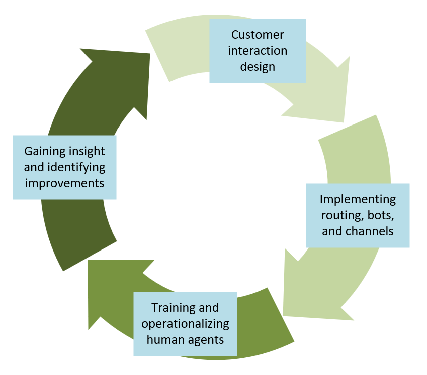
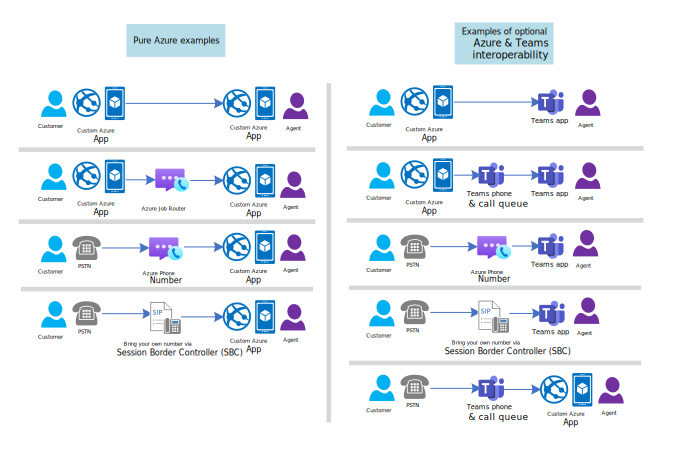
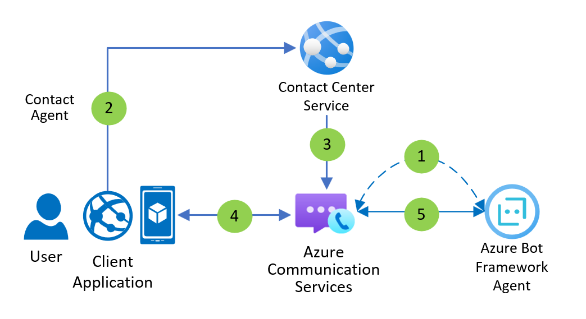
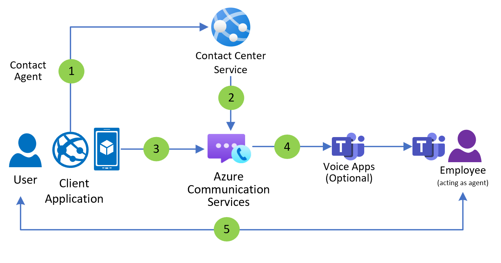

# Contact center
Developers can use Azure Communication Services messaging, voice, and video APIs to power **contact center** applications. This overview describes concepts and high-level architectural guidance for typical contact center applications.

Contact center applications focus on unscheduled communication between **customers** and **agents**. The **organizational boundary** between customers and agents, and the **unscheduled** nature of the interaction, are key attributes of contact center applications. Developers interested in *scheduled* business-to-consumer interactions should read our [virtual visits](/azure/communication-services/tutorials/virtual-visits) tutorial.

The term “contact center” captures a large family of applications diverse across scale, channels, and organizational approaches:

-   **Scale**. Small businesses may have a small number of employees operating as agents in a limited role, for example a restaurant offering a phone number for reservations. While an airline may have thousands of employees and vendors providing a 24/7 contact center.
-   **Channel**. Organizations can reach consumers through the phone system, apps, SMS, or consumer communication platforms such as WhatsApp.
-   **Tenant approach**. Developers can use Azure Communication Services to built multi-tenant contact center software as a service  (CCaaS). Or to build a single-tenant application for their own business.
- **Agent Staffing**. Businesses can have employees operate as agents, out-source the agent role, or use specialized service providers who fully operate contact centers as a service.

## Progressing a customer across communication channels

A typical multi-channel contact center may start with the most efficient form of ad hoc communication: text chat with a AI bot. AI bots can authenticate the customer, answer simple questions, solicit information about customer intent, and otherwise fully satisfy many customer engagement use cases. However, most contact centers have a pathway to progressively escalate customers to more synchronous and intensive interaction: chat with a human agent, voice with a bot, and finally voice and video with a human agent.

Developers have the option of using Azure Azure for all of these phases or a select few. For example, you may implement your own text chat system and then use Azure Communication Services solely for video calling. Quickstarts for the specific capabilities relevant to these phases are linked below:

| Enable customers to initiate messaging via: | Enable customers to initiate voice and video calling via:| Enable agents to reply to messages and answer voice calls via: | Integrate services and bots via: |
|-|--|----|--|
| Desktop & mobile friendly websites  | Desktop & mobile friendly websites   | Desktop & mobile friendly website  | Chat REST APIs   |
| Native apps | Native apps  | Native apps| Advanced Messaging (WhatsApp) APIs   |
| SMS | Call an Azure phone number   | Teams native apps and call queues  | Call Automation REST & Media APIs|
| Meta WhatsApp   | Call your own phone number connected to Microsoft via Direct Routing || Service APIs for Audio Streaming |
| | Call a Teams phone number|| Direct integration with Azure AI Bot Service |

## Continuously improving customer experiences

Many contact center applications are continuously changing to improve customer experience and meet new business needs. This on-going evolution can be modeled as a cycle of customer interaction design, implementing that design, and using data to gain insight on potential improvements :

## Teams interoperability 

Azure and Microsoft Teams are interoperable.  Business-to-customer (B2C) contact center apps use Azure's generic chat and VOIP generic chat and VOIP SDKs to build highly tailored customer experiences. Developers can connect those tailored customer experiences to Microsoft Teams apps and phone system, experiences which are familiar to many employees and citizen agents already. Permutations of Azure and Teams are illustrated below.

## Architecture diagrams
The rest of this article provides the high-level architecture and data flows for two different contact center designs:

1.  Customers going to a website (or mobile app) and talking to a chat bot.
1.  Customer calling a voice channel, that is routed by Teams queues to a Teams based agent.
1.  Customer calling a PSTN number, routed by Azure, that is connected to a Teams based agent.

### Chat on a website with a bot agent
Azure Communication Services provides multiple patterns for connecting customers to chat bots and services. For rich text chat in a web site or native app, using built-in integration with Azure AI Bot Services is especially straightforward. The Bot Service needs to be linked to a Communication Services resource using a channel in the Azure Portal. To learn more about this scenario, see [Add a bot to your chat app - An Azure Communication Services quickstart](/azure/communication-services/quickstarts/chat/quickstart-botframework-integration).

#### Dataflow

1.  An Azure Communication Services Chat channel is connected to an Azure Bot Service in Azure Portal by an administrator.
2.  A user clicks a widget in a client application to contact an agent.
3.  The Contact Center Service creates a Chat thread and adds the user ID for the bot to the thread.
4.  A user sends and receives messages to the bot using the Azure Communication Services Chat SDK.
5.  The bot sends and receives messages to the user using the Azure Communication Services Chat Channel.

SMS, email, and Meta WhatsApp are three other channels available for text-based communication.

### Chat on a website that escalates to a voice call answered by a Teams agent
Text chat may not be sufficient to meet your customer experience objectives. A chat conversation between a user and a bot can be handed off to an agent in Microsoft Teams. To learn more about bot handoff integration models, see [Transition conversations from bot to human - Bot Service](/azure/bot-service/bot-service-design-pattern-handoff-human?view=azure-bot-service-4.0&preserve-view=true). To learn more about Teams Auto Attendants and Call Queues, see [Plan for Teams Auto attendants and Call queues - Microsoft Teams](/microsoftteams/plan-auto-attendant-call-queue).

#### Dataflow

1.  A user clicks a widget in the client application to contact an agent.
2.  The Contact Center Service creates a Chat thread and adds an Azure Bot to the thread.
3.  The user interacts with the Azure Bot by sending and receiving Chat messages.
4.  The Contact Center Service hands the user off to a Teams Call Queue or Auto Attendant.
5.  The Microsoft Teams Voice Apps hands the user off to an employee acting as an agent using Teams. The user and the employee interact using audio, video, and screenshare.

#### Additional Resources

-   [Quickstart: Join your calling app to a Teams call queue](/azure/communication-services/quickstarts/voice-video-calling/get-started-teams-call-queue)
-   [Quickstart - Teams Auto Attendant on Azure Communication Services](/azure/communication-services/quickstarts/voice-video-calling/get-started-teams-auto-attendant)

### Connect Azure managed phone calls to Teams
This last data flow diagram shows a customer calling a phone number that is managed by Azure Communication SErvices. Using Azure Communication Services Call Automation APIs, an agent or subject matter expert hosted out of Teams can be added to the call. This interoperability is offered over VoIP and makes it easy for developers to implement per-region multi-tenant trunks that maximize value and reduce telephony infrastructure overhead.

  
To learn more about Call Automation API and how a contact center can leverage this interoperability with Teams, see [Deliver expedient customer service by adding Microsoft Teams users in Call Automation workflows](/azure/communication-services/concepts/call-automation/call-automation-teams-interop).

### Detailed Teams interoperability capabilities for contact center apps

The following list presents relevant Teams interoperability features available for contact centers in Azure Communication Services. For additional capability information, see [Azure Communication Services Calling SDK overview](/azure/communication-services/concepts/voice-video-calling/calling-sdk-features). Azure Communication Services Calling to Teams, including Teams Auto Attendant and Call Queue, requires setup to be completed as described in [Teams Call Queue on Azure Communication Services](/azure/communication-services/quickstarts/voice-video-calling/get-started-teams-call-queue).

| Group of features| Capability| Status |
|--|-|--|
| DTMF Support in Azure Communication Services UI SDK | Allows touch tone entry | ✔️|
| Teams Capabilities| Audio and video| ✔️|
|   | Screen sharing| ✔️|
|   | Record the call| ✔️|
|   | Park the call | ❌3   |
|   | Personal voicemail | ✔️|
| Teams Auto Attendant  | Answer call   | ✔️|
|   | Operator routing   | ✔️|
|   | Speech recognition of menu options| ✔️1|
|   | Speech recognition of directory search | ✔️1|
|   | Power BI Reporting | ✔️|
| Auto Attendant Redirects   | Disconnect| ✔️|
|   | Person in org | ✔️2|
|   | AA or CQ | ✔️|
|   | External | ✔️2|
|   | Shared voicemail   | ✔️|
| Teams Call Queue | Music on hold | ✔️|
|   | Answer call   | ✔️|
|   | Power BI Reporting | ✔️|
| Overflow Redirects| Disconnect| ✔️|
|   | Person in org | ✔️2|
|   | AA or CQ | ✔️|
|   | External | ✔️2|
|   | Shared voicemail   | ✔️|
| Timeout Redirects| Disconnect| ✔️|
|   | Person in org | ✔️2|
|   | AA or CQ | ✔️|
|   | External | ✔️2|
|   | Shared voicemail   | ✔️|
| No Agents Redirects   | Disconnect| ✔️|
|   | Person in org | ✔️2|
|   | AA or CQ | ✔️|
|   | External | ✔️2|
|   | Shared voicemail   | ✔️|

1.  Teams Auto Attendant must be voice enabled
2.  Licensing required
3.  Teams Call Parking will be available after general availability
