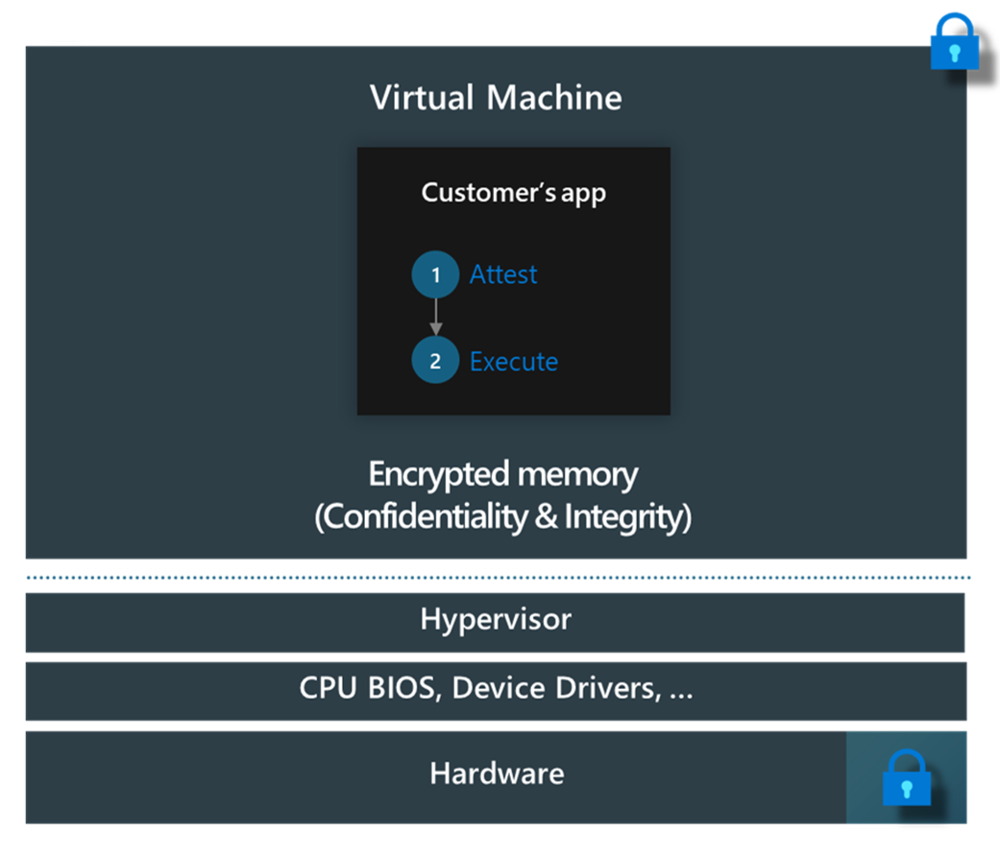

# Deployment models in confidential computing

Azure confidential computing supports multiple deployment models. These models support the wide variety of customer security requirements for modern cloud computing.

## IaaS

Under the infrastructure as a service (IaaS) deployment model in cloud computing, you can use:

- *Confidential virtual machines (VMs)* based on [AMD SEV-SNP](confidential-vm-overview.md) or [Intel TDX](tdx-confidential-vm-overview.md) for VM isolation.
- *Application enclaves* with [Intel SGX](confidential-computing-enclaves.md) for app isolation.

These options provide organizations with differing deployment models, depending on their trust boundary or desired ease of deployment.

The IaaS deployment model grants access to scalable computing resources (such as servers, storage, networking, and virtualization) on demand. By adopting an IaaS deployment model, organizations can forgo the process of procuring, configuring, and managing their own infrastructure. Instead, they pay for only the resources that they use. This ability makes IaaS a cost-effective solution.

In the domain of cloud computing, the IaaS deployment model enables businesses to rent individual services from cloud service providers (CSPs) like Azure. Azure assumes responsibility for managing and maintaining the infrastructure so that organizations can concentrate on installing, configuring, and managing their software. Azure also offers supplementary services such as comprehensive billing management, logging, monitoring, storage resiliency, and security.

Scalability is another advantage of the IaaS deployment model in cloud computing. Enterprises can swiftly scale their resources up and down according to their requirements. This flexibility facilitates faster development life cycles, accelerating time to market for new products and ideas. The IaaS deployment model also helps ensure reliability by eliminating single points of failure. Even if a hardware component fails, the service remains available.

In summary, the IaaS deployment model in combination with Azure confidential computing offers benefits like cost savings, increased efficiency, innovation opportunities, reliability, and high scalability. It takes advantage of a robust and comprehensive security solution that's designed to protect highly sensitive data.

## PaaS

For platform as a service (PaaS), you can use [confidential containers](confidential-containers.md) in confidential computing. This offering includes enclave-aware containers in Azure Kubernetes Service (AKS).

Choosing the right deployment model depends on many factors. You might need to consider the existence of legacy applications, operating system capabilities, and migration from on-premises networks.

Although there are still many reasons to use VMs, containers provide extra flexibility for the many software environments of modern IT. Containers can support apps that:

- Run on multiple clouds.
- Connect to microservices.
- Use various programming languages and frameworks.
- Use automation and Azure Pipelines, including continuous integration and continuous deployment (CI/CD) implementation.

Containers also increase the portability of applications, and improve resource usage, by applying the elasticity of the Azure cloud.

Normally, you might deploy your solution on confidential VMs if:

- You have legacy applications that can't be modified or containerized. However, you still need to introduce protection of data in memory while the data is being processed.
- You're running multiple applications that require different operating systems (OSs) on a single piece of infrastructure.
- You want to emulate an entire computing environment, including all OS resources.
- You're migrating your existing VMs from on-premises to Azure.

You might opt for a confidential container-based approach when:

- You're concerned about cost and resource allocation. However, you need a more agile platform for deployment of your proprietary apps and datasets.
- You're building a modern cloud-native solution. You also have full control of source code and the deployment process.
- You need multicloud support.

Both options offer the highest security level for Azure services.

## Comparison of security boundaries

There are some differences in the security postures of confidential VMs and confidential containers.

### Confidential VMs

Confidential VMs offer hardware-encrypted protection of an entire VM from unauthorized access by the host administrator. This level typically includes the hypervisor, which the CSP manages. You can use this type of confidential VM to prevent the CSP from accessing data and code executed within the VM.

VM admins, or any other apps or services running inside the VM, operate beyond the protected boundaries. These users and services can access data and code within the VM.

### Application enclaves

Application enclaves help protect memory spaces inside a VM with hardware-based encryption. The security boundary of application enclaves is more restricted than the boundary for confidential VMs. For Intel SGX, the security boundary applies to portions of memory within a VM. Guest admins, apps, and services running inside the VM can't access any data and code in execution inside the enclave.

Intel SGX enhances application security by isolating data in use. It creates secure enclaves that prevent modifications to selected code and data, so that only authorized code can access them. Even with high-level permissions, entities outside the enclave (including the OS and hypervisor) can't access enclave memory through standard calls. Accessing enclave functions requires specific Intel SGX CPU instructions, which include multiple security checks.

## Related content

- [Learn about confidential containers](confidential-containers.md)
- [Learn about confidential computing enclaves](confidential-computing-enclaves.md)
