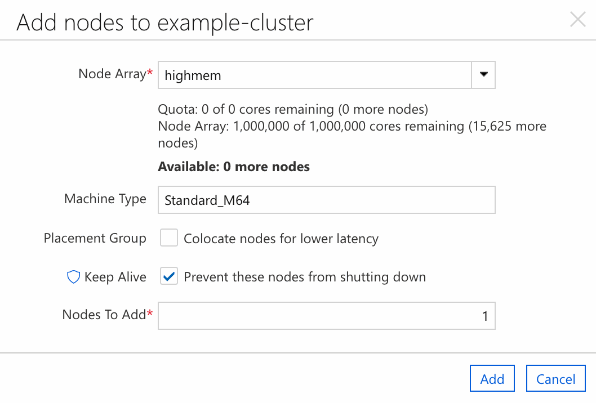

# Add a Node Array to a Cluster

Node arrays are used to define how nodes of a certain type are created/deleted as the cluster scales up and down. Each array has a name, a set of attributes which will be applied to each node in the array, and optional attributes describing how the array should scale (limits, placement groups, scale set configuration, etc).

This article shows you how to add a node array to an existing cluster using a template file. [Read more about node arrays.](../concepts/clusters.md#nodes-and-node-arrays)

## Edit the Cluster Template

In order to add a node array, you must have a [template file](~/how-to/cluster-templates.md) for your cluster. Edit this file and add a new `[[nodearray]]` section underneath `[cluster]`, giving the array a unique name within that cluster.

For example, the template below contains a node array named "highmem" which uses Standard_M64 VMs instead of the value specified in the node defaults (Standard_D4_v2):

```ini
# hpc-template.txt

[cluster hpc]

    [[node defaults]]
    Credentials = $Credentials
    ImageName = cycle.image.centos7
    SubnetId = my-subnet
    Region = USEast2
    MachineType = Standard_D4_v2

    [[node master]]

    [[nodearray highmem]]
    MachineType = Standard_M64


[parameters Cluster Parameters]

    [[parameter Credentials]]
    ParameterType = Cloud.Credentials
    Label = Credentials

    [[parameter Region]]
    ParameterType = Cloud.Region
    Label = Region
    DefaultValue = westus2

    [[[parameter SubnetId]]]
    ParameterType = Azure.Subnet
    Label = Subnet
    Required = true
```

## Reimport the modified cluster template

To apply the cluster template changes and create the new node array, use the [CycleCloud CLI](../cli.md) to import the template. You must specify the name of the cluster to modify as well as the `--force` flag which tells the CLI to overwrite values in the existing cluster.

The command below would apply the changes above to a cluster named "example-cluster":

```CycleCloud CLI
cyclecloud import_cluster example-cluster -f hpc-template.txt -c hpc --force
```

To test your new node array, go to the web UI and click the "Add node" button. Select the "highmem" array and click "Add" to create a new node. To make further changes, simply edit the template file and re-run the import command above.



## Further Reading

* [Node and Node Array Reference](../cluster-references/node-nodearray-reference.md)
