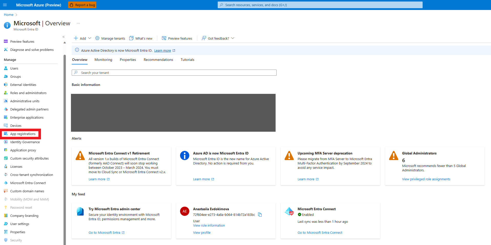
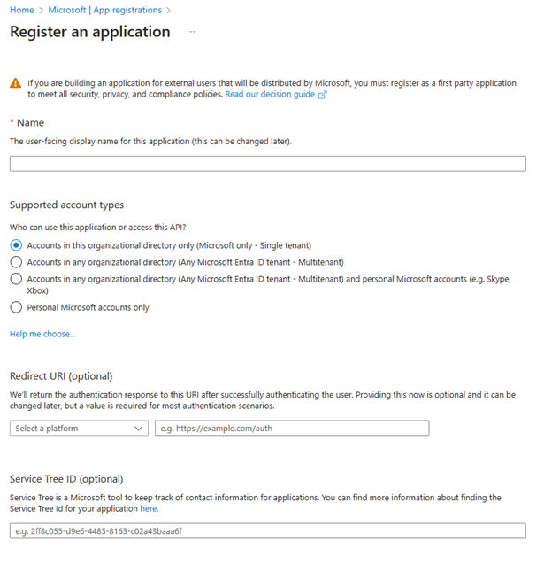
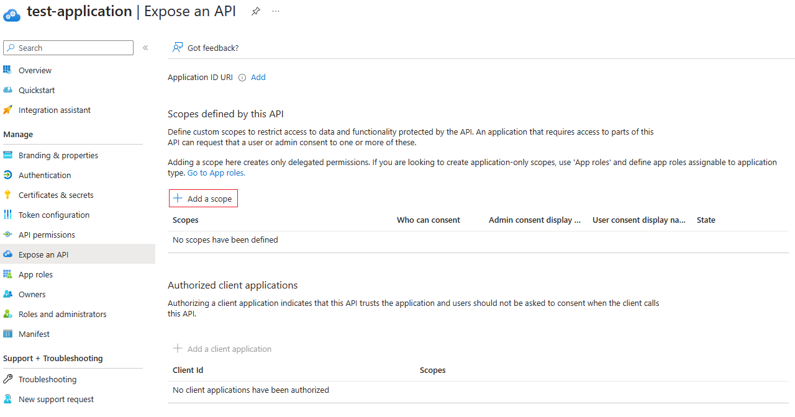
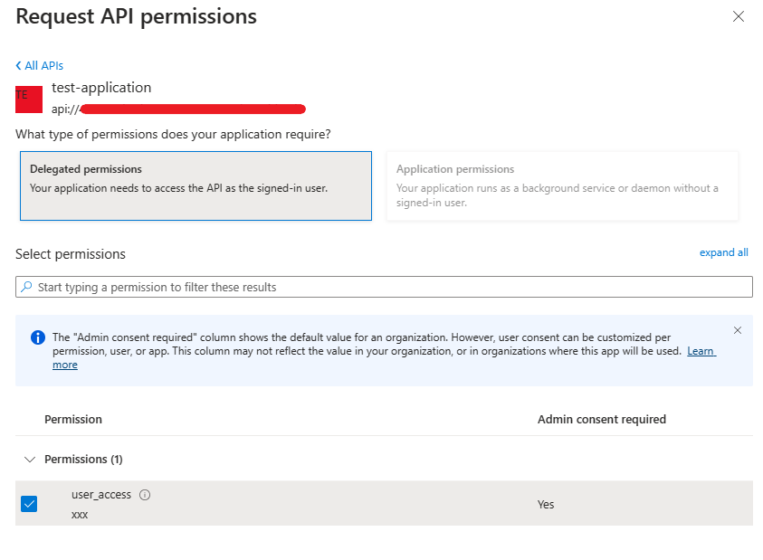
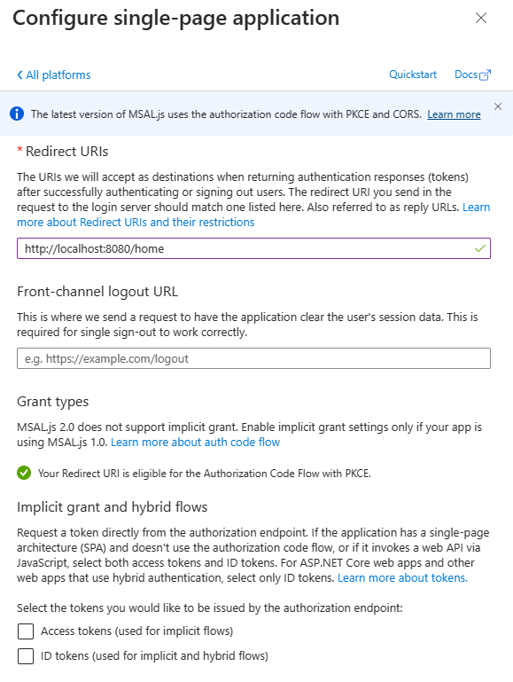
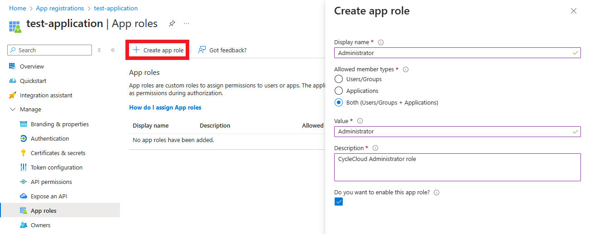
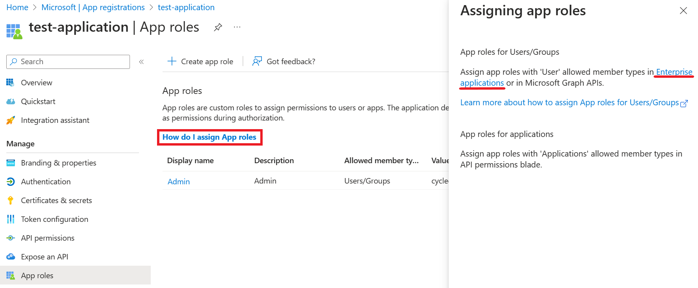
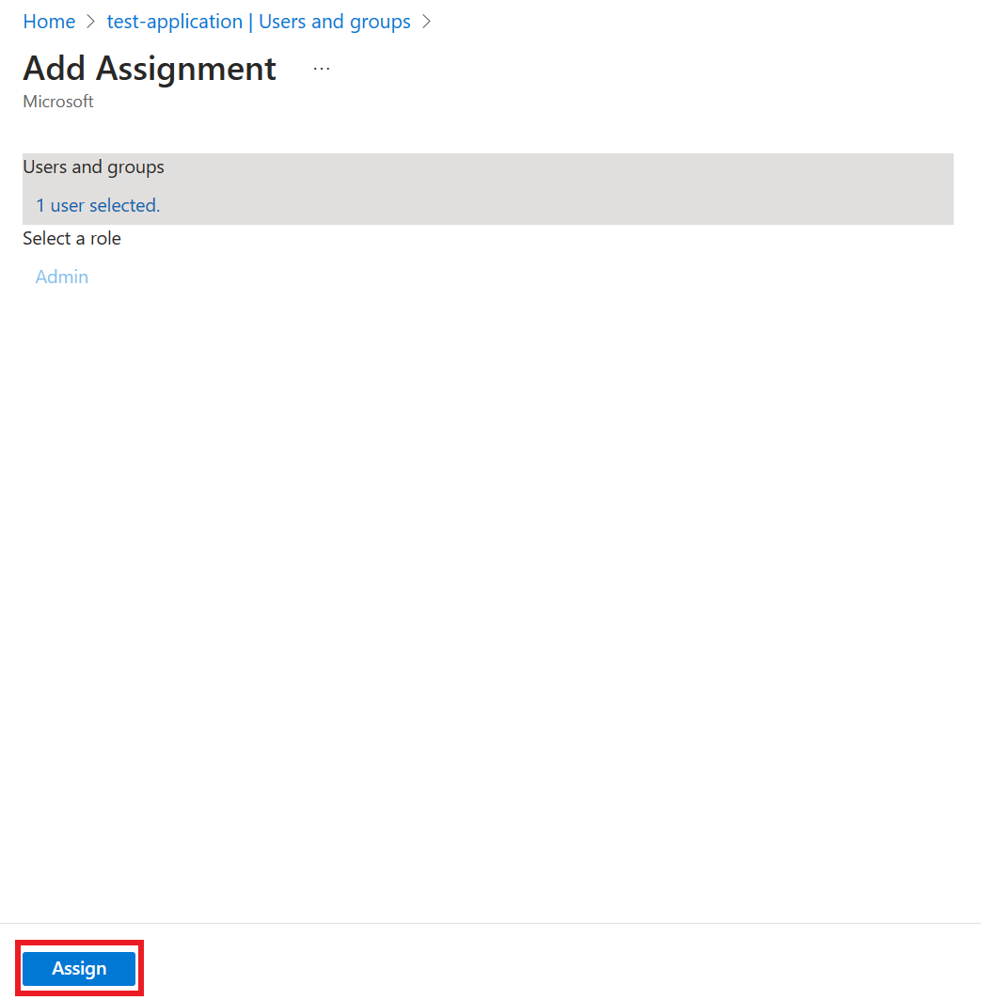
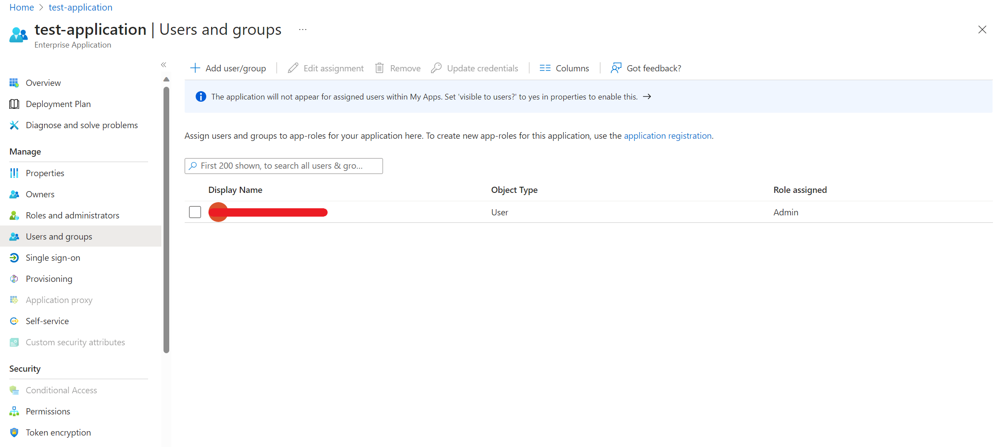

# Create Entra App Registration for use with CycleCloud **(PREVIEW)**

[Microsoft Entra ID](/entra/fundamentals) is a cloud-based identity and access management service that enables your employees access to external resources. If your organization requires the use of Entra ID, CycleCloud provides a native integration to Entra ID for user management, authorization, and authentication.

> [!NOTE]
> Users permissioned for a given App Registration are granted the assigned access and Role for all CycleCloud installations that use that App Registration. To segregate users between multiple CycleCloud installations, create a separate App. Registration for each CycleCloud. 

## Creating the CycleCloud App Registration

> [!NOTE]
> If you are using a service principal for CycleCloud that was generated by the CLI, it will not have an associated Enterprise Application required for Entra ID.

1. In the Azure Portal, click the **Microsoft Entra ID** icon in the navigation frame or type "Microsoft Entra ID" in the search bar and select "Microsoft Entra ID" from the Services category in the results. 
1. Navigate to the **App registrations** tab. 

1. Choose **New registration** from the top menu and configure your application. You don’t need to set the redirect URI right now

1. On the **Overview** page of your newly created application, note down the **Application (client) ID** and **Directory (tenant) ID** fields – you will need them later to configure Entra authentication in CycleCloud.

1. On the **Expose an API** page of your app, select **Add a scope**. This is required to expose your app registration as an API for which Access Tokens can be generated. In the pop-up, leave the Application ID URI as the default value, which should look like "api://{ClientID}".

1. After clicking **Save and Continue**, you will be asked to configure the new scope.   Enter “user_access” as the Scope name, configure all the other fields the way you want, but don’t forget to set **State** to Enabled. After you save the scope, it should show up in the Scopes table 

1. Navigate to the **API Permissions** page and select **Add a permission**. In the **Request API permissions** menu, navigate to **My APIs** and choose the name of your application. From there, choose **Delegated permissions** and select the scope you just created and, finally, click **Add permission**. Your new permission should now appear in the **Configured permissions** table. 

1. On the **Authentication** page, select **Add a platform** and choose **Single-page application**. If you intend to use the CycleCloud CLI with Entra ID, you must also set **Allow public client flows** to **true**

1. Under the **Configure single-page application** menu, configure **Redirect URI** to be "https://{your_cyclecloud_IP_or_DOMAIN_NAME}/home". You can leave the rest of fields blank.

1.	Under **Configure single-page application** menu, configure **Redirect URI** to be "http://localhost". This URI is required.  See [Redirect URI (reply URL) restrictions and limitations](/entra/identity-platform/reply-url). Make sure to also include both "https://{your_cyclecloud_IP_or_DOMAIN_NAME}/home" and "https://{your_cyclecloud_IP_or_DOMAIN_NAME}/login" as allowed redirect URLs. You can leave the rest of fields blank.
1.  If you wish to allow multiple CycleCloud installations or multiple URIs for the same CycleCloud to access this **Application Registration**, you can configure additional URIs on the same **Authentication** page – just select **Add URI** to create a field, enter the additional URI in the new field and click on Save. 

1.	To enable the CycleCloud CLI to authenticate against the new Application Registration, you must also add the **Mobile and desktop applications** platform.  To do that, return to the **Authentication** page, select **Add a platform** again.  Select **Mobile and desktop applications** in the **Configure Desktop + Devices** pop-up, add a **Custom Redirect URI** with value "http://localhost".

    
    
    After clicking **Configure**, you may also **Add URI** for **https://localhost**
    
1.	Next, you can must add the user roles for CycleCloud under **App roles** by selecting **Create app role**. While the **Display name** field can be set to anything you want, **Value** must match the built-in CycleCloud role for this to work. 

    > [!NOTE]
    > Since Entra ID does not allow roles to have spaces in them and some of the in-built CycleCloud roles include spaces (e.g. “Cluster Administrator”), you should replace any spaces in the role names you define in Entra ID with a dot (e.g. “Data Admin” will become “Data.Admin”) and rename any roles defined in CycleCloud to not feature dots. Role definitions in Entra ID are case insensitive.

    At a minimum, add the following roles:
    

## Permissioning Users for CycleCloud

1. After you have create the required CycleCloud roles, you may add users and assign roles to them. To do this, navigate to the app’s **Enterprise Application** page. The easiest way to do it is via a helper link located on your App roles page 

1. To add a user and assign a role, navigate to **Users and groups** page of the Enterprise Application and select **Add user/group**

1. On the **Add Assignment** page, select one or more users and the role (or roles) to be assigned to them. You can use a search bar to filter users (since only one app role was created in the screenshot, it is selected automatically – you might need to select a list of roles to assign in the same way you did users)

1. After the role is assigned, the user should show up on the **User and groups** page – please note that assigning multiple roles to a single user will result in several entries for that user - one entry per role.

1. RECOMMENDED: If you only want to allow access to CycleCloud for users explicitly added to your App, go to the **Properties of the Enterprise Application** and set **Assignment Required** to **Yes** 
