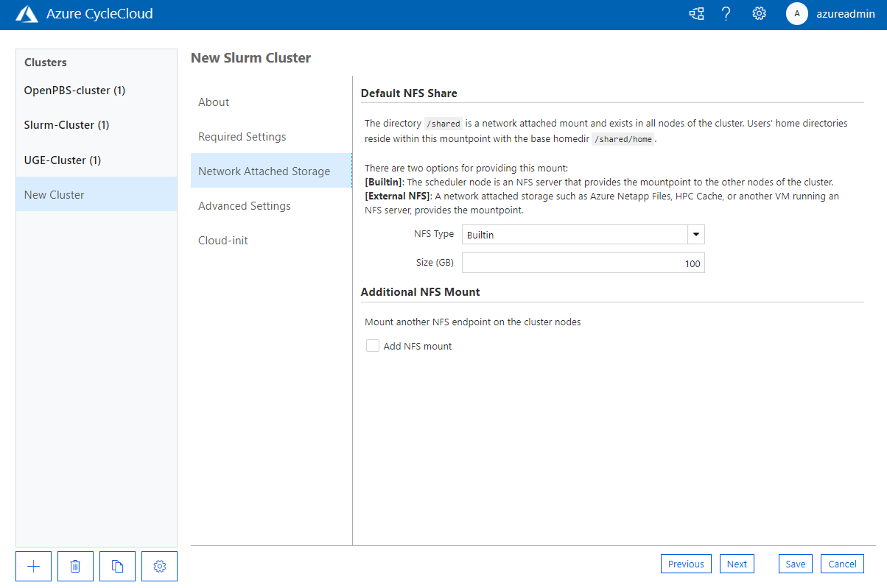
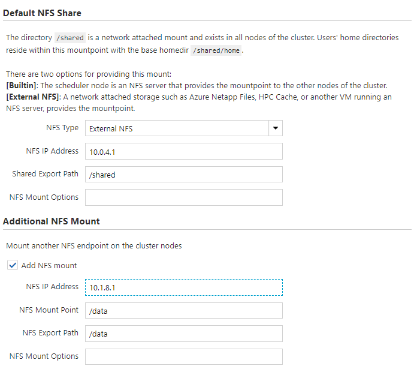

# Configure NFS Mounts

Azure CycleCloud provides built-in support for mounting a simple Network File System (NFS).
The NFS can be another resource managed by CycleCloud or an external resource.

::: moniker range=">=cyclecloud-8"
## Default Templates - Network Attached Storage Settings

The default cluster templates for each scheduler includes a section for configuring NFS options when creating a clsuter.



The `/shared/` directory for each cluster is an NFS share by default. The `NFS Type` dropdown in this configuration section provides options for this NFS share to be either exported from the cluster headnode (the `Builtin` option), or mounted from an NFS server. 

If `Builtin` is selected, the NFS share is created on a Azure Managed Disk([Standard SSD](/azure/virtual-machines/disks-types#standard-ssd)) mounted onto the headnode of the cluster, and the `Size` option specifies the size of the  provisioned disk.

Alternatively, if the `External NFS` option is specified, additional fields appear for specifying the IP address (or hostname) of the NFS server, as well as other NFS mount options. This `External NFS` option can be used to mount endpoints such as [NFS on Azure Files Storage](/azure/storage/files/storage-files-quick-create-use-linux), [Azure HPC Cache](/azure/hpc-cache/hpc-cache-overview), [Azure NetApp Files](/azure/azure-netapp-files/azure-netapp-files-introduction), or [NFS on Azure Blob Storage](/azure/storage/blobs/network-file-system-protocol-support).


If another NFS mount point is required, for example as a `/data` resource for all users, selecting the `Add NFS Mount` option brings up additional fields add another mount.


::: moniker-end

## Mount an NFS Filesystem

To mount an existing NFS filesystem:

``` ini
[[[configuration cyclecloud.mounts.nfs_data]]]
type = nfs
mountpoint = /mnt/exports/nfs_data
export_path = /mnt/exports/data
```

The `export_path` is the path on the server, and the `mountpoint` is the path to mount the share on the client. The mounted NFS filesystem may be exported from a node in the same CycleCloud cluster, exported from a node in another CycleCloud cluster, or a separate NFS filesystem that allows simple mounts. If the filesystem is exported from a node in the local cluster, then CycleCloud will use search to discover the address automatically. If the filesystem is exported from a different CycleCloud cluster, then the mount configuration may specify attribute `cluster_name` to instruct CycleCloud to search the cluster with that name:

``` ini
[[[configuration cyclecloud.mounts.other_cluster_fs]]]
type = nfs
mountpoint = /mnt/exports/other_cluster_fs
export_path = /mnt/exports/data
cluster_name = filesystem_cluster
```

To specify the location of the filesystem explicitly (required for mounting non-CycleCloud filesystems), the mount configuration may specify the attribute `address` with the hostname or IP of the filesystem:

``` ini
[[[configuration cyclecloud.mounts.external_filer]]]
type = nfs
mountpoint = /mnt/exports/external_filer
address = 54.83.20.2
```

## Default Shares

By default, most CycleCloud cluster types include at least one shared drive mounted at _/shared_ and _/mnt/exports/shared_. For clusters that need a simple shared filesystem, this mount is often sufficient.

Many cluster types also include a second NFS mount at _/sched_ and _/mnt/exports/sched_ which is reserved for use by the chosen scheduler. In general, this mount should not be accessed by applications.

The mount configurations for the default shares reserve filesystem names `cyclecloud.mounts.shared` and `cyclecloud.mounts.sched`. Modifying the default configurations for these shares is possible, but may result in unexpected behavior since many cluster types rely on the default mounts.

## Disabling NFS Mounts

Azure CycleCloud NFS mounts may be disabled by setting the `disabled` attribute to true. The default shares may also be disabled this way:

``` ini
[[[configuration]]]
    cyclecloud.mounts.sched.disabled = true
    cyclecloud.mounts.shared.disabled = true
    cshared.server.legacy_links_disabled = true
```

Many clusters assume a shared storage device to be available cluster-wide at _/shared_. Therefore if you use these configurations
enable a fileserver and mount it on each cluster node with:

``` ini
[[[configuration cyclecloud.mounts.external_shared]]]
    type = nfs
    mountpoint = /shared
    export_path = /mnt/raid/export
    address = 54.83.20.2
```

::: moniker range=">=cyclecloud-8"
## Mount an Azure Managed Lustre Filesystem

Azure CycleCloud clusters have built-in support for mounting Azure Managed Lustre.

To create a new Azure Managed Lustre Filesystem (AMLFS) for use in your cluster, follow the [AMLFS documentation](/azure/azure-managed-lustre/amlfs-overview).

To mount an existing AMLFS:

``` ini
[[[configuration cyclecloud.mounts.lustre_data]]]
type = lustre
address = 10.4.0.14
mountpoint = /lustre_data
```

The required `address` attribute specifies the the hostname or IP of the AMLFS. 
The required `mountpoint` attribute specifies the path to mount the AMLFS on the cluster nodes.


Optionally, you may use the `export_path` attribute to mount existing sub-directories within the AMLFS.  For a newly created AMLFS, the only existing path will be `/`.  If `export_path` is not set, it will default to `tcp:/lustrefs/` (AMLFS mount points must be prefixed with `tcp:/lustrefs`)    

For example, assuming the path `/data` has been created in your lustre filesystem, you can mount `data` as follows:

``` ini
[[[configuration cyclecloud.mounts.lustre_data]]]
type = lustre
address = 10.4.0.14
mountpoint = /lustre_data
export_path = tcp:/lustrefs/data/
options = noatime, flock
```

The optional `options` attribute may be used to add mount options for an AMLFS mount.  `options` defaults to `noatime, flock` if not specified.
::: moniker-end

[!NOTE]
Lustre performs best if nodes unmount prior to shutdown, so it is strongly recommended to enable [Termination Notifications](~/how-to/scheduled-events.md#terminate-notification) for nodes which will mount an AMLFS filesystem.   CycleCloud will register a shutdown script to cleanly unmount the filesystem upon node termination that will be called if Termination Notifications are enabled.


## Mount Configuration Options

| Option | Definition |
| ------ | ---------- |
| type          | *REQUIRED* The type attribute must be set to `nfs` for NFS mounts or `lustre` for AMLFS mounts to differentiate from volume mounts and other shared filesystem types.   |
| export_path   | The location of the export on the remote filesystem.  The export_path must already exist on the remote filesystem.  If an export_path is not specified, the mountpoint of the mount will be used as the export_path.  |
| mountpoint    | The location where the filesystem will be mounted after any additional configuration is applied.  If the directory does not already exist, it will be created. |
| cluster_name  | The name of the CycleCloud cluster which exports the filesystem.  If not set, the node's local cluster is assumed.   |
| address       | The explicit hostname or IP address of the filesystem.  If not set, search will attempt to find the filesystem in a CycleCloud cluster. |
| options       | Any non-default options to use when mounting the filesystem.    |
| disabled      | If set to `true`, the node will not mount the filesystem.  |

> [!NOTE]
> Changing the hostname scheme is not supported for most schedulers.

## Further Reading

* [How to Mount a Disk](./mount-disk.md)
* [How to Create a File Share and File Server](./create-fileserver.md)
