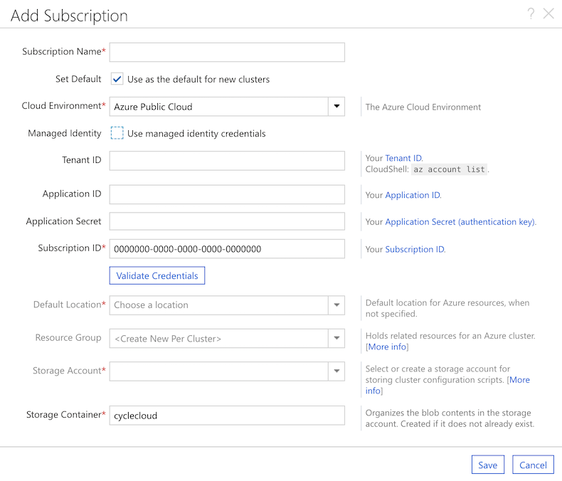

# Using Service Principal

An Azure AD Service Principal may be used to permission Azure CycleCloud to manage clusters in your subscription (as an alternative to using a [Managed Identity](managed-identities.md)).  

## Choosing between a Service Principal and a Managed Identity

If CycleCloud will only manage clusters in a single subscription, then consider using a Managed Identity rather than a Service Principal.

However, since CycleCloud can only use a single Managed Identity, using Service Principals is required when managing clusters in multiple subscriptions or tenants.

## Create a Service Principal

Azure CycleCloud requires a service principal with rights to manage your Azure subscription. If you do not have a service principal available, you can create one using the Azure CLI as shown below.

> [!NOTE]
> Your service principal name **must** be unique.  In the example below, *CycleCloudApp* should be replaced with a unique name.
> If you run the command below with an existing name, it replaces and invalidates the existing Service Principal.

```azurecli-interactive
az ad sp create-for-rbac --name CycleCloudApp --years 1
```

The output will display a series of information. You will need to save the `appId`, `password`, and `tenant`:

``` output
"appId": "xxxxxxxx-xxxx-xxxx-xxxx-xxxxxxxxxxxx",
"displayName": "CycleCloudApp",
"name": "http://CycleCloudApp",
"password": "xxxxxxxx-xxxx-xxxx-xxxx-xxxxxxxxxxxx",
"tenant": "xxxxxxxx-xxxx-xxxx-xxxx-xxxxxxxxxxxx"
```

## Permissions

The simplest option (with sufficient access rights) is to assign the Contributor Role for the Subscription to the new CycleCloud Service Principal.
However, the Contributor Role has a higher privilege level than CycleCloud requires.  A [custom Role](/azure/role-based-access-control/custom-roles) may be created and assigned to the VM.

The [Managed Identity Guide](managed-identities.md) has details on creating an appropriate lower-privilege AD Role for the Service Principal.

To use a Service Principle to give permissions to CycleCloud, ensure that the "Manage Identity" checkbox is unchecked.

::: moniker range=">=cyclecloud-8"

::: moniker-end
