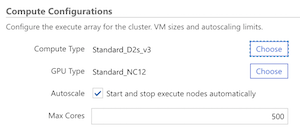
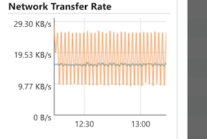
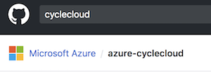

# What is Azure CycleCloud?

Azure CycleCloud is an enterprise-friendly tool for orchestrating and managing High Performance Computing (HPC) environments on Azure. With CycleCloud, users can provision infrastructure for HPC systems, deploy familiar HPC schedulers, and automatically scale the infrastructure to run jobs efficiently at any scale. Through CycleCloud, users can create different types of file systems and mount them to the compute cluster nodes to support HPC workloads.

Azure CycleCloud is targeted at HPC administrators and users who want to deploy an HPC environment with a specific scheduler in mind -- commonly used schedulers such as Slurm, PBSPro, LSF, Grid Engine, and HT-Condor are supported out of the box. CycleCloud is the sister product to [Azure Batch](https://docs.microsoft.com/azure/batch/batch-technical-overview), which provides a Scheduler as a Service on Azure.

See [High Performance Computing (HPC) on Azure](https://docs.microsoft.com/azure/architecture/topics/high-performance-computing/) for information about how CycleCloud compares against other Azure HPC solutions.

[//]: # (Rob will provide a video that should work?)

## Why Should I Use Azure CycleCloud?

Organizations who have operated HPC environments for a while typically accumulate years of expertise and in-house tooling around a specific scheduler, and re-architecting or deploying these environments on Azure can be daunting. CycleCloud abstracts away the basic Azure building blocks such as VMs, scalesets, network interfaces, and disks. This allows an HPC administrator to focus on the familiar: an HPC cluster comprising of nodes and a configurable scheduler of choice.

CycleCloud deploys autoscaling plugins on top of the supported schedulers, so users do not need to implement complex autoscaling functions and routines themselves, but rather interface only with scheduler-level configurations that they are familiar with.

With a rich, declarative, templating format, CycleCloud provides powerful tooling to construct complete HPC environments on Azure. Users can deploy environments that include NFS servers, parallel file systems, login hosts, license servers, and directory services -- essentially all the components needed in an HPC system -- through a single management plane.

CycleCloud integrates with Azure services such as [Azure Monitor](https://docs.microsoft.com/azure/azure-monitor/overview) and [Azure Cost Management tools](https://docs.microsoft.com/azure/cost-management/overview-cost-mgt).

### CycleCloud Capabilities

[//]: # (might want to convert this to a table with mini screenshots similar to App Insights overview)

|  |  |
| --- | --- |
| [**Scheduler Agnostic**](./concepts/scheduling.md) Use standard HPC schedulers such as Slurm, PBS Pro, LSF, Grid Engine, and HTCondor, or extend CycleCloud autoscaling plugins to work with your own scheduler  |   |
| [**Manage Compute Resources**](./how-to/start-cluster.md) Manage virtual machines and scale sets to provide a flexible set of compute resources that can meet your dynamic workload requirements |  |
| [**Autoscale Resources**](./concepts/scheduling.md) Automatically adjust cluster size and components based upon job load, availability, and time requirements |  |
| [**Monitor and Analyze**](./concepts/monitoring.md) Collect and analyze performance data using visualization tools |  |
| [**Template Clusters**](./download-cluster-templates.md) Use CycleCloud templates to share cluster topologies with the community |  |
| [**Customize and Extend Functionality**](./api.md) Use the comprehensive RESTful API to customize and extend functionality, deploy your own scheduler, and support into existing workload managers |  |
| [**Integrate into Existing Workflows**](./how-to/install-cyclecloud-cli.md) Integrate into existing workflows and tools using the built-in CLI |  |

## How Do I Use Azure CycleCloud?

Azure CycleCloud is an installable web application that you can run on premise or in an Azure VM. Once installed, CycleCloud can be configured to use compute and data resources in your prepared Azure subscription. CycleCloud provides a number of official cluster templates for schedulers (PBSPro, LSF, Grid Engine, Slurm, HTCondor), and filesystems (NFS, BeeGFS). Cluster templates provided by the CycleCloud community are also available. You can use these cluster templates unmodified or you can customize them for your specific needs.

Once a cluster is created, it is automatically configured to autoscale by default to handle the computational jobs that are submitted to the scheduler. CycleCloud administrative features govern access to the CycleCloud cluster for other users in your organization.

Tooling using templates and configuration scripts enable you to build complex HPC environments quickly, and replicate these for separate teams across your organization.

[//]: # (## What cluster types are available?)

## What CycleCloud is Not?

There is no job scheduling functionality in CycleCloud. In other words, CycleCloud is not a scheduler, but rather a platform that enables users to deploy their own scheduler into Azure. CycleCloud comes with built-in support for a number of commonly used schedulers (PBSPro, Slurm, IBM LSF, Grid Engine, and HT Condor), but CycleCloud users frequently implement their own scheduler on top of the provided autoscaling API.

CycleCloud does not dictate cluster topology; the installation comes with templates that are designed to get HPC systems up and running in Azure quickly, but HPC operators can customize these templates to tailor the infrastructure to meet their requirements. The Azure HPC community provides opinionated templates that are optimized for different types of workloads and industries.

## What a CycleCloud Deployed Environment Looks Like

:::image type="content" source="~/images/architecture-deployment.png" alt-text="CycleCloud Deployment":::

An entire CycleCloud HPC system can be deployed on Azure infrastructure. CycleCloud itself is installed as an application server on a VM in Azure that requires outbound access to Azure Resource Provider APIs. CycleCloud then starts and manages VMs that form the HPC systems — these typically consist of the HPC scheduler head node(s) and compute nodes, but may also include VM based Network Attached Storage such as an NFS server or BeeGFS cluster, login nodes, bastion hosts, and other components needed to support an HPC infrastructure. The makeup of the HPC system is defined entirely through CycleCloud templates. Additionally, CycleCloud HPC environments can utilize other PaaS services such as Azure NetApp Files, Azure HPC Cache, and Azure Active Directory Domain Service.

## Next Steps

* [Try Azure CycleCloud using a Marketplace VM](qs-install-marketplace.md)
* [Install Azure CycleCloud using an ARM template](~/how-to/install-arm.md)
* [Install CycleCloud manually](~/how-to/install-manual.md)
* [Explore CycleCloud features with the tutorial](./tutorials/create-cluster.md)
