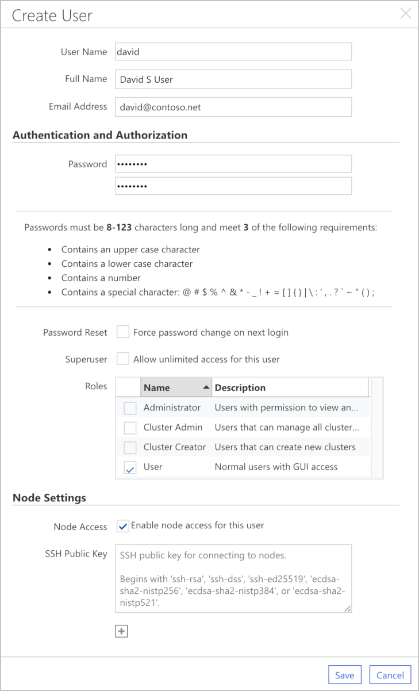

# User Management

## CycleCloud Users vs Cluster Users

There are two separate but intertwined user access notions that are relevant to CycleCloud: users that have access to the CycleCloud application, and users that have login access to cluster nodes orchestrated by CycleCloud. These two sets of users may be mutually exclusive. This document describes the facilities provided in CycleCloud for managing the CycleCloud server users.

For managing user access into cluster nodes please refer to the page [Cluster User Access](user-cluster-access.md).

## Adding New Users to the CycleCloud Application Server

The user management page in CycleCloud can be accessed through the **Settings** link on the left panel, followed by the **Users** tab in the resulting page. Click on the **Create** button to add a new user to the application server.

A pop-up will appear for adding a new user account. Pay attention to the password requirements and select the **Password Reset** box to force the user to change their password on first login.

The **Superuser** checkbox will assign site administrator privileges to a user. This grants the user access to all the data and Azure account information that is stored in CycleCloud.

Select the appropriate roles to assign privileges to the user. The [Roles](#user-roles) section below lists the privileges for each of the built-in roles.

The **Node Settings** section is relevant to the built-in user management system for providing users access to cluster nodes. If user access to cluster nodes is to be provided and managed by the CycleCloud system, select **Enable node access for this user** and also supply the SSH public key that corresponds to the private key that the user will use to connect to the cluster nodes. See the [Cluster User Management](user-cluster-access.md) page for more information.

Select **Save** to save the new user record in CycleCloud.

## Edit User

The **Edit** button on the user management page allows an administrator to modify roles and user properties. The administrator can also set the Unix **UID** for the user's local account on the cluster nodes. By default, CycleCloud will reserve UIDs 50000 and above for node users. [See Cluster User Management for details](user-cluster-access.md).  

## User Roles

Each user can be assigned to one or more of the following roles that are built-in to the CycleCloud application server:

| Role      | Privileges |
| ----------- | ----------- |
| User      | Log in access to clusters that has been explicitly shared this user. Is able to manage and edit a cluster if is made owner of the cluster |
| Cluster Creator   | Inherits `User` privileges. Additionally, has sufficient privilege to create a new cluster |
| Cluster Admin   | Inherits `Cluster Creator` privileges. Additionally, is able manage and edit all clusters in CycleCloud |
| Administrator  | Inherits `Cluster Admin` privileges. Additionally, is able to manage settings and configurations of the CycleCloud application server |

Note also that the **Superuser** checkbox described in the previous section supersedes all roles assigned to a user. All `Superusers` are `Administrators` with additional privileges to view and edit all data in the system.

## Groups

The **Settings** page also includes a tab for managing user groups in CycleCloud. User Groups are logical sets of user accounts and help simplify assigning login access or management privileges to clusters.

Create a new group using the **Create** button. Enter a group name and a description for the group. Use the **Add Member** button to add members to the group. The **Add Member** dialog box includes a check-box for making the user a `Group Administrator`. `Group Administrators` have `Cluster Admin` role privileges to all clusters assigned to the group.

## Cluster Ownership and Sharing Clusters

The user account that creates a new cluster is assigned as the `Owner` of the cluster. The cluster owner has `Cluster Admin` privilege to the cluster and attains sudo privileges on all nodes of the cluster if cluster user management is provided by the built-in CycleCloud system. [See Cluster User Management for details](user-cluster-access.md).

It is possible to share these privileges to other CycleCloud user accounts after a cluster has been created. Clicking on the **Share** button on each cluster page creates a pop-up dialog with an option to **Add Users**.

## User Authentication

User authentication is provided by either the built-in authentication system or by integrating with a third-party authentication service. [See User Authentication](user-authentication.md) for more information.

