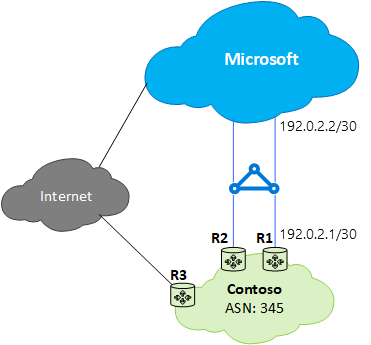
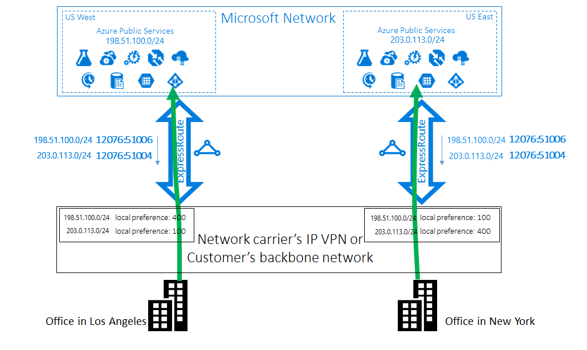
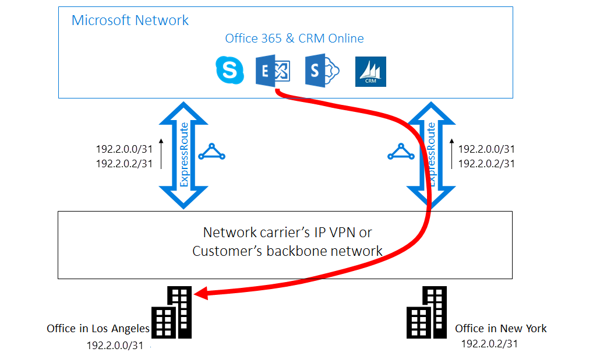

# Optimize routing for Azure ExpressRoute
When you have multiple ExpressRoute circuits, you have more than one path to connect to Microsoft. This can lead to suboptimal routing, where traffic takes a longer path, increasing latency and affecting application performance and user experience. This article explains how to optimize routing using standard routing technologies.

## Path selection for Microsoft peering

To ensure traffic flows over the desired path with multiple ExpressRoute circuits, you need to manage paths to the Internet using an Internet Exchange (IX) or Internet Service Provider (ISP). BGP uses a best path selection algorithm based on factors like the longest prefix match (LPM). To ensure traffic destined for Azure through Microsoft uses the ExpressRoute path, implement the *Local Preference* attribute. This setting ensures the path is always preferred on ExpressRoute.

> [!NOTE]
> The default local preference is typically **100**. Higher local preferences are more preferred.

Consider the following example scenario:



To prefer ExpressRoute paths, configure Local Preference as follows:

**Cisco IOS-XE configuration from R1 perspective:**

```
R1(config)#route-map prefer-ExR permit 10
R1(config-route-map)#set local-preference 150

R1(config)#router BGP 345
R1(config-router)#neighbor 1.1.1.2 remote-as 12076
R1(config-router)#neighbor 1.1.1.2 activate
R1(config-router)#neighbor 1.1.1.2 route-map prefer-ExR in
```

**Junos configuration from R1 perspective:**

```
user@R1# set protocols bgp group ibgp type internal
user@R1# set protocols bgp group ibgp local-preference 150
```

## Suboptimal routing from customer to Microsoft

Imagine you have two offices in the US, one in Los Angeles and one in New York, connected via a WAN. You have two ExpressRoute circuits, one in US West and one in US East, both connected on the WAN. You intend for Los Angeles users to connect to Azure US West and New York users to Azure US East. However, without knowing which prefix is from which region, your WAN may route both offices' traffic to the US East circuit, causing suboptimal routing for Los Angeles users.


### Solution: use BGP Communities

To optimize routing, use [BGP Community values](expressroute-routing.md) to identify prefixes from each Azure region. For example, `12076:51004` for US East and `12076:51006` for US West. Configure higher local preference values for the appropriate prefixes in each region to ensure traffic takes the optimal path.



> [!NOTE]
> The same technique can be applied to routing from customer to Azure virtual network using private peering. Configure your routers to prefer one ExpressRoute circuit over another based on your virtual network deployments.

## Suboptimal routing from Microsoft to customer

In this scenario, Microsoft connections take a longer path to reach your network. For example, Exchange Online connections to on-premises servers may route through the wrong ExpressRoute circuit. Without hints, Microsoft can't determine which on-premises prefix is closer to which circuit.



### Solution: use AS PATH prepending

Advertise your on-premises prefixes on the appropriate ExpressRoute circuits or use AS PATH prepending to influence routing. Lengthen the AS PATH for prefixes in the less preferred region to ensure Microsoft prefers the optimal path.


> [!IMPORTANT]
> We remove private AS numbers in the AS PATH for prefixes received on Microsoft Peering when using a private AS number. Peer with a public AS and append public AS numbers in the AS PATH to influence routing for Microsoft Peering.

## Suboptimal routing between virtual networks

With ExpressRoute, you can enable VNet-to-VNet communication by linking them to an ExpressRoute circuit. Suboptimal routing can occur when VNets are linked to multiple circuits. For example, VNets in US West and US East may route traffic through the remote circuit due to ECMP routing.


### Solution: assign a high weight to local connection

Assign a higher weight to the local connection to ensure VNets prefer the optimal path. This configuration ensures traffic takes the shortest path between VNets.


> [!NOTE]
> You can also influence routing from VNet to your on-premises network by configuring the connection weight instead of using AS PATH prepending. The connection weight is considered before the AS Path length when deciding how to send traffic.

## Next steps

- Learn about [designing ExpressRoute for high availability](designing-for-high-availability-with-expressroute.md).
- Learn about [designing ExpressRoute for disaster recovery](designing-for-disaster-recovery-with-expressroute-privatepeering.md).
