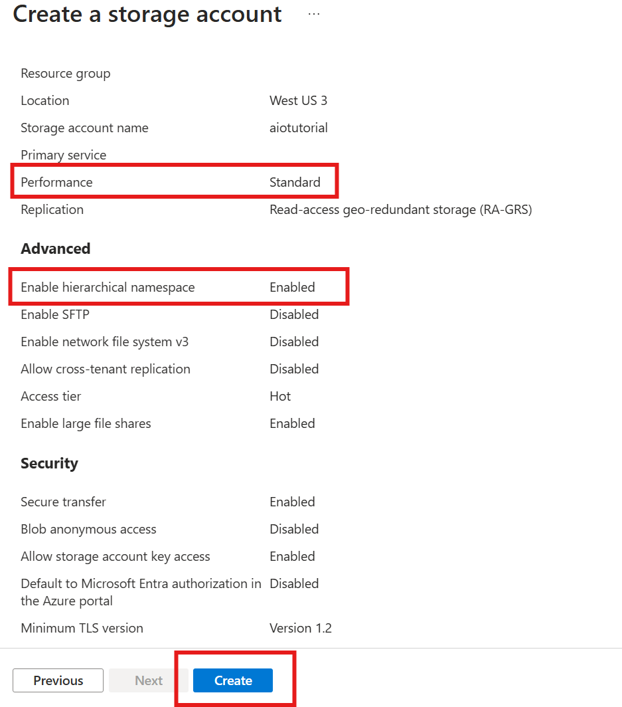
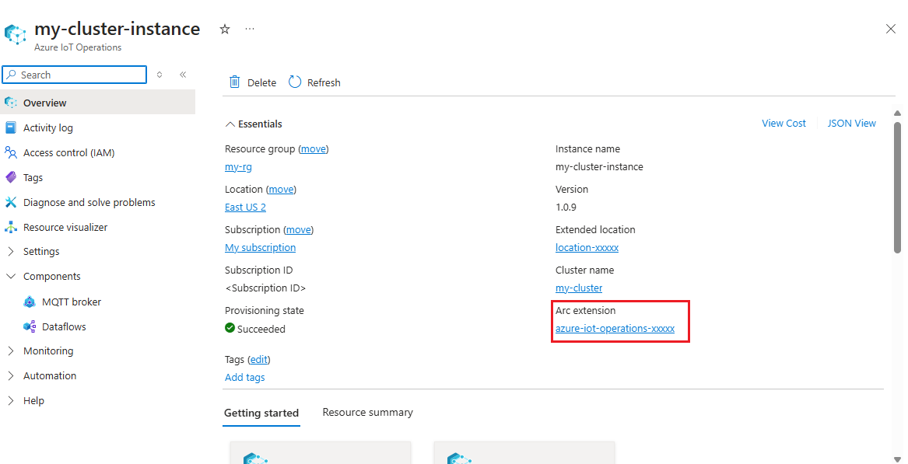
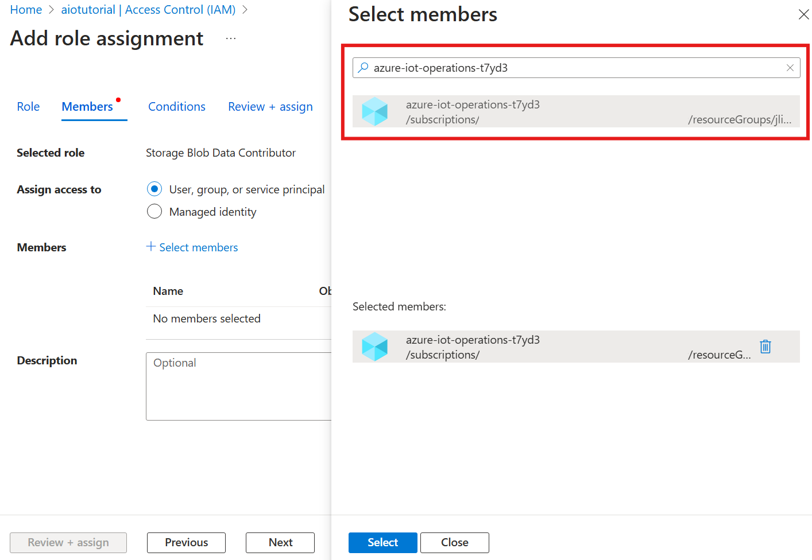
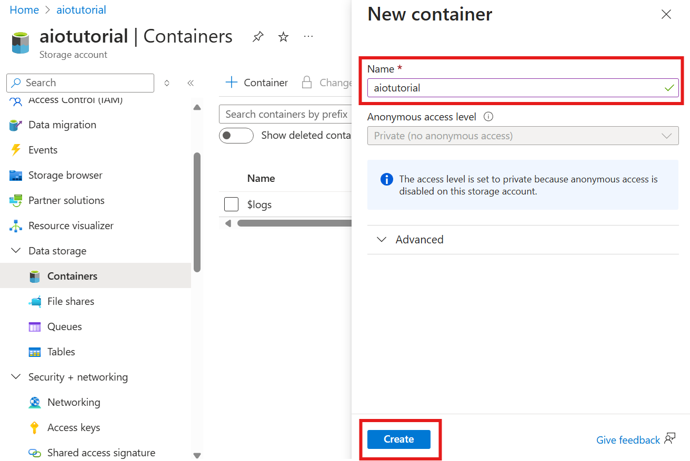
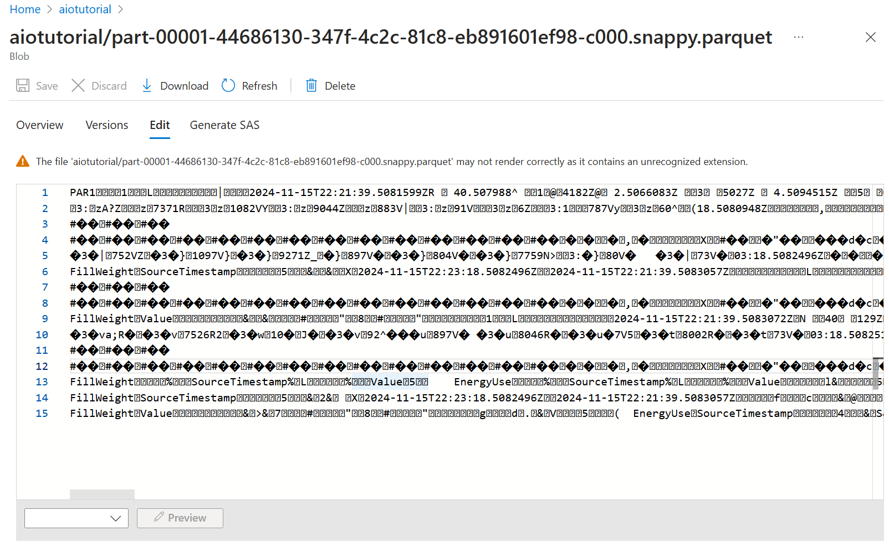

# Tutorial: Send data from an OPC UA server to Azure Data Lake Storage Gen 2

In the quickstart, you created a dataflow that sends data from Azure IoT Operations to Event Hubs, and then to Microsoft Fabric via EventStreams.

However, it's also possible to send the data directly to a storage endpoint without using Event Hubs. This approach requires creating a Delta Lake schema that represents the data, uploading the schema to Azure IoT Operations, and then creating a dataflow that reads the data from the OPC UA server and writes it to the storage endpoint.

This tutorial builds on the quickstart setup and demonstrates how to bifurcate the data to Azure Data Lake Storage Gen 2. This approach allows you to store the data directly in a scalable and secure data lake, which can be used for further analysis and processing.

## Prerequisites

Finish the [second step of the quickstart](../get-started-end-to-end-sample/quickstart-configure.md) which gets you the data from the OPC UA server to the Azure IoT Operations MQTT broker. Make sure you can see the data in Event Hub.

## Create a storage account with Data Lake Storage capability

First, follow steps to [create a storage account with Data Lake Storage Gen 2 capability](../../storage/blobs/create-data-lake-storage-account.md).

- Choose a memorable but unique name for the storage account, since it's needed in the next steps. 
- For best results, use a location that's close to the Kubernetes cluster where Azure IoT Operations is running.
- During the creation process, enable the **Hierarchical namespace** setting. This setting is required for Azure IoT Operations to write to the storage account.
- You can leave other settings as default.

At the **Review** step, verify the settings and select **Create** to create the storage account.



## Get the extension name of Azure IoT Operations

In Azure portal, find the Azure IoT Operations instance you created in the quickstart. In the **Overview** blade, find the **Arc extension** section and see the name of the extension. It should look like `azure-iot-operations-xxxxx`.



This extension name is used in the next steps to assign permissions to the storage account.

## Assign permission to Azure IoT Operations to write to the storage account

In the storage account, go to the **Access control (IAM)** blade and select **+ Add role assignment**. In the **Add role assignment** blade, search for the role **Storage Blob Data Contributor** and select it. 


Select **Next** to get to the *Members* section.

Choose **Select members** and in the **Select** box, search for the managed identity of the Azure IoT Operations Arc extension named `azure-iot-operations-xxxxx` and select it.



Finish the assignment with **Review + assign**.

## Create a container in the storage account

In the storage account, go to the **Containers** blade and select **+ Container**. For this tutorial, name the container `aiotutorial`. Select **Create** to create the container.



## Get the schema registry name and namespace

To upload the schema to Azure IoT Operations, you need to know the schema registry name and namespace. You can get this information using the Azure CLI.

Run the following command to get the schema registry name and namespace. Replace the placeholders with your values.

```sh
az iot ops schema registry list -g <RESOURCE_GROUP> --query "[0].{name: name, namespace: properties.namespace}" -o tsv
```

The output should look like this:

```sh
<REGISTRY_NAME>    <SCHEMA_NAMESPACE>
```

Save the values for the next steps.

## Upload schema to Azure IoT Operations

In the quickstart, the data that comes from the oven asset looks like:

```json
{
  "Temperature": {
    "SourceTimestamp": "2024-11-15T21:40:28.5062427Z",
    "Value": 6416
  },
  "FillWeight": {
    "SourceTimestamp": "2024-11-15T21:40:28.5063811Z",
    "Value": 6416
  },
  "EnergyUse": {
    "SourceTimestamp": "2024-11-15T21:40:28.506383Z",
    "Value": 6416
  }
}
```

The required schema format for Delta Lake is a JSON object that follows the Delta Lake schema serialization format. The schema should define the structure of the data, including the types and properties of each field. For more details on the schema format, see [Delta Lake schema serialization format documentation](https://github.com/delta-io/delta/blob/master/PROTOCOL.md#schema-serialization-format).

To create a Delta schema that represents the data from the oven asset, create a JSON file with the following content:

```json
{
  "$schema": "Delta/1.0",
  "type": "object",
  "properties": {
    "type": "struct",
    "fields": [
      {
        "name": "Temperature",
        "type": {
          "type": "struct",
          "fields": [
            {
              "name": "SourceTimestamp",
              "type": "string",
              "nullable": true,
              "metadata": {}
            },
            {
              "name": "Value",
              "type": "integer",
              "nullable": true,
              "metadata": {}
            }
          ]
        },
        "nullable": true,
        "metadata": {}
      },
      {
        "name": "FillWeight",
        "type": {
          "type": "struct",
          "fields": [
            {
              "name": "SourceTimestamp",
              "type": "string",
              "nullable": true,
              "metadata": {}
            },
            {
              "name": "Value",
              "type": "integer",
              "nullable": true,
              "metadata": {}
            }
          ]
        },
        "nullable": true,
        "metadata": {}
      },
      {
        "name": "EnergyUse",
        "type": {
          "type": "struct",
          "fields": [
            {
              "name": "SourceTimestamp",
              "type": "string",
              "nullable": true,
              "metadata": {}
            },
            {
              "name": "Value",
              "type": "integer",
              "nullable": true,
              "metadata": {}
            }
          ]
        },
        "nullable": true,
        "metadata": {}
      }
    ]
  }
}
```

Save it as a file named `opcua-schema.json`.

Then, upload the schema to Azure IoT Operations using the Azure CLI. Replace the placeholders with your values.

```sh
az iot ops schema create -n opcua-schema -g <RESOURCE_GROUP> --registry <REGISTRY_NAME> --format delta --type message --version-content opcua-schema.json --ver 1
```

This creates a schema named `opcua-schema` in the Azure IoT Operations registry with version `1`.

To verify the schema is uploaded, list the schema versions using the Azure CLI.

```sh
az iot ops schema version list -g <RESOURCE_GROUP> --schema opcua-schema --registry <REGISTRY_NAME>
```

## Create dataflow endpoint

The dataflow endpoint is the destination where the data is sent. In this case, the data is sent to Azure Data Lake Storage Gen 2. The authentication method is system assigned managed identity, which you set up to have right permissions to write to the storage account.

Create a dataflow endpoint using Bicep. Replace the placeholders with your values.

```bicep
// Replace with your values
param aioInstanceName string = '<AIO_INSTANCE_NAME>'
param customLocationName string = '<CUSTOM_LOCATION_NAME>'

// Tutorial specific values
param endpointName string = 'adls-gen2-endpoint'
param host string = 'https://<ACCOUNT>.blob.core.windows.net'

resource aioInstance 'Microsoft.IoTOperations/instances@2024-11-01' existing = {
  name: aioInstanceName
}

resource customLocation 'Microsoft.ExtendedLocation/customLocations@2021-08-31-preview' existing = {
  name: customLocationName
}

resource adlsGen2Endpoint 'Microsoft.IoTOperations/instances/dataflowEndpoints@2024-11-01' = {
  parent: aioInstance
  name: endpointName
  extendedLocation: {
    name: customLocation.id
    type: 'CustomLocation'
  }
  properties: {
    endpointType: 'DataLakeStorage'
    dataLakeStorageSettings: {
      host: host
      authentication: {
        method: 'SystemAssignedManagedIdentity'
        systemAssignedManagedIdentitySettings: {}
      }
    }
  }
}
```

Save the file as `adls-gen2-endpoint.bicep` and deploy it using the Azure CLI

```sh
az deployment group create -g <RESOURCE_GROUP> --template-file adls-gen2-endpoint.bicep
```

## Create a dataflow

To send data to Azure Data Lake Storage Gen 2, you need to create a dataflow that reads data from the OPC UA server and writes it to the storage account. No transformation is needed in this case, so the data is written as-is.

Create a dataflow using Bicep. Replace the placeholders with your values.

```bicep
// Replace with your values
param aioInstanceName string = '<AIO_INSTANCE_NAME>'
param customLocationName string = '<CUSTOM_LOCATION_NAME>'
param schemaNamespace string = '<SCHEMA_NAMESPACE>'

// Tutorial specific values
param schema string = 'opcua-schema'
param schemaVersion string = '1'
param dataflowName string = 'tutorial-adls-gen2'
param assetName string = 'oven'
param endpointName string = 'adls-gen2-endpoint'
param containerName string = 'aiotutorial'
param serialFormat string = 'Delta'

resource aioInstance 'Microsoft.IoTOperations/instances@2024-11-01' existing = {
  name: aioInstanceName
}

resource customLocation 'Microsoft.ExtendedLocation/customLocations@2021-08-31-preview' existing = {
  name: customLocationName
}

// Pointer to the default dataflow profile
resource defaultDataflowProfile 'Microsoft.IoTOperations/instances/dataflowProfiles@2024-11-01' existing = {
  parent: aioInstance
  name: 'default'
}

resource adlsEndpoint 'Microsoft.IoTOperations/instances/dataflowEndpoints@2024-11-01' existing = {
  parent: aioInstance
  name: endpointName
}

resource defaultDataflowEndpoint 'Microsoft.IoTOperations/instances/dataflowEndpoints@2024-11-01' existing = {
  parent: aioInstance
  name: 'default'
}

resource asset 'Microsoft.DeviceRegistry/assets@2024-11-01' existing = {
  name: assetName
}

resource dataflow 'Microsoft.IoTOperations/instances/dataflowProfiles/dataflows@2024-11-01' = {
  // Reference to the parent dataflow profile, the default profile in this case
  // Same usage as profileRef in Kubernetes YAML
  parent: defaultDataflowProfile
  name: dataflowName
  extendedLocation: {
    name: customLocation.id
    type: 'CustomLocation'
  }
  properties: {
    mode: 'Enabled'
    operations: [
      {
        operationType: 'Source'
        sourceSettings: {
          endpointRef: defaultDataflowEndpoint.name
          assetRef: asset.name
          dataSources: ['azure-iot-operations/data/${assetName}']
        }
      }
      // Transformation optional
      {
        operationType: 'BuiltInTransformation'
        builtInTransformationSettings: {
          serializationFormat: serialFormat
          schemaRef: 'aio-sr://${schemaNamespace}/${schema}:${schemaVersion}'
          map: [
            {
              type: 'PassThrough'
              inputs: [
                '*'
              ]
              output: '*'
            }
         ]
        }
      }
      {
        operationType: 'Destination'
        destinationSettings: {
          endpointRef: adlsEndpoint.name
          dataDestination: containerName
        }
      }
    ]
  }
}
```

Save the file as `adls-gen2-dataflow.bicep` and deploy it using the Azure CLI

```sh
az deployment group create -g <RESOURCE_GROUP> --template-file adls-gen2-dataflow.bicep
```

## Verify data in Azure Data Lake Storage Gen 2

In the storage account, go to the **Containers** blade and select the container `aiotutorial` you created. You should see a folder named `aiotutorial` and inside it, you should see Parquet files with the data from the OPC UA server. The file names are in the format `part-00001-44686130-347f-4c2c-81c8-eb891601ef98-c000.snappy.parquet`.


To see the content of the files, select each file and select **Edit**. 



The content doesn't render properly in the Azure portal, but you can download the file and open it in a tool like [Parquet Viewer](https://github.com/mukunku/ParquetViewer).

## Related content

- [Fabric tutorial](../end-to-end-tutorials/tutorial-add-assets.md)