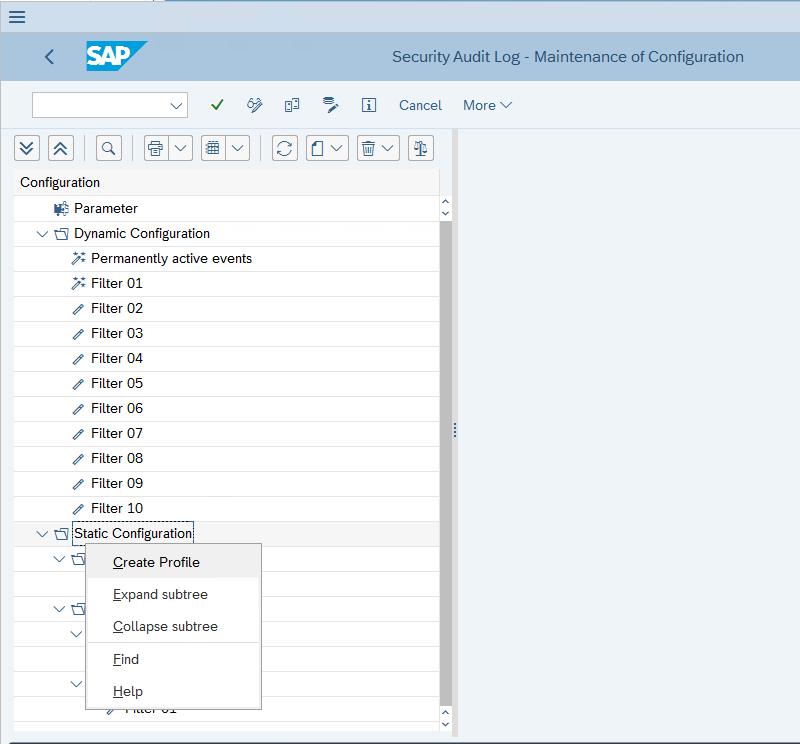

# Enable and configure SAP auditing for Microsoft Sentinel

Some installations of SAP systems may not have audit logging enabled by default. For best results in evaluating the performance and efficacy of the Microsoft Sentinel solution for SAP applications, enable auditing of your SAP system and configure the audit parameters.

This article provides guidance on how to enable and configure auditing for the Microsoft Sentinel solution for SAP applications, and is part of the second step in the deployment process, and is typically handled by your SAP team.

:::image type="content" source="media/deployment-steps/prepare-sap-environment.png" alt-text="Diagram of the deployment flow for the Microsoft Sentinel solution for SAP applications, with the preparing SAP step highlighted." border="false":::

<!--this is pure SAP instructions and really shouldn't be in Microsoft docs. I feel for security admins trying to do this but we really can't document SAP procedures .... I'd like to remove this altogether and just add it into the prereqs page instead. it's unfortunate b/c we're getting about 250 pv a month on it...-->

> [!IMPORTANT]
> We strongly recommend that any management of your SAP system is carried out by an experienced SAP system administrator.
>
> The steps in this article may vary, depending on your SAP system's version, and should be considered as a sample only.

## Check if auditing is enabled

1. Sign in to the SAP GUI and run the **RSAU_CONFIG** transaction.

   

1. In the **Security Audit Log - Display of Current Configuration** window, find the **Parameter** section within the **Configuration** section. Under **General Parameters**, check to see whether the **Static security audit active** checkbox is marked.

## Enable auditing

This procedure describes how to enable auditing in your SAP system if it's not already enabled.

> [!IMPORTANT]
> Your audit policy should be determined in close collaboration with SAP administrators and your security department.

1. Sign in to the SAP GUI and run the **RSAU_CONFIG** transaction.

1. In the **Security Audit Log** screen, select **Parameter** under **Security Audit Log Configuration** section in **Configuration** tree.

1. If the **Static security audit active** checkbox is marked, system-level auditing is turned on. If it isn't, select **Display <-> Change** and mark the **Static security audit active** checkbox.

1. By default, the SAP system logs the client name (terminal ID) rather than client IP address. If you want the system to log by client IP address instead, mark the **Log peer address not terminal ID** checkbox in the **General Parameters** section.

1. If you changed any settings in the **Security Audit Log Configuration - Parameter** section, select **Save** to save the changes. Auditing will be activated only after the server is rebooted.

   > [!IMPORTANT]
   > SAP applications running on Windows OS should consider recommendations in SAP Note 2360334 in case the audit log isn't read correctly after setup.

   

1. Right-click **Static Configuration** and select **Create Profile**.

    

1. Specify a name for the profile in the **Profile/Filter Number** field.

   > [!NOTE]
   > Vanilla SAP installation requires this additional step: right-click the profile you have created and create a new filter.

1. Mark the **Filter for recording active** checkbox.

1. In the **Client** field, enter `*`.

1. In the **User** field enter `*`.

1. Under **Event Selection**, choose **Classic event selection** and select all the event types in the list.

1. Select **Save**.

    

1. You'll see that the **Static Configuration** section displays the newly created profile. Right-click the profile and select **Activate**.

1. In the confirmation window select **Yes** to activate the newly created profile.
   > [!NOTE]
   > Static configuration only takes effect after a system restart. For an immediate setup, create an additional dynamic filter with the same properties, by right clicking the newly created static profile and selecting "apply to dynamic configuration".

## Next step

Your SAP environment is now fully prepared to deploy a data connector agent. 

> [!div class="nextstepaction"]
> [Deploy and configure the container hosting the SAP data connector agent](deploy-data-connector-agent-container.md)