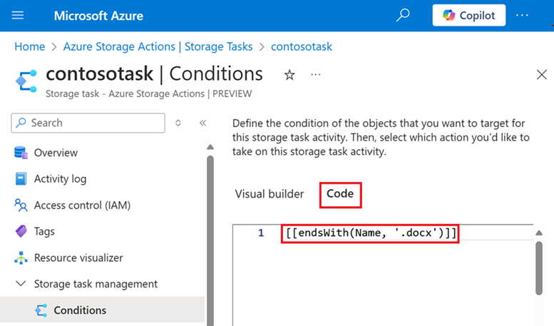

# Storage task conditions

This article describes the format of a storage task condition and the properties and operators that you can use to compose the clauses of a condition. 

> [!IMPORTANT]
> Azure Storage Actions is currently in PREVIEW and is available these [regions](../overview.md#supported-regions).
> See the [Supplemental Terms of Use for Microsoft Azure Previews](https://azure.microsoft.com/support/legal/preview-supplemental-terms/) for legal terms that apply to Azure features that are in beta, preview, or otherwise not yet released into general availability.

A storage task contains a set of conditions and operations in a JSON document. The following image shows how a single condition and operation appear in a the document.  

> [!div class="mx-imgBorder"]
> 

## Condition format

A condition a collection of one or more _clauses_. Each clause contains a _property_, a _value_, and an _operator_. When the storage task runs, it uses the operator to compare a property with a value to determine whether a clause is met by the target object. In a clause, the **operator** always appears first followed by the **property**, and then the **value**. The following image shows how each element is positioned in the expression.

> [!div class="mx-imgBorder"]
> 

The following clause allows operations only on Microsoft Word documents. This clause targets all documents that end with the file extension `.docx`. Therefore, the operator is `endsWith`, the property is `Name`, the value is `.docx`. 

```json
{
   "condition": "[[[endsWith(Name, '.docx')]]"
}
```
If you define conditions by using the Azure portal, you can see this JSON structure by opening the **Code** tab of the visual designer.

> [!div class="mx-imgBorder"]
> 

### Multiple clauses in a condition

A condition can contain multiple clauses separated by a comma along with either the string `and` or `or`. The string `and` targets objects that meet the criteria in all clauses in the condition while `or` targets objects that meet the criterion in any of the clauses in the condition. The following image shows the position of the `and` and `or` string along with two clauses.

> [!div class="mx-imgBorder"]
> 

The following JSON shows a condition that contains two clauses. Because the `and` string is used in this expression, both clauses must evaluate to `true` before an operation is performed on the object. 

```json
{
"condition": "[[and(endsWith(Name, '.docx'), equals(Tags.Value[readyForLegalHold], 'Yes'))]]"
}
```

### Groups of conditions

Grouped clauses operate as a single unit separate from the rest of the clauses. Grouping clauses is similar to putting parentheses around a mathematical equation or logic expression. The `and` or `or` string for the first clause in the group applies to the whole group.

 The following image shows two clauses grouped together.

> [!div class="mx-imgBorder"]
> 

The following condition allows operations only on Microsoft Word documents where the `readyForLegalHold` tag of the document is set to a value of `Yes`. Operations are also performed on objects that are greater than 100 bytes even if the other two conditions are not true.

```json
{
"condition": "[[[or(and(endsWith(Name, '.docx'), equals(Tags.Value[readyForLegalHold], 'Yes')), greater(Content-Length, '100'))]]"
}
```

## Supported properties

The following table shows the properties that you can use to compose each clause of a condition. A clause can contain string, boolean, numeric, as well as date and time properties.

| String                         | Date and time<sup>3</sup> | Numeric        | Boolean          |
|--------------------------------|---------------------------|----------------|------------------|
| AccessTier<sup>1</sup>         | AccessTierChangeTime      | Content-Length | Deleted          |
| Metadata.Value                 | Creation-Time             | TagCount       | IsCurrentVersion |
| Name                           | DeletedTime               |                |                  |
| BlobType<sup>2</sup>           | LastAccessTime            |                |                  |
| Container.Metadata.Value[Name] | Last-Modified             |                |                  |
| Container.Name                 |                           |                |                  |
| Container.Metadata.Value[Name] |                           |                |                  |
| Container.Name                 |                           |                |                  |
| Tags.Value[Name]               |                           |                |                  |
| VersionId                      |                           |                |                  |

<sup>1</sup>    Allowed values are `Hot`, `Cool`, or `Archive`.

<sup>2</sup>    Allowed values are `BlockBlob`, `PageBlob`, or `AppendBlob`

<sup>3</sup>    Can be set to a specific time or to a metadata value dynamically obtained from objects. See [Reference a value from object metadata](storage-task-conditions-operations-edit.md#reference-a-value-from-object-metadata).

## Supported operators

The following table shows the operators that you can use in a clause to evaluate the value of each type of property.

| String | Date and time | Numeric | Boolean |
|---|---|---|---|
| contains | equals |equals | equals |
| empty | greater | greater | not |
| equals | greaterOrEquals |greaterOrEquals ||
| endWith | less | less ||
| length | lessOrEquals | lessOrEquals ||
| startsWith | addToTime | ||
| Matches |  | ||

## See also

- [Storage task operations](storage-task-operations.md)
- [Define conditions and operations](storage-task-conditions-operations-edit.md)
