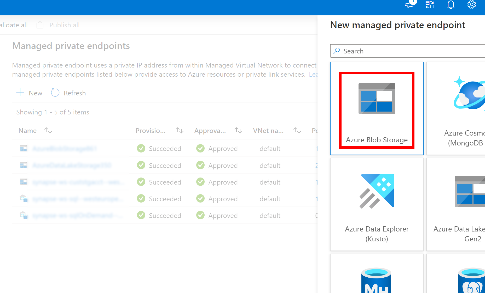

# Tutorial: Use FSSPEC to read/write ADLS data in serverless Apache Spark pool in Synapse Analytics

Learn how to use Filesystem Spec (FSSPEC) to read/write data to Azure Data Lake Storage (ADLS) using a linked service in a serverless Apache Spark pool in Azure Synapse Analytics.

In this tutorial, you'll learn how to:

> [!div class="checklist"]
> - Read/write ADLS data in a dedicated Spark session.

If you don't have an Azure subscription, [create a free account before you begin](https://azure.microsoft.com/free/).

## Prerequisites

- [Azure Synapse Analytics workspace](../get-started-create-workspace.md) with an Azure Data Lake Storage Gen2 storage account configured as the default storage. You need to be the *Storage Blob Data Contributor* of the Data Lake Storage Gen2 file system that you work with.
- Spark pool in your Azure Synapse Analytics workspace. For details, see [Create a Spark pool in Azure Synapse](../get-started-analyze-spark.md).

## Sign in to the Azure portal

Sign in to the [Azure portal](https://portal.azure.com/).

## Create linked services

In Azure Synapse Analytics, a linked service is where you define your connection information to other services. In this section, you'll add an Azure Synapse Analytics and Azure Data Lake Storage Gen2 linked service.

1. Open the Azure Synapse Studio and select the **Manage** tab.
1. Under **External connections**, select **Linked services**.
1. To add a linked service, select **New**.
1. Select the Azure Data Lake Storage Gen2 tile from the list and select **Continue**.
1. Enter your authentication credentials. Account key is currently supported authentication type. Select **Test connection** to verify your credentials are correct. Select **Create**.

   :::image type="content" source="media/tutorial-spark-pool-filesystem-spec/create-adls-linked-service.png" alt-text="Screenshot of creating a linked service using an ADLS Gen2 storage access key.":::

> [!IMPORTANT]
>
> - If the above created Linked Service to Azure Data Lake Storage Gen2 uses a [managed private endpoint](../security/synapse-workspace-managed-private-endpoints.md) (with a *dfs* URI) , then we need to create another secondary managed private endpoint using the Azure Blob Storage option (with a **blob** URI) to ensure that the internal [fsspec/adlfs](https://github.com/fsspec/adlfs/blob/main/adlfs/spec.py#L400) code can connect using the *BlobServiceClient* interface.
> - In case the secondary managed private endpoint is not configured correctly, then we would see an error message like *ServiceRequestError: Cannot connect to host [storageaccountname].blob.core.windows.net:443 ssl:True [Name or service not known]*
> 
> 

## Read/Write data using storage account name and key

FSSPEC can read/write ADLS data by specifying the storage account name and key directly.

1. In Synapse studio, open **Data** > **Linked** > **Azure Data Lake Storage Gen2**. Upload data to the default storage account.

1. Run the following code.

   > [!NOTE]
   > Update the file URL, ADLS Gen2 storage name and key in this script before running it.

   ```PYSPARK
   # To read data
   import fsspec
   import pandas

   adls_account_name = '' #Provide exact ADLS account name
   adls_account_key = '' #Provide exact ADLS account key

   fsspec_handle = fsspec.open('abfs[s]://<container>/<path-to-file>', account_name=adls_account_name, account_key=adls_account_key)

   with fsspec_handle.open() as f:
       df = pandas.read_csv(f)

   # To write data
   import fsspec
   import pandas

   adls_account_name = '' #Provide exact ADLS account name 
   adls_account_key = '' #Provide exact ADLS account key 
   
   data = pandas.DataFrame({'Name':['Tom', 'nick', 'krish', 'jack'], 'Age':[20, 21, 19, 18]})
   
   fsspec_handle = fsspec.open('abfs[s]://<container>/<path-to-file>', account_name=adls_account_name, account_key=adls_account_key, mode="wt")
   
   with fsspec_handle.open() as f:
   	data.to_csv(f)
   ```

## Read/Write data using linked service

FSSPEC can read/write ADLS data by specifying the linked service name.


1. In Synapse studio, open **Data** > **Linked** > **Azure Data Lake Storage Gen2**. Upload data to the default storage account.

1. Run the following code.

   > [!NOTE]
   > Update the file URL, Linked Service Name and ADLS Gen2 storage name in this script before running it.

   ```PYSPARK
   # To read data
   import fsspec
   import pandas
   
   linked_service_name = '' #Provide exact Linked Service Name
   
   fsspec_handle = fsspec.open('abfs[s]://<container>/<path-to-file>', storage_options={'linked_service': linked_service_name})
   
   with fsspec_handle.open() as f:
       df = pandas.read_csv(f)

   # To write data
   import fsspec
   import pandas
   
   linked_service_name = '' #Provide exact Linked Service Name
   
   data = pandas.DataFrame({'Name':['Tom', 'nick', 'krish', 'jack'], 'Age':[20, 21, 19, 18]})
   
   fsspec_handle = fsspec.open('abfs[s]://<container>/<path-to-file>', storage_options={'linked_service': linked_service_name}, mode="wt") 
   
   with fsspec_handle.open() as f:
       data.to_csv(f) 
   ```
   
## Upload file from local file system to default ADLS storage account of Synapse workspace

FSSPEC can upload a file from the local file system to a Synapse workspace default ADLS storage account.


Run the following code.

   > [!NOTE]
   > Update the file URL in this script before running it.
   > Please ensure you import pandas when using the below code snippet. This is critical for proper handling of access tokens.  

   ```PYSPARK
   # Import libraries
   import fsspec
   import os
   import pandas
   
   # Set variables
   local_file_name = "<local_file_name>"
   ADLS_Store_Path = "abfs[s]://<filesystemname>@<account name>.dfs.windows.core.net/"+local_file_name
   
   # Generate local file for testing 
   with open(local_file_name, mode='w') as f:
       for i in range(1000):
           f.write("Testing local file functionality\n")
   print("Created: " + local_file_name)

   # Upload local file to ADLS 
   fs = fsspec.filesystem('abfs[s]')
   fs.upload(local_file_name, ADLS_Store_Path)
   ```

## Next steps

- [Pandas in Synapse Analytics using serverless Apache Spark pool](tutorial-use-pandas-spark-pool.md)
- [Azure Synapse Analytics](../index.yml)
- [FSSPEC official documentation](https://filesystem-spec.readthedocs.io/en/latest/)
